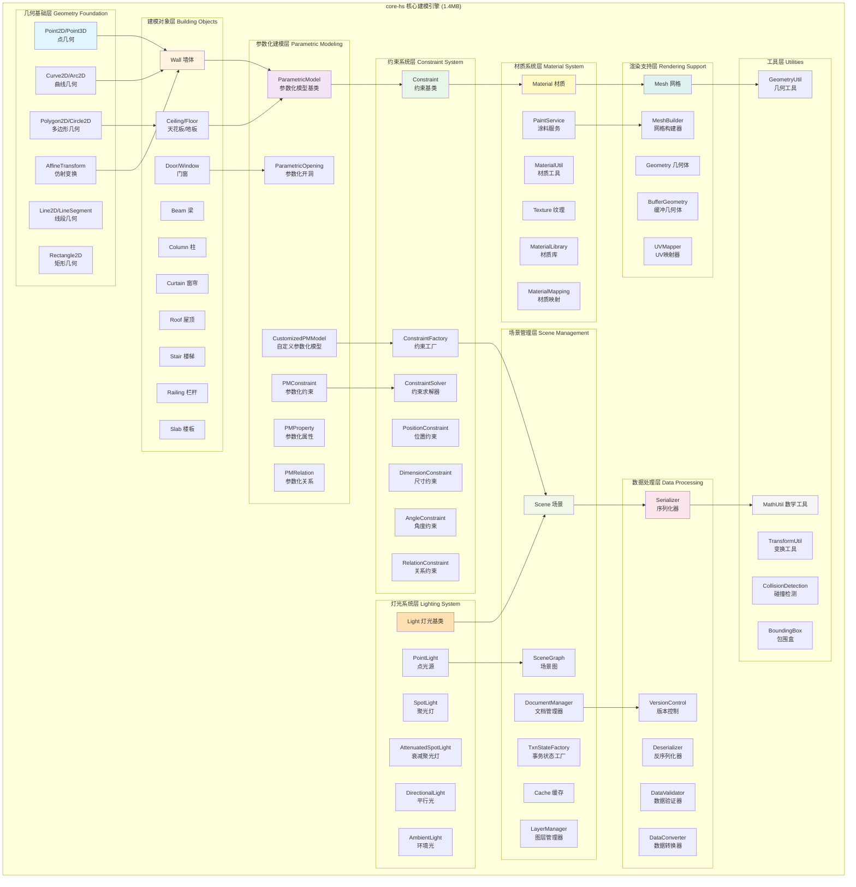
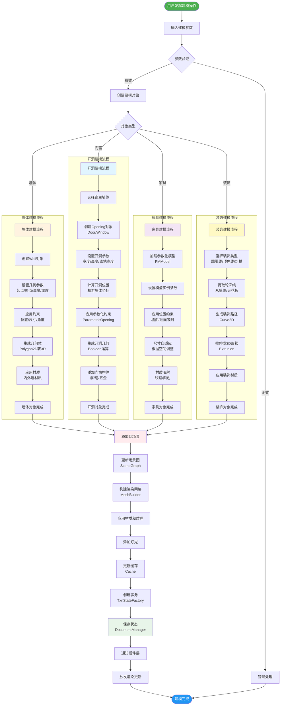
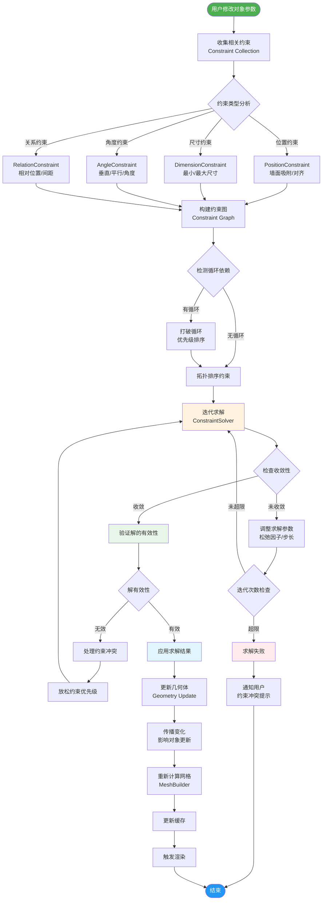
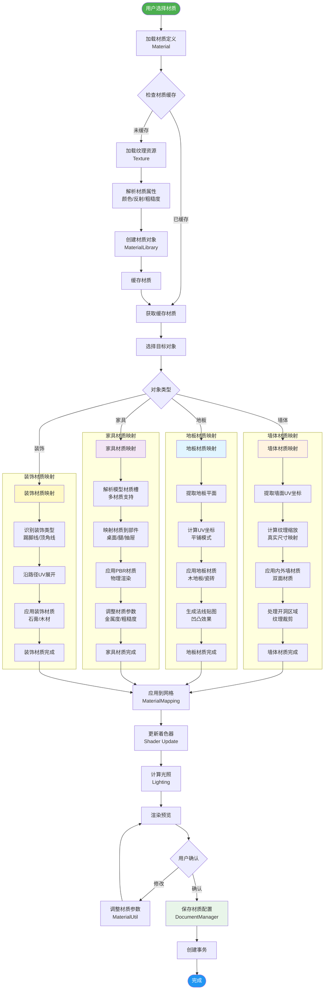
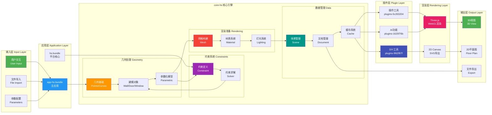
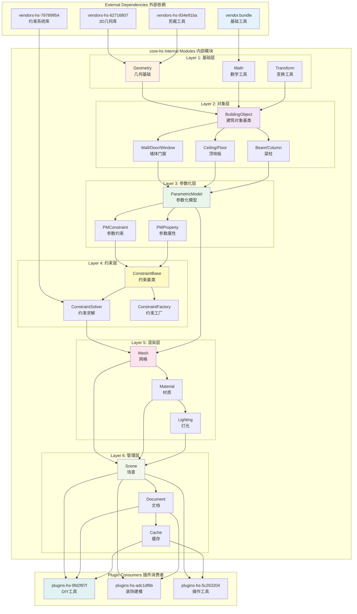
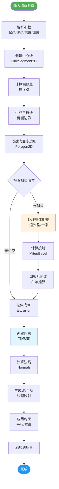
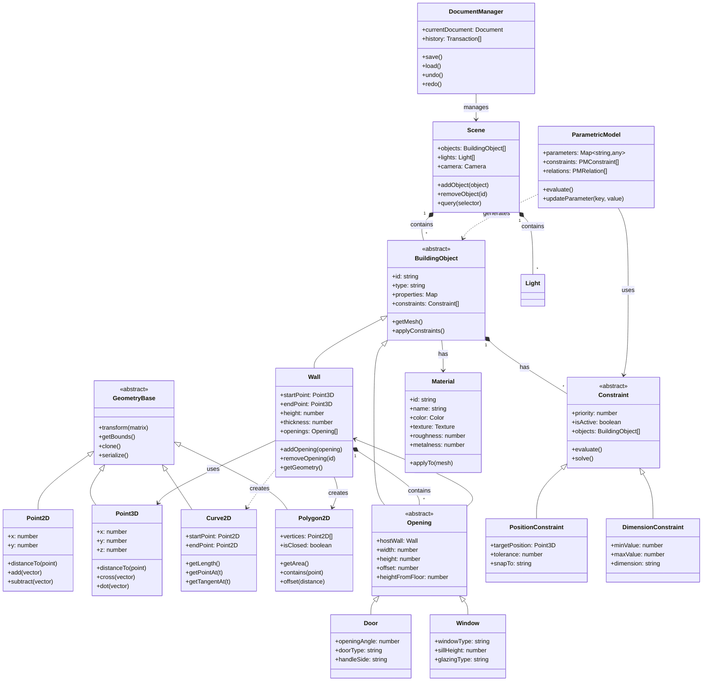
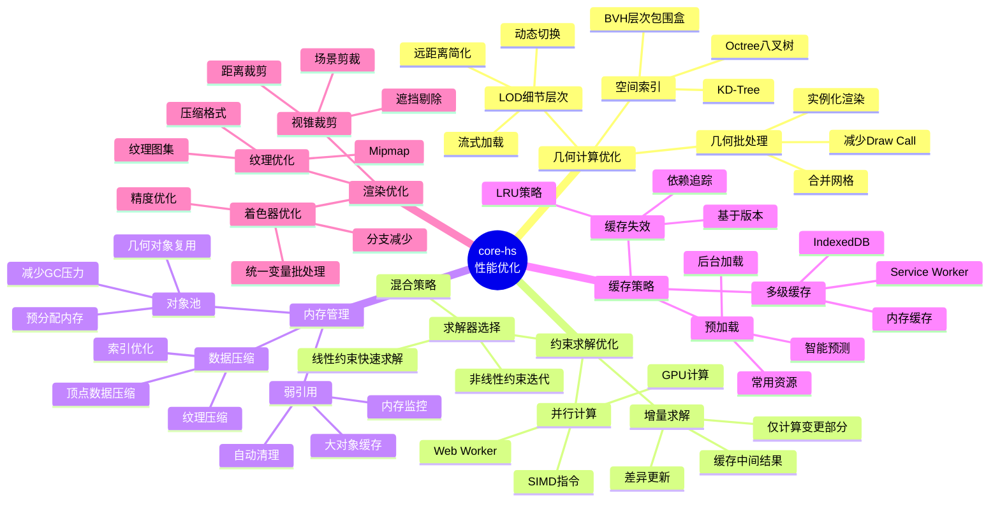
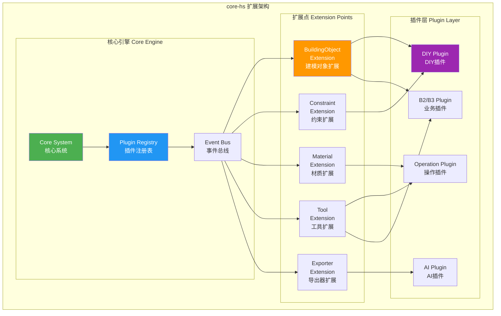

# core-hs.fe5726b7.bundle 完整架构图和工作流程图

> **模块概述**: core-hs.fe5726b7.bundle (1.4MB) - 宿舍家平台的核心几何建模引擎

---

## 一、完整模块架构图



---

## 二、核心工作流程图

### 2.1 建模工作流程



### 2.2 约束求解流程



### 2.3 材质系统工作流程



---

## 三、数据流图



---

## 四、模块依赖关系详细图



---

## 五、核心算法流程

### 5.1 墙体建模算法



### 5.2 约束求解算法

```mermaid
flowchart TD
    Start([接收约束变更]) --> CollectAffected[收集受影响对象]
    
    CollectAffected --> BuildGraph[构建依赖图<br/>Dependency Graph]
    BuildGraph --> TopologicalSort[拓扑排序<br/>解决顺序]
    
    TopologicalSort --> InitSolver[初始化求解器<br/>ConstraintSolver]
    InitSolver --> SetupEquations[建立方程组<br/>Ax=b]
    
    SetupEquations --> ChooseMethod{选择求解方法}
    
    ChooseMethod -->|线性约束| GaussElimination[高斯消元法]
    ChooseMethod -->|非线性约束| NewtonMethod[牛顿迭代法]
    ChooseMethod -->|混合约束| HybridMethod[混合求解]
    
    GaussElimination --> Solve1[求解线性系统]
    NewtonMethod --> Solve2[迭代求解<br/>Jacobian矩阵]
    HybridMethod --> Solve3[分步求解]
    
    Solve1 --> CheckConvergence{收敛检查}
    Solve2 --> CheckConvergence
    Solve3 --> CheckConvergence
    
    CheckConvergence -->|未收敛| UpdateParams[更新参数<br/>步长/松弛因子]
    CheckConvergence -->|收敛| ValidateResult[验证结果<br/>物理有效性]
    
    UpdateParams --> IterCount{迭代次数}
    IterCount -->|<最大次数| Solve2
    IterCount -->|≥最大次数| Failed[求解失败]
    
    ValidateResult --> CheckValid{结果有效}
    CheckValid -->|无效| RelaxConstraints[放松约束]
    CheckValid -->|有效| ApplyResult[应用结果]
    
    RelaxConstraints --> SetupEquations
    
    ApplyResult --> UpdateGeometry[更新几何体]
    UpdateGeometry --> PropagateChanges[传播变更<br/>相关对象]
    PropagateChanges --> NotifyObservers[通知观察者<br/>Observer Pattern]
    
    NotifyObservers --> End([完成])
    Failed --> End
    
    style Start fill:#4caf50,color:#fff
    style End fill:#2196f3,color:#fff
    style NewtonMethod fill:#fff3e0
    style ValidateResult 
fill:#e8f5e9
    style Failed fill:#ffebee
```

---

## 六、核心类关系图



---

## 七、性能优化策略



---

## 八、核心API接口

### 8.1 几何API

```typescript
// 点 Point
interface IPoint2D {
    x: number;
    y: number;
    distanceTo(other: IPoint2D): number;
    add(vector: IVector2D): IPoint2D;
    clone(): IPoint2D;
}

interface IPoint3D extends IPoint2D {
    z: number;
    cross(other: IPoint3D): IPoint3D;
    dot(other: IPoint3D): number;
}

// 曲线 Curve
interface ICurve2D {
    startPoint: IPoint2D;
    endPoint: IPoint2D;
    getLength(): number;
    getPointAt(t: number): IPoint2D;
    getTangentAt(t: number): IVector2D;
    offset(distance: number): ICurve2D;
}

// 多边形 Polygon
interface IPolygon2D {
    vertices: IPoint2D[];
    isClosed: boolean;
    getArea(): number;
    getPerimeter(): number;
    contains(point: IPoint2D): boolean;
    offset(distance: number): IPolygon2D;
    boolean(other: IPolygon2D, operation: BooleanOp): IPolygon2D;
}
```

### 8.2 建模对象API

```typescript
// 建筑对象基类
interface IBuildingObject {
    id: string;
    type: string;
    properties: Map<string, any>;
    constraints: IConstraint[];
    
    getMesh(): IMesh;
    getBounds(): IBoundingBox;
    applyConstraints(): void;
    serialize(): string;
}

// 墙体 Wall
interface IWall extends IBuildingObject {
    startPoint: IPoint3D;
    endPoint: IPoint3D;
    height: number;
    thickness: number;
    openings: IOpening[];
    
    addOpening(opening: IOpening): void;
    removeOpening(id: string): void;
    getGeometry(): IGeometry3D;
    split(point: IPoint3D): IWall[];
}

// 开洞 Opening
interface IOpening extends IBuildingObject {
    hostWall: IWall;
    width: number;
    height: number;
    offset: number;
    heightFromFloor: number;
    
    getLocalPosition(): IPoint2D;
    updatePosition(offset: number): void;
}
```

### 8.3 参数化建模API

```typescript
// 参数化模型
interface IParametricModel {
    parameters: Map<string, IParameter>;
    constraints: IPMConstraint[];
    relations: IPMRelation[];
    
    evaluate(): void;
    updateParameter(key: string, value: any): void;
    addConstraint(constraint: IPMConstraint): void;
    createInstance(params: Record<string, any>): IBuildingObject;
}

// 参数定义
interface IParameter {
    name: string;
    type: ParameterType;
    value: any;
    min?: number;
    max?: number;
    options?: any[];
    expression?: string;
}

// 参数化约束
interface IPMConstraint {
    type: ConstraintType;
    parameters: string[];
    expression: string;
    evaluate(): boolean;
}
```

### 8.4 约束系统API

```typescript
// 约束基类
interface IConstraint {
    id: string;
    type: ConstraintType;
    priority: number;
    isActive: boolean;
    objects: IBuildingObject[];
    
    evaluate(): number;
    solve(): boolean;
    getError(): number;
}

// 约束求解器
interface IConstraintSolver {
    constraints: IConstraint[];
    
    addConstraint(constraint: IConstraint): void;
    removeConstraint(id: string): void;
    solve(): SolveResult;
    reset(): void;
}

// 求解结果
interface SolveResult {
    success: boolean;
    iterations: number;
    error: number;
    conflictingConstraints?: string[];
}
```

### 8.5 材质系统API

```typescript
// 材质
interface IMaterial {
    id: string;
    name: string;
    color: IColor;
    texture?: ITexture;
    normalMap?: ITexture;
    roughness: number;
    metalness: number;
    
    applyTo(mesh: IMesh): void;
    clone(): IMaterial;
}

// 材质映射
interface IMaterialMapping {
    material: IMaterial;
    uvTransform?: IMatrix3;
    
    mapToObject(object: IBuildingObject): void;
    calculateUV(geometry: IGeometry): number[];
}

// 材质库
interface IMaterialLibrary {
    materials: Map<string, IMaterial>;
    
    add(material: IMaterial): void;
    get(id: string): IMaterial;
    search(query: string): IMaterial[];
    loadFromServer(url: string): Promise<void>;
}
```

### 8.6 场景管理API

```typescript
// 场景
interface IScene {
    objects: Map<string, IBuildingObject>;
    lights: ILight[];
    camera: ICamera;
    
    addObject(object: IBuildingObject): void;
    removeObject(id: string): void;
    getObject(id: string): IBuildingObject;
    query(selector: string): IBuildingObject[];
    raycast(ray: IRay): Intersection[];
}

// 文档管理器
interface IDocumentManager {
    currentDocument: IDocument;
    history: ITransaction[];
    
    save(): Promise<void>;
    load(id: string): Promise<IDocument>;
    undo(): boolean;
    redo(): boolean;
    createTransaction(description: string): ITransaction;
}

// 事务
interface ITransaction {
    id: string;
    description: string;
    timestamp: number;
    changes: IChange[];
    
    execute(): void;
    rollback(): void;
}
```

---

## 九、扩展点和插件接口



### 插件接口定义

```typescript
// 插件基类
interface IPlugin {
    name: string;
    version: string;
    dependencies: string[];
    
    initialize(context: IPluginContext): void;
    activate(): void;
    deactivate(): void;
    dispose(): void;
}

// 插件上下文
interface IPluginContext {
    scene: IScene;
    documentManager: IDocumentManager;
    eventBus: IEventBus;
    registry: IRegistry;
    
    registerBuildingObjectType(type: string, factory: IFactory): void;
    registerConstraintType(type: string, solver: ISolver): void;
    registerTool(tool: ITool): void;
    registerExporter(exporter: IExporter): void;
}

// 事件总线
interface IEventBus {
    on(event: string, handler: Function): void;
    off(event: string, handler: Function): void;
    emit(event: string, data: any): void;
}
```

---

## 十、总结

### 核心特性

1. **强大的几何引擎**: 完整的2D/3D几何基础库
2. **参数化建模**: 灵活的参数化系统支持复杂模型
3. **约束求解**: 高效的约束求解器保证模型一致性
4. **可扩展架构**: 清晰的扩展点支持插件开发
5. **材质系统**: 完整的PBR材质和纹理映射
6. **性能优化**: 多级缓存和LOD系统

### 技术亮点

- **模块化设计**: 500+模块清晰分层
- **依赖管理**: 严格的依赖层次避免循环依赖
- **事务系统**: 完整的undo/redo支持
- **插件架构**: 8个插件模块灵活扩展功能
- **数据持久化**: 完善的序列化和版本控制

### 应用场景

- 室内设计CAD系统
- BIM建筑信息建模
- 家装DIY工具
- 3D户型编辑器
- 参数化家具设计

---

**文档版本**: v1.0  
**最后更新**: 2026-01-22  
**维护者**: 