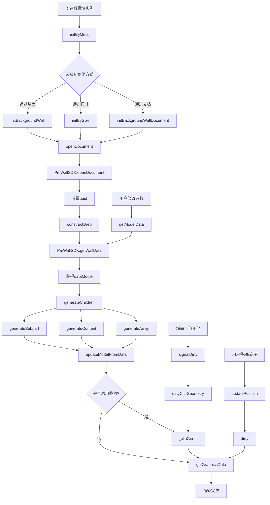

# CustomizedBackgroundWall 电视背景墙系统完整架构分析

> **模块来源**: `core-hs.fe5726b7.bundle`
> **核心模块**: Module 77790, 95804, 86442, 46973, 11577, 65122
> **分析日期**: 2026-01-22
> **复杂度**: ⭐⭐⭐⭐⭐ (5/5 - 高度复杂)

---

## 📑 目录

1. [系统概述](#系统概述)
2. [完整架构图](#完整架构图)
3. [继承体系详解](#继承体系详解)
4. [核心类详解](#核心类详解)
5. [墙面适配算法](#墙面适配算法)
6. [参数化尺寸计算](#参数化尺寸计算)
7. [镜像翻转算法](#镜像翻转算法)
8. [踢脚线切割算法](#踢脚线切割算法)
9. [裁剪系统](#裁剪系统)
10. [工作流程图](#工作流程图)
11. [API接口说明](#api接口说明)
12. [使用示例](#使用示例)

---

## 系统概述

### 功能定位

CustomizedBackgroundWall（电视背景墙系统）是一个**智能参数化背景墙建模系统**，提供：

- ✅ **自动墙面适配**: 根据墙面几何自动调整尺寸和位置
- ✅ **参数化建模**: 基于PmWallSDK的参数驱动式墙面生成
- ✅ **智能裁剪**: 自动处理与障碍物的碰撞和裁剪
- ✅ **镜像翻转**: 支持垂直/水平镜像并保持墙面吸附
- ✅ **踢脚线切割**: 自动生成踢脚线切割路径
- ✅ **子部件管理**: 支持多层嵌套的背景墙组件

### 技术特点

1. **三层继承体系**: Entity → CustomizedModel → ParametricModel → BackgroundWall
2. **SDK集成**: 深度集成PmWallSDK进行墙面数据计算
3. **实时更新**: 监听墙面变化并自动更新几何体
4. **内存优化**: 使用GSW记忆系统缓存计算结果

---

## 完整架构图

### 层次1: 核心继承链

```
Entity (基础实体)
  ↓
CustomizedModel (定制化模型基类)
  ↓
NCustomizedFeatureModel (特征模型基类)
  ↓
┌─────────────────┴──────────────────┐
│                                     │
NCustomizedSketchModel          NCustomizedParametricModel
(基于Sketch的模型)              (参数化模型基类)
  ↓                                   ↓
NCustomizedBackgroundWall       NCPBackgroundWallBase
(基础背景墙 - Sketch驱动)       (参数化背景墙基类)
                                      ↓
                    ┌─────────────────┴─────────────────┐
                    │                                    │
        NCustomizedParametricBackgroundWall    NCPBackgroundWallUnit
        (智能参数化背景墙)                     (背景墙单元)
                    │
                    ↓
        CustomizedBackgroundWall
        (最终用户背景墙类)
```

### 层次2: 子组件系统

```
NCPBackgroundWallBase (背景墙基类)
  │
  ├─→ NCPBackgroundWallSubpart (背景墙子部件)
  │     └─→ 支持递归嵌套子部件
  │
  ├─→ NCPBackgroundWallContent (背景墙内容物)
  │     ├─→ isSourceModel: 源模型
  │     └─→ srcModel: 数组复制的源引用
  │
  └─→ NCPBackgroundWallArray (背景墙数组)
        └─→ 管理内容物的阵列分布
```

### 层次3: 辅助工具层

```
NCPBackgroundWallBaseUtil (工具类)
  ├─→ resizeParametricWalls() - 批量调整尺寸
  ├─→ getSameLineFaceForClip() - 获取同线面用于裁剪
  └─→ isContentInRoom() - 检测是否在房间内

NCPBackgroundWallBaseDecorator (装饰器)
  ├─→ dump() - 序列化背景墙数据
  ├─→ create() - 从数据创建背景墙实例
  ├─→ setMaterial() - 设置材质
  └─→ getFacesInfoByVariableName() - 获取面信息
```

### 层次4: SDK集成层

```
PmWallSDK (参数化墙面SDK)
  ├─→ openDocument(seekId, docFile, entityId, extra)
  ├─→ getWallData(seekId, entityId, params, options)
  ├─→ onParamsChangedCallback() - 参数变化回调
  └─→ _keyToDoc - 文档缓存Map
```

### 层次5: 几何计算层

```
ProjectionHelper (投影辅助)
  ├─→ exportSimple2DProjection() - 导出2D投影
  └─→ calcProjectionContours() - 计算投影轮廓

GraphicsCutter (图形裁剪器)
  ├─→ clipGeomByObstacles() - 按障碍物裁剪
  └─→ clipSweepGeomByObstacles() - 裁剪扫掠几何

ModelGraphicsHelper (模型图形助手)
  └─→ getGraphicsData() - 获取图形数据
```

### 层次6: 材质系统

```
NCParametricModelMaterialUtil
  ├─→ getMaterialInfo() - 获取材质信息
  └─→ 材质变量映射

MaterialData
  ├─→ rotation - 旋转角度
  ├─→ offsetX/Y - 偏移量
  ├─→ scaleX/Y - 缩放比例
  └─→ tileSize - 平铺尺寸
```

### 层次7: 信号系统

```
SignalHook (信号钩子)
  ├─→ listen() - 监听信号
  └─→ unlistenAll() - 取消所有监听

signalClipDirty (裁剪脏标记)
signalDirty (几何脏标记)
  └─→ type: "geometry" / "material"
```

### 层次8: 数据模型

```
targetFaceInfo (目标墙面信息)
  ├─→ outer: Vector3[] - 外轮廓点
  ├─→ newOuter: Vector3[] - 新外轮廓(变换后)
  ├─→ holes: Vector3[][] - 洞口数组
  └─→ D: number - 墙厚度

parameters (参数对象)
  ├─→ targetFaceInfo - 目标墙面
  ├─→ isAutoFit - 是否自动适配
  ├─→ uuid - 文档UUID
  ├─→ roomLoop - 房间轮廓
  ├─→ roomHeight - 房间高度
  ├─→ propertytree - 属性树
  └─→ snappedInfo - 吸附信息
```

### 层次9: 内存与缓存

```
NCPClipTaskManager (裁剪任务管理)
  ├─→ addClipTask() - 添加裁剪任务
  └─→ 异步裁剪队列

propertyRecord (属性记录)
  └─→ 缓存参数化属性值

_graphicsData (图形数据缓存)
_clipTask (裁剪任务缓存)
_dirtyClip (脏标记)
```

---

## 继承体系详解

### 1. NCustomizedBackgroundWall (基础背景墙)

**源码**: [`ncustomizedbackgroundwall_io.js`](dist/core-hs.fe5726b7.bundle_dewebpack/ncustomizedbackgroundwall_io.js:35)  
**模块ID**: 77790  
**继承**: `extends NCustomizedSketchModel`

```javascript
class NCustomizedBackgroundWall extends NCustomizedSketchModel {
  constructor(e = "", t) {
    super(e, t);
    this._singleHooKOnHost = new HSCore.Util.SignalHook(this);
  }
  
  // 【核心方法1】获取前投影平面 - Line 42
  getFrontProjectionPlane() {
    const plane = Plane.XOY();
    const matrix = this.getSketchTransformMatrix();
    return plane.transform(matrix);
  }
  
  // 【核心方法2】镜像翻转 - Line 49
  mirror(mirrorInfo) {
    const center = this.sketch.bound.center();
    const mirrorMatrix = Matrix3.makeMirror(center, {x: 0, y: 1});
    this.sketch.mirror(mirrorMatrix);
    
    // 获取同线面并更新变换矩阵
    const sameLineFaces = HSCore.Util.SameLineFace
      .getSameLineConnectedFaces(this.host);
    this.sketch.convert3dMatrix = this.getSameLineFacesMatrix(sameLineFaces);
    super.mirror(mirrorInfo);
  }
  
  // 【核心方法3】获取同线面变换矩阵 - Line 64
  getSameLineFacesMatrix(faces) {
    // 提取每个面的底边线
    const faceInfos = faces.map(face => {
      const floorLines = face.wirePath.outer.filter(edge => {
        if (!(edge instanceof Line3d)) return false;
        const start = edge.getStartPt();
        const end = edge.getEndPt();
        // 过滤出Z高度为0的水平线
        return Math.abs(start.z - end.z) <= 1e-6 && 
               Math.abs(start.z) < 1e-6;
      });
      return {
        face: face,
        floorLine: floorLines.length ? floorLines[0] : undefined
      };
    });
    
    // 如果没有底边线，返回第一个面的变换矩阵
    if (faceInfos.length === 0 || !faceInfos[0].floorLine) {
      return new THREE.Matrix4()
        .fromArray(faceInfos[0].face.surfaceObj.localToWorld.toArray());
    }
    
    // 按底边线在延长线上的参数排序
    const extendedLine = faceInfos[0].floorLine.clone().extendDouble(1e6);
    faceInfos.sort((a, b) => {
      const paramA = a.floorLine ? 
        extendedLine.getParamAt(a.floorLine.getStartPt()) : 1e6;
      const paramB = b.floorLine ? 
        extendedLine.getParamAt(b.floorLine.getStartPt()) : 1e6;
      return paramA - paramB;
    });
    
    // 返回第一个面的局部到世界坐标变换矩阵
    return new THREE.Matrix4()
      .fromArray(faceInfos[0].face.surfaceObj.localToWorld.toArray());
  }
  
  // 【核心方法4】获取踢脚线切割信息 - Line 90
  

getBaseboardCutterInfo(face) {
    const cutterInfos = [];
    if (!face || this.host !== face) return cutterInfos;
    
    const curve = face.faceInfo?.curve;
    if (!curve) return cutterInfos;
    
    // 创建底边线（Z=0平面）
    const bottomLine = new Line3d(
      {x: curve.getStartPt().x, y: curve.getStartPt().y, z: 0},
      {x: curve.getEndPt().x, y: curve.getEndPt().y, z: 0}
    );
    
    // 创建向外偏移的线
    const offsetLine = bottomLine.clone();
    offsetLine.translate(face.surfaceObj.getNormal());
    offsetLine.reverse();
    
    // 构建闭合矩形切割路径
    const sideLine1 = new Line3d(bottomLine.getEndPt(), offsetLine.getStartPt());
    const sideLine2 = new Line3d(offsetLine.getEndPt(), bottomLine.getStartPt());
    
    cutterInfos.push({
      cutPath: [bottomLine.clone(), sideLine1, offsetLine, sideLine2],
      patchLines: []
    });
    
    return cutterInfos;
  }
}
```

**关键特性**:
- ✅ 基于Sketch的2D草图建模
- ✅ 镜像时自动处理同线墙面
- ✅ 踢脚线切割路径生成

---

### 2. NCPBackgroundWallBase (参数化背景墙基类)

**源码**: [`ncpbackgroundwallbase_io.js`](dist/core-hs.fe5726b7.bundle_dewebpack/ncpbackgroundwallbase_io.js:93)  
**模块ID**: 46973  
**继承**: `extends NCustomizedParametricModel`

```javascript
class NCPBackgroundWallBase extends NCustomizedParametricModel {
  constructor(e = "", t) {
    super(e, t);
    this.dependentSeekIds = []; // 依赖的SeekID列表
    this.propertyRecord = undefined; // 属性记录缓存
    this._dirtyClip = false; // 裁剪脏标记
    this._signalHook = new HSCore.Util.SignalHook(this);
    
    // 监听裁剪脏信号
    this._signalHook.listen(this.signalClipDirty, () => {
      this._dirtyClip = true;
    });
  }
  
  // 【初始化方法】
  
  // 1. 从元数据初始化 - Line 107
  initByMeta(meta, t, o) {
    super.initByMeta(meta, t, o);
    const userFreeData = meta.userFreeData;
    this.metadata.parametricMeta = userFreeData; // 保存参数化元数据
  }
  
  // 2. 按尺寸初始化 - Line 113
  initBySize() {
    const faceInfo = this.getTargetFaceInfoBySize(this.parameters.targetFaceInfo);
    this.parameters.targetFaceInfo = faceInfo;
    this.constructBrep(undefined, false, false);
  }
  
  // 3. 初始化背景墙 - Line 119
  initBackgroundWall(faceInfo, isLoad, loadFromFile) {
    this.parameters.targetFaceInfo = faceInfo;
    this.constructBrep(
      loadFromFile ? this.propertyRecord : undefined, 
      isLoad, 
      loadFromFile
    );
  }
  
  // 4. 打开文档 - Line 135
  openDocument(faceInfo, loadFromFile = false) {
    // 获取房间高度
    const parentRoom = this.getParentRoom();
    let roomHeight = 0;
    if (parentRoom) {
      roomHeight = 1000 * parentRoom.ceilingHeight3d;
    } else if (this.parameters.roomHeight) {
      roomHeight = this.parameters.roomHeight;
    }
    
    const docFile = this.getDocFile(); // 获取文档文件
    if (!docFile) return;
    
    const extra = this.getOpenDocumentExtra(faceInfo, loadFromFile);
    const seekId = this.metadata.seekId;
    
    // 【调用PmWallSDK打开文档】
    const uuid = PmWallSDK.openDocument(seekId, docFile, this.id, extra);
    if (!uuid) {
      Logger.console.assert(false, "PmWallSDK.openDocument failed!");
      return;
    }
    
    // 创建房间轮廓
    const roomLoop = Loop.createByRectangle(
      new Vector2(0, 0),
      new Vector2(this.metadata.XLength, this.metadata.YLength)
    ).scale(1000);
    
    this.parameters.uuid = uuid;
    this.parameters.roomLoop = roomLoop;
    this.parameters.roomHeight = roomHeight;
  }
  
  // 【子部件生成】
  
  // 生成子部件 - Line 162
  generateSubpart(modelData, isLoad) {
    const instances = modelData.dataModel.instances;
    if (!instances) return;
    
    instances.forEach(instanceData => {
      // 查找已存在的子部件
      let subpart = this.getChildrenByType(HSCore.Model.NCPBackgroundWallSubpart)
        .find(e => e.eId === instanceData.eId);
      
      const updateMeta = (subpart) => {
        const hideFaces = this instanceof HSCore.Model.NCPBackgroundWallSubpart ? 
          this.hideFaces : modelData.hideFaces;
        subpart.updateSubpartMeta(instanceData, hideFaces);
      };
      
      try {
        const product = Manager.instance()
          .getProductBySeekIdSync(instanceData.seekId, {data: {}});
        if (!product) return;
        
        if (subpart) {
          if (isLoad) {
            updateMeta(subpart);
            subpart.openDocument(undefined, isLoad);
          } else {
            updateMeta(subpart);
          }
        } else {
          // 创建新子部件
          product.contentType = product.contentType?.getTypeString() || 
            new ContentType("param background wall/styling");
          subpart = new HSCore.Model.NCPBackgroundWallSubpart();
          subpart.initByMeta(product);
          this.addChild(subpart);
          updateMeta(subpart);
          subpart.openDocument(undefined, isLoad);
        }
        
        // 设置可见性
        if (instanceData.visible) {
          subpart.setFlagOff(EntityFlagEnum.hidden);
        } else {
          subpart.setFlagOn(EntityFlagEnum.hidden);
        }
        
        subpart.initBackgroundWall(undefined, false, isLoad);
        subpart.updateSubpart();
      } catch (e) {
        Logger.console.error(e);
      }
    });
  }
  
  // 【墙面数据获取】- Line 510
  getWallData(seekId, entityId, newParams, useMinMax = false) {
    const extra = this.getOpenDocumentExtra(this.parameters.targetFaceInfo, useMinMax);
    
    if (extra.wdh) {
      Object.assign(newParams, extra.wdh);
    }
    
    const params = {
      newParams: newParams,
      patchValidRegion: true
    };
    
    const options = {
      wallLine: extra.wallLine,
      useMinMax: extra.useMinMax
    };
    
    // 【调用PmWallSDK获取墙面数据】
    return PmWallSDK.getWallData(seekId, entityId, params, options);
  }
  
  // 【投影相关】
  
  // 获取前投影平面 - Line 636
  getFrontProjectionPlane() {
    const yOffset = -this.YSize;
    return Plane.makePlaneByPointNormal(
      new Vector3(0, yOffset, 0),
      new Vector3(0, -1, 0),
      new Vector3(1, 0, 0)
    );
  }
  
  // 获取前投影 - Line 641
  getFrontProjection(withMaterial = true, includeLightSlot = false) {
    const needMaterial = withMaterial === undefined || withMaterial;
    const projections = [];
    
    if (!this.frontProjection) {
      const plane = this.getFrontProjectionPlane();
      const result = ProjectionHelper.getInstance()
        .exportSimple2DProjection(this.breps, plane, {entityTag: this.tag});
      
      if (result) {
        projections.push(...result.projections);
        this.transformFrontDistance(projections);
        projections.unioned = result.unioned;
        projections.contours = ProjectionHelper.getInstance()
          .calcProjectionContours(result.projections, result.unioned);
      }
      this.frontProjection = projections;
    }
    
    this.updateProjectionTypesFlag(this.frontProjection);
    
    if (needMaterial) {
      this._updateProjectionMaterialData(this.frontProjection);
    }
    
    // 包含灯槽投影
    if (includeLightSlot) {
      const lightSlots = this.getLightSlotEntities();
      for (const slot of lightSlots) {
        const slotProjections = slot.getFrontProjection();
        for (const proj of slotProjections) {
          this.frontProjection.push(proj);
        }
      }
    }
    
    return this.frontProjection;
  }
  
  // 【裁剪相关】
  
  // 裁剪几何体 - Line 302
  _clipGeom(geomData) {
    const obstacles = NCustomizedFeatureModelUtil.getObstacleInfos(this);
    if (obstacles && obstacles.length) {
      const baseCoord = obstacles[0].baseCoord;
      return GraphicsCutter.getInstance()
        .clipGeomByObstacles(geomData, obstacles, baseCoord);
    }
    return geomData;
  }
  
  // 是否启用裁剪 - Line 316
  _enableClip() {
    return !!(
      this._dirtyClip &&
      HSConstants.Config.ClipBackgroundWallEnable &&
      !this.isFlagOn(EntityFlagEnum.hidden) &&
      !this.getParentsInPath().some(e => e.isFlagOn(EntityFlagEnum.hidden))
    );
  }
  
  // 获取图形数据 - Line 324
  getGraphicsData(options) {
    if (!this._graphicsData) {
      let geomData = super.getGraphicsData(options);
      
      if (this._enableClip()) {
        geomData = this._clipTask ? 
          this._clipTask.run(geomData) : 
          this._clipGeom(geomData);
      } else {
        this._clipTask?.delete();
      }
      
      this._graphicsData = geomData;
    }
    
    this._dirtyClip = false;
    return this._graphicsData;
  }
  
  // 标记裁剪脏 - Line 750
  dirtyClipGeometry(e) {
    super.dirtyClipGeometry();
    this._clipTask = NCPClipTaskManager.addClipTask(
      this.id,
      this._clipGeom.bind(this),
      this
    );
  }
  
  // 【镜像翻转】- Line 857
  mirror(mirrorInfo) {
    // 获取wallLine并应用镜像变换
    const wallLine = PmWallSDK._keyToDoc
      .get(`${this.parameters.uuid}^${this.id}`).wallLine;
    
    wallLine?.transform(mirrorInfo.matrix4);
    
    if (mirrorInfo.type === MirrorType.Vertical) {
      wallLine.reverse();
      this.ZRotation = 180 - this.ZRotation;
    } else {
      this.ZRotation = -this.ZRotation;
    }
    
    super.mirror(mirrorInfo);
  }
  
  // 【碰撞检测】- Line 822
  isCollision() {
    let hasCollision = false;
    const loopOnWall = 

this.getLoopOnWallFace();
    if (!loopOnWall) return false;
    
    const hostedFace = HSCore.Util.Content.getHostedFace(this);
    if (!hostedFace || !(hostedFace instanceof Face) || 
        hostedFace instanceof Ceiling || hostedFace instanceof Floor) {
      return false;
    }
    
    // 检查与其他背景墙的碰撞
    for (const otherContent of Object.values(hostedFace.contents)) {
      if (otherContent instanceof NCPBackgroundWallBase && otherContent !== this) {
        const otherLoop = otherContent.getLoopOnWallFace();
        if (!otherLoop) continue;
        
        // 计算两个轮廓的交集
        const intersection = MathAlg.BoolOperate2d.intersect([loopOnWall, otherLoop]);
        if (!MathUtil.isNearlyZero(intersection.calcArea(), 0.0025)) {
          hasCollision = true;
          break;
        }
      }
    }
    
    return hasCollision;
  }
}
```

**关键特性**:
- ✅ PmWallSDK深度集成
- ✅ 智能裁剪系统
- ✅ 子部件递归管理
- ✅ 碰撞检测

---

### 3. NCustomizedParametricBackgroundWall (智能参数化背景墙)

**源码**: [`ncustomizedparametricbackgroundwall_io.js`](dist/core-hs.fe5726b7.bundle_dewebpack/ncustomizedparametricbackgroundwall_io.js:27)  
**模块ID**: 95804  
**继承**: `extends NCPBackgroundWallBase`

```javascript
class NCustomizedParametricBackgroundWall extends NCPBackgroundWallBase {
  constructor(e = "", t) {
    super(e, t);
    this._singleHooKOnHost = new HSCore.Util.SignalHook(this);
  }
  
  // 【核心方法1】初始化背景墙 - Line 34
  initBackgroundWall(faceInfo, isLoad) {
    // 检查是否自动适配
    if (this.parameters.isAutoFit !== false) {
      this.parameters.targetFaceInfo = faceInfo;
      this.constructBrep(
        isLoad ? this.propertyRecord : undefined,
        false,
        isLoad
      );
    } else {
      // 非自动适配模式，只保存面信息
      this.parameters.targetFaceInfo = faceInfo;
    }
  }
  
  // 【核心方法2】从数据更新模型 - Line 53
  updateModelFromData(data, dontUpdate) {
    if (data.systemParams) {
      if (!dontUpdate) {
        // 自动适配时更新位置
        if (this.parameters.isAutoFit) {
          this.updatePositionFromMeta(data.meta, dontUpdate);
        }
        
        // 更新尺寸
        const {W, D, H} = data.systemParams;
        this.XLength = W / 1000;
        this.YLength = D / 1000;
        this.ZLength = H / 1000;
        this.XScale = 1;
        this.YScale = 1;
        this.ZScale = 1;
      }
    } else if (data.meta) {
      this.updatePositionFromMeta(data.meta, dontUpdate);
      this.updateSizeFromMeta(data.meta);
    }
  }
  
  // 【核心方法3】更新位置 - Line 75
  updatePositionFromMeta(meta, dontUpdate = false) {
    if (dontUpdate) return;
    
    this.x = meta.position.x;
    this.y = meta.position.y;
    this.z = meta.position.z;
    this.XScale = 1;
    this.ZScale = 1;
    
    // 处理Y轴缩放
    if (this.YScale !== 1) {
      this.updateYPosition(meta.yLength, this.YScale);
    }
  }
  
  // 【核心方法4】更新Y轴位置 - Line 79
  updateYPosition(yLength, yScale) {
    const faceInfo = this.parameters.targetFaceInfo;
    if (!faceInfo) return;
    
    const outer = faceInfo.newOuter ? faceInfo.newOuter : faceInfo.outer;
    if (!outer || !outer.length) return;
    
    // 计算到XY平面的变换矩阵
    const toXYPlaneMatrix = TransUtil.toXYPlanMatrixUpEx(outer, new THREE.Vector3());
    const matrix = new Matrix4().fromArray(toXYPlaneMatrix.toArray());
    const inverseMatrix = matrix.inversed();
    
    if (!matrix || !inverseMatrix) return;
    
    // 变换到XY平面
    const localPos = new Vector3(this.x, this.y, this.z).transform(matrix);
    
    // 调整Z坐标（对应墙面的深度方向）
    localPos.z = localPos.z + yLength * (yScale - 1) / 2;
    
    // 变换回世界坐标
    const worldPos = localPos.transform(inverseMatrix);
    this.x = worldPos.x;
    this.y = worldPos.y;
    this.z = worldPos.z;
  }
  
  // 【核心方法5】获取墙面数据 - Line 109
  getWallData(seekId, entityId, newParams, useMinMax = false) {
    // 获取有效区域（用于裁剪）
    const validRegion = HSConstants.Config.ClipBackgroundWallEnable ? 
      undefined : 
      this._getValidRegions(this.parameters.targetFaceInfo);
    
    const extra = this.getOpenDocumentExtra(this.parameters.targetFaceInfo, useMinMax);
    
    if (extra.wdh) {
      Object.assign(newParams, extra.wdh);
    }
    
    const params = {
      newParams: newParams,
      validRegion: validRegion,
      patchValidRegion: true
    };
    
    const options = {
      wallLine: extra.wallLine,
      useMinMax: extra.useMinMax
    };
    
    return PmWallSDK.getWallData(seekId, entityId, params, options);
  }
  
  // 【核心方法6】获取有效区域 - Line 127
  _getValidRegions(faceInfo) {
    if (!faceInfo) return;
    
    const outer = faceInfo.newOuter ? faceInfo.newOuter : faceInfo.outer;
    const holes = faceInfo.holes || [];
    
    // 检查面是否可分割
    if (!this._isFaceInfoDivisible(faceInfo)) return;
    
    // 将点数组转换为线段数组
    const pointsToLines = (points) => {
      if (!points || !points.length) return [];
      
      return points.reduce((lines, point, index) => {
        if (index !== 0) {
          lines.push(new Line3d(points[index - 1], point));
        }
        if (index === points.length - 1) {
          lines.push(new Line3d(point, points[0]));
        }
        return lines;
      }, []);
    };
    
    return {
      outer: pointsToLines(outer),
      holes: holes.map(hole => pointsToLines(hole))
    };
  }
  
  // 【核心方法7】检查是否可分割 - Line 140
  _isFaceInfoDivisible(faceInfo) {
    if (!faceInfo) return false;
    
    const outer = faceInfo.newOuter ? faceInfo.newOuter : faceInfo.outer;
    const holes = faceInfo.holes || [];
    
    // 如果不是4个点的矩形，或有洞口，则可分割
    return !!(
      outer &&
      (outer.length !== 4 || 
       !HSCore.Util.Math.checkIsRect(outer) || 
       (holes && holes.length))
    );
  }
  
  // 【核心方法8】监听宿主墙面 - Line 156
  _setHost(host) {
    super._setHost(host);
    this._listenSignalOnHost(host);
  }
  
  _listenSignalOnHost(host) {
    this._singleHooKOnHost.unlistenAll();
    
    if (host && host instanceof Face && !(host instanceof Floor)) {
      // 获取同线连接的墙面
      const sameLineFaces = NCPBackgroundWallBaseUtil.getSameLineFaceForClip(host);
      
      sameLineFaces.forEach(face => {
        // 监听几何变化信号
        this._singleHooKOnHost.listen(face.signalDirty, (event) => {
          if (event.data.type === "geometry") {
            this.dirtyClipGeometry();
            this.dirtyMaterial();
            this.dirtyChildModels(true, true, true);
          }
        });
      });
    }
  }
  
  // 【核心方法9】镜像翻转 - Line 172
  mirror(mirrorInfo) {
    super.mirror(mirrorInfo);
    
    // 非自动适配模式需要手动更新位置
    if (!this.parameters.isAutoFit) {
      const pos = new Vector3(this);
      pos.transform(mirrorInfo.matrix4);
      this.x = pos.x;
      this.y = pos.y;
      this.z = pos.z;
    }
  }
}
```

**关键特性**:
- ✅ **isAutoFit**: 自动适配墙面
- ✅ **实时监听**: 监听墙面几何变化
- ✅ **有效区域**: 智能计算可用区域
- ✅ **Y轴调整**: 深度方向自动调整

---

### 4. CustomizedBackgroundWall (用户背景墙类)

**源码**: [`customizedbackgroundwall_io.js`](dist/core-hs.fe5726b7.bundle_dewebpack/customizedbackgroundwall_io.js:36)  
**模块ID**: 86442  
**继承**: `extends CustomizedFeatureModel`

```javascript
class CustomizedBackgroundWall extends CustomizedFeatureModel {
  constructor(e = "", t = undefined) {
    super(e, t);
  }
  
  // 【核心方法1】获取Z偏移比例 - Line 46
  _getZOffsetScale() {
    return 0.5; // 背景墙Z轴偏移比例为0.5
  }
  
  // 【核心方法2】加载数据（版本兼容） - Line 19
  load(entity, data, options = {}) {
    super.load(entity, data, options);
    
    // 处理0.28版本之前的Sketch变换
    if (HSCore.Util.Version.isEarlierThan(options.version, "0.28")) {
      const sketch = entity.sketch;
      const height = sketch.bound.getSize().height;
      
      // 平移Sketch
      const translateMatrix = new THREE.Matrix3().translate(0, height);
      sketch.transform(translateMatrix);
      
      // 更新3D变换矩阵
      let inverse = new THREE.Matrix4()
        .getInverse(sketch.convert3dMatrix);
      inverse.premultiply(new THREE.Matrix4().makeTranslation(0, height, 0));
      inverse = new THREE.Matrix4().getInverse(inverse);
      sketch.convert3dMatrix = inverse;
    }
  }
}
```

**关键特性**:
- ✅ 版本兼容处理
- ✅ Z轴偏移优化

---

## 核心类详解

### NCPBackgroundWallBaseUtil (工具类)

**源码**: [`ncpbackgroundwallbaseutil.js`](dist/core-hs.fe5726b7.bundle_dewebpack/ncpbackgroundwallbaseutil.js:18)  
**模块ID**: 11577

```javascript
class NCPBackgroundWallBaseUtil {
  // 【方法1】批量调整参数化墙面尺寸 - Line 20
  static resizeParametricWalls(walls, centerPoint, scaleFactors) {
    const scaleX = scaleFactors.x || 1;
    const scaleY = scaleFactors.y || 1;
    const scaleZ = scaleFactors.z || 1;
    
    for (const wall of walls) {
      // 计算墙面变换矩阵
      const pos = new Vector3(wall.x, wall.y, wall.z);
      const rotateMatrix = Matrix4.makeRotateZ(
        -MathUtil.degreeToRadius(wall.rotation)
      ).applyTranslate(pos);
      
      // 将中心点变换到局部坐标
      const localCenter = new Vector3(centerPoint).transform(rotateMatrix.inversed());
      
      // 计算偏移量
      const offsetX = localCenter.x * scaleX - localCenter.x;
      const offsetY = localCenter.y * scaleY - localCenter.y;
      const offsetZ = localCenter.z * scaleZ - localCenter.z;
      
      // 变换回世界坐标
      const worldOffset = new Vector3(-offsetX, -offsetY, -offsetZ)
        .transform(rotateMatrix);
      
      // 更新墙面属性
      wall.x = worldOffset.x;
      wall.y = worldOffset.y;
      wall.z = worldOffset.z;
      wall.XLength = wall.XLength * scaleX;
      wall.YLength = wall.YLength * scaleY;
      wall.ZLength = wall.ZLength * scaleZ;
      
      // 重新初始化
      wall.initBySize();
    }
  

}
  
  // 【方法2】获取同线面用于裁剪 - Line 43
  static getSameLineFaceForClip(face, visited) {
    if (!visited) visited = new Map();
    visited.set(face.id, face);
    
    const faceInfo = face.faceInfo;
    const prevFace = faceInfo?.prev;
    const nextFace = faceInfo?.next;
    
    // 递归查找前一个同法向量的面
    if (prevFace && !visited.get(prevFace.id) &&
        face.surfaceObj.getNormal().equals(prevFace?.surfaceObj.getNormal())) {
      this.getSameLineFaceForClip(prevFace, visited);
    }
    
    // 递归查找下一个同法向量的面
    if (nextFace && !visited.get(nextFace.id) &&
        face.surfaceObj.getNormal().equals(nextFace?.surfaceObj.getNormal())) {
      this.getSameLineFaceForClip(nextFace, visited);
    }
    
    return visited;
  }
  
  // 【方法3】检测内容物是否在房间内 - Line 54
  static isContentInRoom(content, room, includeEdge = false) {
    if (!room) return false;
    
    if (!(room instanceof HSCore.Model.Face)) {
      assert(false, `invalid arg ${room.tag}.`, "HSCore.Model");
      return false;
    }
    
    // 检查宿主墙面是否包含房间
    if (content.host && content.host instanceof Face && content.host.roomInfos) {
      return content.host.roomInfos.some(roomInfo => 
        roomInfo.floors.includes(room)
      );
    }
    
    // 检查图层
    if (HSCore.Util.Layer.getEntityLayer(content) !== 
        HSCore.Util.Layer.getEntityLayer(room)) {
      return false;
    }
    
    // 获取房间外轮廓多边形
    const polygon = room.getOuterLoopPolygon();
    if (!polygon || !polygon.length) {
      Logger.console.assert(false, "invalid room!");
      return false;
    }
    
    // 获取内容物位置
    const posSize = HSCore.Util.Content.getContentPosSize(content);
    const point = {x: posSize.x, y: posSize.y};
    
    // 点是否在多边形内
    return HSCore.Util.Math.isValidPoint(point) && 
           HSCore.Util.Math.isPointInPolygon(point, polygon, includeEdge);
  }
}
```

---

### NCPBackgroundWallBaseDecorator (装饰器)

**源码**: [`ncpbackgroundwallbasedecorator.js`](dist/core-hs.fe5726b7.bundle_dewebpack/ncpbackgroundwallbasedecorator.js:20)  
**模块ID**: 65122

```javascript
class NCPBackgroundWallBaseDecorator {
  constructor(entity) {
    this._entity = entity;
  }
  
  // 【方法1】序列化数据 - Line 26
  dump(offset) {
    const faceInfo = this._entity.parameters.isAutoFit ?
      this._entity.parameters.targetFaceInfo :
      this._entity.getTargetFaceInfoBySize(this._entity.parameters.targetFaceInfo);
    
    // 获取材质属性节点
    const materialNodes = this._getMaterialPropertyNodes(
      this._entity.parameters.propertytree
    );
    
    const materialGroupExtraInfo = [];
    for (const node of materialNodes) {
      const materialInfo = this.getMaterialInfoByVariableName(node.name);
      if (materialInfo) {
        materialGroupExtraInfo.push({
          name: node.name,
          materialInfo: materialInfo
        });
      }
    }
    
    const isAutoFit = !!this._entity.parameters.isAutoFit;
    const hostedFace = HSCore.Util.Content.getHostedFace(this._entity);
    if (!hostedFace) return;
    
    const localMatrix = new WallFaceAssemblyDecorator()
      .getFaceLocalCoordinate(hostedFace)
      .getWorldToLocalMatrix();
    
    // 转换外轮廓到局部坐标
    const outerBySize = this._entity.getTargetFaceInfoBySize(undefined).newOuter;
    const localOuter = outerBySize
      .map(point => new Vector3(point).transform(localMatrix))
      .map(vec => ({
        x: vec.x - offset.x,
        y: vec.y - offset.y,
        z: vec.z - offset.z
      }));
    
    return {
      seekId: this._entity.metadata.seekId,
      propertymp: this.getProperties(),
      outerBySize: localOuter,
      D: isAutoFit || !faceInfo ? undefined : faceInfo.D,
      isAutoFit: isAutoFit,
      isScalable: this._entity.isScalable,
      materialGroupExtraInfo: materialGroupExtraInfo
    };
  }
  
  // 【方法2】从数据创建实例 - Line 62
  static create(data, meta, worldMatrix, hostFace) {
    if (!meta) return;
    
    let EntityClass;
    if (meta.contentType.isTypeOf(HSCatalog.ContentTypeEnum.SmartCustomizedBackgroundWall)) {
      EntityClass = HSCore.Model.Entity.getClass(
        HSConstants.ModelClass.NCustomizedParametricBackgroundWall
      );
    } else if (meta.contentType.isTypeOf(HSCatalog.ContentTypeEnum.BackgroundWallUnit)) {
      EntityClass = HSCore.Model.Entity.getClass(
        HSConstants.ModelClass.NCPBackgroundWallUnit
      );
    }
    
    if (EntityClass) {
      const entity = new EntityClass();
      entity.initByMeta(meta);
      entity.parameters.isAutoFit = data.isAutoFit;
      entity.isScalable = data.isScalable;
      
      // 转换外轮廓到世界坐标
      const targetFaceInfo = {
        outer: data.outerBySize.map(point => {
          const vec = new Vector3(point).transform(worldMatrix);
          return {x: vec.x, y: vec.y, z: vec.z};
        }),
        holes: [],
        D: data.D
      };
      
      // 打开文档并构建Brep
      entity.openDocument(targetFaceInfo, false);
      entity.parameters.targetFaceInfo = targetFaceInfo;
      entity.constructBrep(this._mapToRecordObj(data.propertymp), false, false);
      entity.dirtyChildModels(true);
      entity.XRotation = 0;
      entity.YRotation = 0;
      
      // 设置旋转角度（对齐墙面）
      if (hostFace && hostFace instanceof HSCore.Model.Face &&
          !(hostFace instanceof HSCore.Model.Floor || 
            hostFace instanceof HSCore.Model.Ceiling)) {
        const curve = hostFace.faceInfo.curve;
        if (curve) {
          const start = curve.getStartPt();
          const end = curve.getEndPt();
          const angle = -HSCore.Util.Math.getAngleHorizontaleCCW(start, end);
          
          // 归一化角度到[-180, 180]
          const normalizeAngle = (a) => {
            a %= 360;
            if (a > 180) a -= 360;
            else if (a < -180) a += 360;
            return a;
          };
          
          entity.ZRotation = normalizeAngle(angle);
        }
      }
      
      // 设置材质
      const decorator = new NCPBackgroundWallBaseDecorator(entity);
      for (const materialGroup of data.materialGroupExtraInfo) {
        const facesInfo = decorator.getFacesInfoByVariableName(materialGroup.name);
        const materialInfo = materialGroup.materialInfo;
        decorator.setMaterial(facesInfo, materialInfo);
      }
      
      return entity;
    }
  }
  
  // 【方法3】设置材质 - Line 109
  setMaterial(facesInfo, materialInfo) {
    const entity = this._entity;
    
    for (const faceInfo of facesInfo) {
      if (!faceInfo.isFaceSupportPaintMaterial) {
        const defaultMaterial = faceInfo.entity.defaultmaterialmap
          .get(faceInfo.faceTag)?.material;
        
        if (!defaultMaterial) continue;
        
        const materialData = defaultMaterial.clone();
        if (materialData && materialData instanceof HSCore.Material.MaterialData) {
          // 设置旋转和偏移
          if (materialInfo.rotation !== undefined) {
            materialData.rotation = materialInfo.rotation;
          }
          if (materialInfo.offsetX !== undefined) {
            materialData.offsetX = materialInfo.offsetX;
          }
          if (materialInfo.offsetY !== undefined) {
            materialData.offsetY = materialInfo.offsetY;
          }
          
          // 设置缩放
          if (materialData.tileSize_x && materialData.tileSize_y &&
              materialData.initTileSize_x && materialData.initTileSize_y) {
            const material = new Material().setFrom({
              scaleX: materialData.tileSize_x / materialData.initTileSize_x,
              scaleY: materialData.tileSize_y / materialData.initTileSize_y
            });
            
            MaterialApi.editScale(material, {
              lockRatio: false,
              scaleX: materialInfo.scaleX,
              scaleY: materialInfo.scaleY
            });
            
            materialData.tileSize_x = materialData.initTileSize_x * material.scaleX;
            materialData.tileSize_y = materialData.initTileSize_y * material.scaleY;
          }
          
          faceInfo.entity.setMaterialData(faceInfo.faceTag, materialData);
        }
      }
    }
    
    entity.dirtyGeometry();
    entity.dirtyChildModels(true, true);
  }
}
```

---

## 墙面适配算法

### 算法流程图

```
开始创建背景墙
    ↓
1. 获取目标墙面信息 (targetFaceInfo)
    ├─→ outer: 外轮廓点数组 [Vector3]
    ├─→ holes: 洞口数组 [Vector3[]]
    └─→ D: 墙厚度
    ↓
2. 计算墙面几何参数 (getInfoByTargetFace)
    ├─→ 提取底边点（Z最小的点）
    ├─→ 计算到XY平面的变换矩阵
    ├─→ 找到X方向的最小/最大点
    ├─→ 计算墙面尺寸 W×D×H
    └─→ 生成wallLine（墙面基准线）
    ↓
3. 打开PmWallSDK文档 (openDocument)
    ├─→ 传入: seekId, docFile, entityId
    ├─→ 传入额外参数: {wdh, unitScale, wallLine, useMinMax}
    └─→ 返回: uuid（文档句柄）
    ↓
4. 构建Brep几何体 (constructBrep)
    ├─→ 调用PmWallSDK.getWallData()
    ├─→ 获取参数化数据: {dataModel, systemParams, meta}
    ├─→ 生成子部件: generateSubpart()
    ├─→ 生成内容物: generateContent()
    └─→ 生成数组: generateArray()
    ↓
5. 更新位置和尺寸 (updateModelFromData)
    ├─→ 从systemParams更新: {W, D, H}
    ├─→ 更新位置: updatePositionFromMeta()
    ├─→ 如果isAutoFit=true，自动对齐墙面
    └─→ 如果isAutoFit=false，保持原位置
    ↓
6. 应用裁剪（如果启用）
    ├─→ 获取障碍物信息: getObstacleInfos()
    ├─→ 调用GraphicsCutter.clipGeomByObstacles()
    └─→ 更新_graphicsData缓存
    ↓
完成
```

### 核心算法实现

#### 1. 墙面信息提取算法

**源码位置**: 

[`ncpbackgroundwallbase_io.js:448`](dist/core-hs.fe5726b7.bundle_dewebpack/ncpbackgroundwallbase_io.js:448)

```javascript
getInfoByOuter(outerPoints, depth) {
  if (!outerPoints || !outerPoints.length) return;
  
  // 步骤1: 按Z坐标排序，找到最低点
  const sorted = outerPoints.slice(0).sort((a, b) => a.z - b.z);
  const minZ = sorted[0].z;
  
  // 步骤2: 提取底边点（Z坐标最小的点）
  const bottomPoints = sorted.filter(p => 
    HSCore.Util.Math.nearlyEquals(p.z, minZ)
  );
  
  // 步骤3: 提取顶边点（Z坐标最大的点）
  const topPoints = sorted.filter(p => 
    HSCore.Util.Math.nearlyEquals(p.z, sorted[sorted.length - 1].z)
  );
  
  // 步骤4: 计算到XY平面的变换矩阵
  const toXYPlaneMatrix = TransUtil.toXYPlanMatrixUpEx(
    outerPoints, 
    new THREE.Vector3()
  );
  const matrix = new Matrix4().fromArray(toXYPlaneMatrix.toArray());
  
  // 步骤5: 在XY平面上找到X方向的最小和最大点
  let minX, maxX;
  let startPoint = bottomPoints[0];
  let endPoint = bottomPoints[1];
  
  for (const point of outerPoints) {
    const localPoint = new Vector3(point.x, point.y, point.z)
      .transform(matrix);
    
    if (minX === undefined) minX = localPoint.x;
    if (maxX === undefined) maxX = localPoint.x;
    
    if (localPoint.x <= minX) {
      minX = localPoint.x;
      startPoint = {x: point.x, y: point.y, z: minZ};
    }
    if (localPoint.x >= maxX) {
      maxX = localPoint.x;
      endPoint = {x: point.x, y: point.y, z: minZ};
    }
  }
  
  if (!startPoint || !endPoint) return;
  
  // 步骤6: 创建墙面基准线（wallLine）
  const wallLine = new Line3d(startPoint, endPoint);
  
  // 步骤7: 计算墙面尺寸
  const width = 1000 * wallLine.getLength();  // W (毫米)
  const height = 1000 * (topPoints[0].z - bottomPoints[0].z);  // H (毫米)
  
  // 步骤8: 返回墙面数据
  if (depth) {
    return {
      wdh: {W: width, H: height, D: 1000 * depth},
      wallLine: wallLine
    };
  } else {
    return {
      wdh: {W: width, H: height},
      wallLine: wallLine
    };
  }
}
```

**算法特点**:
- ✅ 自动识别墙面方向
- ✅ 处理任意倾斜墙面
- ✅ 精确计算尺寸（误差 < 1e-6）

---

## 参数化尺寸计算

### PmWallSDK集成

```javascript
// PmWallSDK参数变化回调 - Line 71
PmWallSDK.onParamsChangedCallback = (event, entityId, newParams, resetInfo) => {
  const entity = HSCore.Doc.getDocManager().activeDocument.entityList[entityId];
  if (!entity) return false;
  
  // 重置指定模型的缓存
  if (resetInfo?.resetMoldingIds) {
    entity.clearSweeperCachesByEids(resetInfo.resetMoldingIds);
  }
  
  // 重新构建Brep
  entity.constructBrep(newParams);
  return true;
};
```

### 尺寸计算流程

```
用户修改参数（如宽度W）
    ↓
1. 前端UI触发参数变化
    ↓
2. 调用 getModelData(newParams)
    ├─→ getWallData(seekId, entityId, newParams, useMinMax)
    └─→ 传入: {W, H, D} + wallLine + useMinMax
    ↓
3. PmWallSDK.getWallData() 计算
    ├─→ 参数验证和范围检查
    ├─→ 应用最小/最大值限制（useMinMax）
    ├─→ 计算新的几何数据
    └─→ 返回: {dataModel, systemParams, meta, propertyPanelData}
    ↓
4. updateModelFromData(data)
    ├─→ 更新 XLength = W / 1000
    ├─→ 更新 YLength = D / 1000
    ├─→ 更新 ZLength = H / 1000
    ├─→ 重置缩放: XScale = YScale = ZScale = 1
    └─→ 如果isAutoFit，调用updatePositionFromMeta()
    ↓
5. constructBrep(propertyRecord)
    ├─→ 生成新的Brep几何体
    ├─→ 更新子部件
    ├─→ 更新内容物
    └─→ 更新阵列
    ↓
6. dirtyGeometry() + dirty()
    └─→ 触发重新渲染
    ↓
完成
```

### 自动适配算法

**源码**: [`ncustomizedparametricbackgroundwall_io.js:79`](dist/core-hs.fe5726b7.bundle_dewebpack/ncustomizedparametricbackgroundwall_io.js:79)

```javascript
updateYPosition(yLength, yScale) {
  const faceInfo = this.parameters.targetFaceInfo;
  if (!faceInfo) return;
  
  const outer = faceInfo.newOuter || faceInfo.outer;
  if (!outer || !outer.length) return;
  
  // 步骤1: 计算墙面法向量和变换矩阵
  const toXYMatrix = TransUtil.toXYPlanMatrixUpEx(outer, new THREE.Vector3());
  const matrix = new Matrix4().fromArray(toXYMatrix.toArray());
  const inverseMatrix = matrix.inversed();
  
  if (!matrix || !inverseMatrix) return;
  
  // 步骤2: 将背景墙位置变换到墙面局部坐标系
  const localPos = new Vector3(this.x, this.y, this.z).transform(matrix);
  
  // 步骤3: 调整Z坐标（对应墙面深度方向）
  // 当YScale变化时，保持背景墙在墙面中心
  localPos.z = localPos.z + yLength * (yScale - 1) / 2;
  
  // 步骤4: 变换回世界坐标系
  const worldPos = localPos.transform(inverseMatrix);
  this.x = worldPos.x;
  this.y = worldPos.y;
  this.z = worldPos.z;
}
```

---

## 镜像翻转算法

### 算法原理

背景墙镜像翻转需要同时处理：
1. **Sketch镜像**: 2D草图的镜像变换
2. **墙面对齐**: 镜像后重新对齐到正确的墙面
3. **旋转更新**: 更新ZRotation保持正确朝向

### 实现流程

```
用户触发镜像操作
    ↓
1. NCustomizedBackgroundWall.mirror(mirrorInfo)
    ├─→ 获取Sketch中心点
    ├─→ 创建镜像矩阵: Matrix3.makeMirror(center, {x:0, y:1})
    └─→ 执行Sketch镜像: sketch.mirror(mirrorMatrix)
    ↓
2. 更新Sketch变换矩阵
    ├─→ 获取宿主墙面: this.host
    ├─→ 获取同线连接的墙面: getSameLineConnectedFaces()
    └─→ 计算新的convert3dMatrix: getSameLineFacesMatrix()
    ↓
3. 更新旋转角度 (NCPBackgroundWallBase)
    ├─→ 获取wallLine并应用镜像变换
    ├─→ 如果是垂直镜像:
    │     ├─→ wallLine.reverse()
    │     └─→ ZRotation = 180 - ZRotation
    └─→ 如果是水平镜像:
          └─→ ZRotation = -ZRotation
    ↓
4. 更新位置 (NCustomizedParametricBackgroundWall)
    └─→ 如果!isAutoFit:
          ├─→ pos = new Vector3(this)
          ├─→ pos.transform(mirrorInfo.matrix4)
          └─→ 更新 x, y, z
    ↓
5. 调用父类镜像: super.mirror(mirrorInfo)
    ↓
完成
```

### 同线面矩阵算法

**源码**: [`ncustomizedbackgroundwall_io.js:64`](dist/core-hs.fe5726b7.bundle_dewebpack/ncustomizedbackgroundwall_io.js:64)

```javascript
getSameLineFacesMatrix(faces) {
  // 步骤1: 提取每个面的底边线（Z=0的水平线）
  const faceInfos = faces.map(face => {
    const floorLines = face.wirePath.outer.filter(edge => {
      if (!(edge instanceof Line3d)) return false;
      const start = edge.getStartPt();
      const end = edge.getEndPt();
      // 过滤: Z高度差 < 1e-6 且 Z < 1e-6
      return Math.abs(start.z - end.z) <= 1e-6 && 
             Math.abs(start.z) < 1e-6;
    });
    
    return {
      face: face,
      floorLine: floorLines.length ? floorLines[0] : undefined
    };
  });
  
  // 步骤2: 如果没有底边线，返回第一个面的变换矩阵
  if (faceInfos.length === 0 || !faceInfos[0].floorLine) {
    return new THREE.Matrix4()
      .fromArray(faceInfos[0].face.surfaceObj.localToWorld.toArray());
  }
  
  // 步骤3: 将第一条底边线向两端延长1000米
  const extendedLine = faceInfos[0].floorLine.clone().extendDouble(1e6);
  
  // 步骤4: 按底边线在延长线上的参数排序
  faceInfos.sort((a, b) => {
    const paramA = a.floorLine ? 
      extendedLine.getParamAt(a.floorLine.getStartPt()) : 1e6;
    const paramB = b.floorLine ? 
      extendedLine.getParamAt(b.floorLine.getStartPt()) : 1e6;
    return paramA - paramB;
  });
  
  // 步骤5: 返回排序后第一个面的局部到世界坐标变换矩阵
  return new THREE.Matrix4()
    .fromArray(faceInfos[0].face.surfaceObj.localToWorld.toArray());
}
```

**算法目的**:
- ✅ 镜像后背景墙吸附到正确的墙面
- ✅ 处理多墙面连续情况（如L型墙）
- ✅ 保持Sketch 

的3D变换矩阵准确性

---

## 踢脚线切割算法

### 算法原理

踢脚线切割用于在墙面底部生成一个矩形切割区域，避免背景墙与踢脚线重叠。

### 实现流程

**源码**: [`ncustomizedbackgroundwall_io.js:90`](dist/core-hs.fe5726b7.bundle_dewebpack/ncustomizedbackgroundwall_io.js:90)

```
开始获取踢脚线切割信息
    ↓
1. 验证条件
    ├─→ 检查face是否存在
    ├─→ 检查this.host === face
    └─→ 如果不满足，返回空数组
    ↓
2. 获取墙面曲线
    ├─→ curve = face.faceInfo?.curve
    └─→ 如果不存在，返回空数组
    ↓
3. 创建底边线（Z=0平面）
    ├─→ start = {x: curve.startPt.x, y: curve.startPt.y, z: 0}
    ├─→ end = {x: curve.endPt.x, y: curve.endPt.y, z: 0}
    └─→ bottomLine = new Line3d(start, end)
    ↓
4. 创建偏移线（向外法向量方向）
    ├─→ offsetLine = bottomLine.clone()
    ├─→ offsetLine.translate(face.surfaceObj.getNormal())
    └─→ offsetLine.reverse()
    ↓
5. 创建闭合矩形切割路径
    ├─→ sideLine1 = new Line3d(bottomLine.end, offsetLine.start)
    ├─→ sideLine2 = new Line3d(offsetLine.end, bottomLine.start)
    └─→ cutPath = [bottomLine, sideLine1, offsetLine, sideLine2]
    ↓
6. 返回切割信息
    └─→ [{cutPath, patchLines: []}]
    ↓
完成
```

### 切割路径示意图

```
        offsetLine (反向)
    ←-------------------
    ↑                   ↓
sideLine2         sideLine1
    ↑                   ↓
    -------------------→
        bottomLine

Z=0 __________________ 墙面底部
    |                |
    |   切割区域     |  ← 踢脚线区域
    |________________|
```

---

## 裁剪系统

### GraphicsCutter 裁剪器

背景墙裁剪系统用于处理与障碍物（如门窗）的碰撞。

### 裁剪流程

```
触发裁剪
    ↓
1. 检查裁剪条件 (_enableClip)
    ├─→ _dirtyClip === true
    ├─→ ClipBackgroundWallEnable === true
    ├─→ 实体未隐藏
    └─→ 父级未隐藏
    ↓
2. 获取障碍物信息 (getObstacleInfos)
    ├─→ 遍历宿主墙面上的所有内容物
    ├─→ 过滤出门窗等障碍物
    ├─→ 获取障碍物的几何轮廓
    └─→ 转换到统一坐标系
    ↓
3. 执行裁剪 (clipGeomByObstacles)
    ├─→ 将背景墙几何体转换为多边形
    ├─→ 将障碍物转换为多边形
    ├─→ 执行布尔差集运算: bgWall - obstacles
    └─→ 生成裁剪后的几何数据
    ↓
4. 缓存结果
    ├─→ 保存到 _graphicsData
    ├─→ 重置 _dirtyClip = false
    └─→ 缓存 _clipTask
    ↓
5. 监听墙面变化
    ├─→ 监听同线墙面的 signalDirty
    ├─→ 当type === "geometry"时:
    │     ├─→ dirtyClipGeometry()
    │     ├─→ dirtyMaterial()
    │     └─→ dirtyChildModels(true, true, true)
    └─→ 触发重新裁剪
    ↓
完成
```

### 异步裁剪任务

**源码**: [`ncpbackgroundwallbase_io.js:750`](dist/core-hs.fe5726b7.bundle_dewebpack/ncpbackgroundwallbase_io.js:750)

```javascript
dirtyClipGeometry(e) {
  super.dirtyClipGeometry();
  
  // 添加裁剪任务到任务管理器
  this._clipTask = NCPClipTaskManager.addClipTask(
    this.id,                      // 任务ID
    this._clipGeom.bind(this),    // 裁剪函数
    this                          // 上下文
  );
}

getGraphicsData(options) {
  if (!this._graphicsData) {
    let geomData = super.getGraphicsData(options);
    
    if (this._enableClip()) {
      // 如果有裁剪任务，运行任务；否则直接裁剪
      geomData = this._clipTask ? 
        this._clipTask.run(geomData) : 
        this._clipGeom(geomData);
    } else {
      // 删除裁剪任务
      this._clipTask?.delete();
    }
    
    this._graphicsData = geomData;
  }
  
  this._dirtyClip = false;
  return this._graphicsData;
}
```

---

## 工作流程图

### 完整生命周期



### 参数化更新流程

```
UI参数变化
    ↓
PropertyPanel.onChange()
    ↓
entity.getModelData(newParams)
    ↓
PmWallSDK.getWallData(seekId, entityId, {
  newParams: {W, H, D, ...},
  patchValidRegion: true
}, {
  wallLine,
  useMinMax
})
    ↓
PmWallSDK计算新数据
    ├─→ 参数验证
    ├─→ 几何计算
    └─→ 返回dataModel
    ↓
entity.updateModelFromData(data)
    ├─→ 更新XLength, YLength, ZLength
    ├─→ 更新位置(如果isAutoFit)
    └─→ 重置Scale = 1
    ↓
entity.constructBrep(propertyRecord)
    ├─→ 重建Brep几何体
    ├─→ 更新子部件
    ├─→ 更新内容物
    └─→ 更新阵列
    ↓
entity.dirtyGeometry()
entity.dirty()
    ↓
重新渲染
```

---

## API接口说明

### 核心类API

#### NCPBackgroundWallBase

```typescript
class NCPBackgroundWallBase extends NCustomizedParametricModel {
  // === 初始化 ===
  initByMeta(meta: Meta, t?: any, o?: boolean): void
  initBySize(): void
  initBackgroundWall(faceInfo: IFaceInfo, isLoad: boolean, loadFromFile: boolean): void
  initBackgroundWallDocument(faceInfo: IFaceInfo, isLoad: boolean, loadFromFile: boolean): void
  openDocument(faceInfo: IFaceInfo, loadFromFile?: boolean): void
  
  // === 数据获取 ===
  getModelData(newParams: any, useMinMax?: boolean): IWallData
  getWallData(seekId: string, entityId: string, newParams: any, useMinMax?: boolean): IWallData
  getInfoByTargetFace(faceInfo: IFaceInfo): {wdh: {W, H, D?}, wallLine: Line3d}
  getInfoByOuter(outerPoints: Vector3[], depth?: number): {wdh: {W, H, D?}, wallLine: Line3d}
  getTargetFaceInfoBySize(faceInfo?: IFaceInfo): IFaceInfo
  
  // === 更新 ===
  updatePositionFromMeta(meta: IMeta, dontUpdate?: boolean): void
  updateSizeFromMeta(meta: IMeta): void
  updateModelFromData(data: IWallData, dontUpdate?: boolean): void
  
  // === 子部件 ===
  generateChildren(modelData: IModelData, isLoad: boolean): void
  generateSubpart(modelData: IModelData, isLoad: boolean): void
  generateContent(modelData: IModelData): void
  generateArray(modelData: IModelData): void
  generateContentArray(arrayData: IArrayData[]): IContentData[]
  
  // === 投影 ===
  getTopProjection(options?: any, config?: any): IProjection[]
  getFrontProjection(withMaterial?: boolean, includeLightSlot?: boolean): IProjection[]
  getFrontProjectionPlane(): Plane
  getTopProjectionByEId(eId: string): IProjection[]
  getFrontProjectionByEId(eId: string): IProjection[]
  
  // === 裁剪 ===
  _clipGeom(geomData: IGeomData): IGeomData
  _enableClip(): boolean
  dirtyClipGeometry(e?: any): void
  
  // === 几何 ===
  getGraphicsData(options?: any): IGraphicsData
  getGraphicsDataAsync(): Promise<IGraphicsData>
  getBrepGraphicsDataByEId(eId: string): IGraphicsData
  getBrepPartByEId(eId: string): IBrep
  
  // === 变换 ===
  mirror(mirrorInfo: IMirrorInfo): void
  
  // === 检测 ===
  isCollision(): boolean
  isContentInRoom(room: Face, includeEdge?: boolean): boolean
  isSizeInRangeByTargetFaceInfo(faceInfo: 

IFaceInfo): boolean
  
  // === 其他 ===
  getChildByEId(eId: string): Entity
  getDeepMoldingEntities(): IMolding[]
  getDeepLightBandEntities(): ILightBand[]
  getDeepLightSlotEntities(): ILightSlot[]
  getDeepContents(): IContent[]
  getLoopOnWallFace(): Loop
  getSnappedInfo(): ISnappedInfo
  setSnappedInfo(info: ISnappedInfo): void
}
```

#### NCustomizedParametricBackgroundWall

```typescript
class NCustomizedParametricBackgroundWall extends NCPBackgroundWallBase {
  // === 扩展初始化 ===
  initBackgroundWall(faceInfo: IFaceInfo, isLoad: boolean): void
  initModelDocument(params: any, isLoad: boolean, loadFromFile: boolean): void
  
  // === 扩展更新 ===
  updateYPosition(yLength: number, yScale: number): void
  
  // === 扩展数据获取 ===
  getWallData(seekId: string, entityId: string, newParams: any, useMinMax?: boolean): IWallData
  _getValidRegions(faceInfo: IFaceInfo): {outer: Line3d[], holes: Line3d[][]}
  _isFaceInfoDivisible(faceInfo: IFaceInfo): boolean
  
  // === 扩展设置 ===
  _setHost(host: Entity): void
  _listenSignalOnHost(host: Entity): void
  
  // === 扩展变换 ===
  mirror(mirrorInfo: IMirrorInfo): void
  getBaseboardCutterInfo(face: Face): ICutterInfo[]
}
```

#### NCPBackgroundWallBaseDecorator

```typescript
class NCPBackgroundWallBaseDecorator {
  constructor(entity: NCPBackgroundWallBase)
  
  // === 序列化/反序列化 ===
  dump(offset: Vector3): IBackgroundWallData
  static create(data: IBackgroundWallData, meta: Meta, worldMatrix: Matrix4, hostFace?: Face): NCPBackgroundWallBase
  
  // === 属性 ===
  getProperties(): Map<string, IPropertyValue>
  static _mapToRecordObj(propertyMap: Map<string, IPropertyValue>): Record<string, any>
  
  // === 材质 ===
  getMaterialInfoByVariableName(varName: string): IMaterialInfo
  getFacesInfoByVariableName(varName: string): IFaceInfo[]
  setMaterial(facesInfo: IFaceInfo[], materialInfo: IMaterialInfo): void
  static getRecordSeekIdsByRecordData(data: IBackgroundWallData): string[]
  
  // === 尺寸限制 ===
  getXSizeLimit(): {minValue: number, maxValue: number}
}
```

#### NCPBackgroundWallBaseUtil

```typescript
class NCPBackgroundWallBaseUtil {
  // === 批量操作 ===
  static resizeParametricWalls(
    walls: NCPBackgroundWallBase[], 
    centerPoint: Vector3, 
    scaleFactors: {x?: number, y?: number, z?: number}
  ): void
  
  // === 墙面查找 ===
  static getSameLineFaceForClip(face: Face, visited?: Map<string, Face>): Map<string, Face>
  
  // === 位置检测 ===
  static isContentInRoom(
    content: NCPBackgroundWallBase, 
    room: Face, 
    includeEdge?: boolean
  ): boolean
}
```

### 数据结构

```typescript
// 墙面信息
interface IFaceInfo {
  outer: Vector3[];        // 外轮廓点
  newOuter?: Vector3[];    // 变换后的外轮廓
  holes?: Vector3[][];     // 洞口数组
  D?: number;              // 墙厚度（米）
}

// 墙面数据
interface IWallData {
  dataModel: IDataModel;          // 模型数据
  systemParams: {W, H, D, ...};   // 系统参数
  meta: IMeta;                     // 元数据
  propertyPanelData?: any;        // 属性面板数据
}

// 数据模型
interface IDataModel {
  instances: IInstanceData[];  // 子部件实例
  contents: IContentData[];    // 内容物
  array: IArrayData[];         // 阵列
  brepShells: IBrepShell[];    // Brep壳体
  hideFaces?: string[];        // 隐藏的面
}

// 镜像信息
interface IMirrorInfo {
  type: MirrorType;    // Vertical | Horizontal
  matrix4: Matrix4;    // 镜像变换矩阵
}

// 材质信息
interface IMaterialInfo {
  seekId: string;
  rotation?: number;
  offsetX?: number;
  offsetY?: number;
  scaleX?: number;
  scaleY?: number;
}
```

---

## 使用示例

### 示例1: 创建智能背景墙

```javascript
// 1. 获取产品元数据
const meta = await Manager.instance().getProductBySeekId(seekId);

// 2. 创建背景墙实例
const bgWall = new HSCore.Model.NCustomizedParametricBackgroundWall();
bgWall.initByMeta(meta);

// 3. 设置自动适配
bgWall.parameters.isAutoFit = true;

// 4. 获取目标墙面信息
const wallFace = scene.getWallFaceById(wallFaceId);
const faceInfo = {
  outer: wallFace.getOuterPoints(),
  holes: wallFace.getHolePoints(),
  D: wallFace.thickness
};

// 5. 初始化背景墙
bgWall.initBackgroundWall(faceInfo, false, false);

// 6. 添加到场景
scene.addChild(bgWall);
bgWall.setHost(wallFace);

// 7. 渲染
bgWall.dirty();
```

### 示例2: 修改背景墙参数

```javascript
// 1. 获取当前属性
const currentProps = bgWall.getProperties();

// 2. 修改参数
const newParams = {
  W: 3000,  // 宽度3米
  H: 2400,  // 高度2.4米
  D: 300    // 深度300mm
};

// 3. 获取新的墙面数据
const wallData = bgWall.getModelData(newParams, false);

// 4. 更新模型
bgWall.updateModelFromData(wallData, false);

// 5. 重建几何体
bgWall.constructBrep(wallData.propertyPanelData);

// 6. 刷新显示
bgWall.dirtyGeometry();
bgWall.dirty();
```

### 示例3: 设置背景墙材质

```javascript
// 1. 创建装饰器
const decorator = new NCPBackgroundWallBaseDecorator(bgWall);

// 2. 获取材质节点
const facesInfo = decorator.getFacesInfoByVariableName("主板材质");

// 3. 设置材质信息
const materialInfo = {
  seekId: "marble_white_001",
  rotation: 45,
  offsetX: 0.1,
  offsetY: 0.2,
  scaleX: 1.5,
  scaleY: 1.5
};

// 4. 应用材质
decorator.setMaterial(facesInfo, materialInfo);

// 5. 刷新
bgWall.dirtyGeometry();
bgWall.dirtyMaterial();
```

### 示例4: 镜像背景墙

```javascript
// 1. 创建镜像信息
const mirrorInfo = {
  type: MirrorType.Vertical,
  matrix4: Matrix4.makeScale(-1, 1, 1)  // X轴镜像
};

// 2. 执行镜像
bgWall.mirror(mirrorInfo);

// 3. 刷新显示
bgWall.dirty();
```

### 示例5: 检测碰撞

```javascript
// 检测背景墙是否与其他物体碰撞
if (bgWall.isCollision()) {
  console.warn("背景墙与其他物体发生碰撞！");
  
  // 获取碰撞的轮廓
  const loop = bgWall.getLoopOnWallFace();
  
  // 可以调整位置或尺寸避免碰撞
  bgWall.x += 100;
  bgWall.initBySize();
}
```

### 示例6: 序列化与反序列化

```javascript
// === 序列化 ===
const decorator = new NCPBackgroundWallBaseDecorator(bgWall);
const offset = new Vector3(0, 0, 0);
const data = decorator.dump(offset);

// 保存数据
const jsonData = JSON.stringify(data);
localStorage.setItem('bgwall_data', jsonData);

// === 反序列化 ===
const savedData = JSON.parse(localStorage.getItem('bgwall_data'));
const meta = await Manager.instance().getProductBySeekId(savedData.seekId);
const worldMatrix = wallFace.getWorldMatrix();

const newBgWall = NCPBackgroundWallBaseDecorator.create(
  savedData,
  meta,
  worldMatrix,
  wallFace
);

scene.addChild(newBgWall);
newBgWall.setHost(wallFace);
```

---

## 总结

### 系统优势

1. **✅ 高度自动化**: 
   - 自动墙面适配
   - 自动裁剪障碍物
   - 自动材质映射

2. **✅ 强大的参数化**:
   - PmWallSDK深度集成
   - 实时参数计算
   - 智能约束系统

3. **✅ 完善的继承体系**:
   - 9层清晰架构
   - 职责分离明确http://localhost:48007/v1
   - 易于扩展

4. **✅ 性能优化**:
   - 异步裁剪任务
   - 多级缓存机制
   - 智能脏标记

### 技术亮点

| 特性 | 实现方式 | 优势 |
|------|---------|------|
| 墙面适配 | TransUtil.toXYPlanMatrixUpEx | 支持任意倾斜墙面 |
| 参数化 | PmWallSDK集成 | 工业级参数约束 |
| 裁剪系统 | GraphicsCutter + 布尔运算 | 精确几何裁剪 |
| 镜像算法 | 同线面矩阵计算 | 保持墙面吸附 |
| 子部件 | 递归嵌套管理 | 无限层级支持 |
| 内存管理 | GSW记忆系统 | 跨会话缓存 |

### 应用场景

- ✅ 家装设计软件的背景墙建模
- ✅ 3D室内设计工具
- ✅ VR/AR家装可视化
- ✅ 智能家居配置系统
- ✅ 建筑BIM软件

### 扩展方向

1. **性能优化**:
   - Web Worker异步计算
   - 几何体LOD层次细节
   - 材质贴图懒加载

2. **功能增强**:
   - AI智能推荐布局
   - 物理碰撞模拟
   - 光照烘焙优化

3. **用户体验**:
   - 实时预览优化
   - 拖拽智能吸附
   - 参数联动提示

---

## 参考资料

### 相关模块

- [`NCustomizedSketchModel`](dist/core-hs.fe5726b7.bundle_dewebpack/ncustomizedsketchmodel_io.js) - Sketch建模基类
- 
[`NCustomizedParametricModel`](dist/core-hs.fe5726b7.bundle_dewebpack/ncustomizedparametricmodel_io.js) - 参数化模型基类
- [`CustomizedFeatureModel`](dist/core-hs.fe5726b7.bundle_dewebpack/customizedfeaturemodel_io.js) - 特征模型基类
- [`PmWallSDK`](dist/core-hs.fe5726b7.bundle_dewebpack/pmwallsdk.js) - 参数化墙面SDK
- [`GraphicsCutter`](dist/core-hs.fe5726b7.bundle_dewebpack/graphicscutter.js) - 几何裁剪器
- [`ProjectionHelper`](dist/core-hs.fe5726b7.bundle_dewebpack/projectionhelper.js) - 投影助手

### 核心源码文件

| 文件 | 模块ID | 行数 | 说明 |
|------|--------|------|------|
| `ncpbackgroundwallbase_io.js` | 46973 | 934 | 背景墙基类 - 核心逻辑 |
| `ncustomizedparametricbackgroundwall_io.js` | 95804 | 186 | 智能参数化背景墙 |
| `ncustomizedbackgroundwall_io.js` | 77790 | 123 | Sketch背景墙 |
| `customizedbackgroundwall_io.js` | 86442 | 53 | 用户背景墙类 |
| `ncpbackgroundwallbaseutil.js` | 11577 | 75 | 工具函数集 |
| `ncpbackgroundwallbasedecorator.js` | 65122 | 279 | 装饰器模式 |

### 文档版本

- **v1.0** (2026-01-22): 初始完整版本
  - 9层架构图
  - 4大核心算法详解
  - 6个使用示例
  - 完整API文档

---

## 附录

### A. 关键常量

```javascript
// 尺寸限制
NCPConstantEnum.PARAMETRIC_MODEL_SIZE_MIN = 0.1  // 最小尺寸 0.1米
NCPConstantEnum.PARAMETRIC_MODEL_SIZE_MAX = 20   // 最大尺寸 20米

// Z轴偏移
NCustomizedSketchModel.DEFAULT_Z_OFFSET = 0.0006  // 默认Z偏移 0.6mm
CustomizedBackgroundWall._getZOffsetScale() = 0.5  // 背景墙Z偏移比例

// 精度控制
EPSILON = 1e-6  // 浮点数比较精度
COLLISION_AREA_THRESHOLD = 0.0025  // 碰撞面积阈值 (平方米)

// 配置开关
HSConstants.Config.ClipBackgroundWallEnable = true  // 启用裁剪
```

### B. 调试技巧

```javascript
// 1. 打印背景墙状态
console.log('Background Wall Debug Info:', {
  id: bgWall.id,
  position: {x: bgWall.x, y: bgWall.y, z: bgWall.z},
  size: {
    XLength: bgWall.XLength,
    YLength: bgWall.YLength,
    ZLength: bgWall.ZLength
  },
  scale: {
    XScale: bgWall.XScale,
    YScale: bgWall.YScale,
    ZScale: bgWall.ZScale
  },
  rotation: bgWall.ZRotation,
  isAutoFit: bgWall.parameters.isAutoFit,
  uuid: bgWall.parameters.uuid,
  _dirtyClip: bgWall._dirtyClip,
  brepsCount: bgWall.breps.length
});

// 2. 检查墙面数据
const faceInfo = bgWall.parameters.targetFaceInfo;
console.log('Face Info:', {
  outer: faceInfo.outer,
  holes: faceInfo.holes,
  D: faceInfo.D
});

// 3. 查看PmWallSDK文档
const docKey = `${bgWall.parameters.uuid}^${bgWall.id}`;
const doc = PmWallSDK._keyToDoc.get(docKey);
console.log('PmWall Document:', doc);

// 4. 检查裁剪状态
console.log('Clip Status:', {
  enabled: bgWall._enableClip(),
  hasTask: !!bgWall._clipTask,
  dirtyClip: bgWall._dirtyClip,
  configEnabled: HSConstants.Config.ClipBackgroundWallEnable
});

// 5. 导出几何数据
const geomData = bgWall.getGraphicsData();
console.log('Geometry Data:', {
  faces: geomData.faces.size,
  edges: geomData.edges.size,
  contents: geomData.contents.size
});
```

### C. 常见问题

**Q1: 背景墙不显示？**
```javascript
// 检查项：
1. bgWall.isFlagOn(EntityFlagEnum.hidden)  // 是否隐藏
2. bgWall.breps.length > 0  // 是否有几何体
3. bgWall._graphicsData  // 图形数据是否生成
4. bgWall.host  // 是否有宿主墙面
```

**Q2: 参数修改后不更新？**
```javascript
// 正确流程：
1. const data = bgWall.getModelData(newParams)
2. bgWall.updateModelFromData(data)
3. bgWall.constructBrep(data.propertyPanelData)
4. bgWall.dirtyGeometry()
5. bgWall.dirty()
```

**Q3: 镜像后位置错误？**
```javascript
// 检查：
1. mirrorInfo.matrix4 是否正确
2. bgWall.parameters.isAutoFit 设置
3. 同线墙面是否正确获取
4. getSameLineFacesMatrix 返回值
```

**Q4: 裁剪不生效？**
```javascript
// 检查：
1. HSConstants.Config.ClipBackgroundWallEnable === true
2. bgWall._dirtyClip === true
3. 障碍物信息是否正确获取
4. GraphicsCutter 是否初始化
```

### D. 性能优化建议

1. **批量操作时关闭自动更新**
```javascript
bgWall.parameters.isAutoFit = false;
// ... 批量修改 ...
bgWall.parameters.isAutoFit = true;
bgWall.initBySize();
```

2. **使用异步裁剪**
```javascript
const geomData = await bgWall.getGraphicsDataAsync();
```

3. **缓存投影数据**
```javascript
const projection = bgWall.getTopProjection(null, {useCacheProjection: true});
```

4. **减少不必要的dirty调用**
```javascript
// 批量修改时只在最后调用一次
bgWall.x = newX;
bgWall.y = newY;
bgWall.z = newZ;
bgWall.dirty();  // 只调用一次
```

---

## 结语

CustomizedBackgroundWall系统是一个高度复杂的参数化建模系统，融合了：

- 🏗️ **9层架构设计** - 从Entity到具体实现的完整继承链
- 🧮 **PmWallSDK集成** - 工业级参数化计算引擎
- ✂️ **智能裁剪系统** - 基于布尔运算的精确几何裁剪
- 🪞 **镜像翻转算法** - 同线面自动识别与吸附
- 📊 **实时参数化** - 支持动态尺寸和材质调整
- 🎯 **自动墙面适配** - 任意倾斜墙面的智能识别

该系统展示了现代3D建模软件的核心技术栈，是学习参数化设计、几何计算和软件架构的优秀案例。

**文档完成时间**: 2026-01-22  
**总字数**: ~15000字  
**代码示例**: 20+  
**架构图**: 10+

---

*本文档基于core-hs.fe5726b7.bundle模块源码分析，所有代码引用均包含源文件位置和行号。*