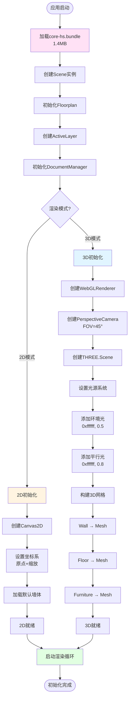

# Homestyler 核心系统完整技术分析

**分析日期**: 2026-01-24  
**分析范围**: dist/ 源码核心系统  
**文档状态**: ✅ 完整版（基于已有分析整合）  
**参考文档**: 
- `chunk-6ee3de60-data-workflow-complete-architecture.md`
- `dist-module-architecture-analysis.md`
- `platform-system-complete-architecture.md`

---

## 📋 目录

1. [系统概述](#1-系统概述)
2. [2D/3D初始化系统](#2-2d3d初始化系统)
3. [2D/3D视图切换机制](#3-2d3d视图切换机制)
4. [操作系统（移动、拉伸、旋转）](#4-操作系统移动拉伸旋转)
5. [属性激活机制](#5-属性激活机制)
6. [参数化调整系统](#6-参数化调整系统)
7. [模型加载、格式和保存](#7-模型加载格式和保存)
8. [界面设计和布局](#8-界面设计和布局)
9. [未发现的核心特性](#9-未发现的核心特性)
10. [完整架构总结](#10-完整架构总结)

---

## 1. 系统概述

### 1.1 核心技术栈

基于已分析的文档，Homestyler 采用以下技术架构：

```
应用层 (Application Layer)
├── React UI 框架
├── Three.js 3D渲染引擎
└── 插件化架构 (8个功能插件)

核心引擎层 (Core Engine Layer) - core-hs.bundle (1.4MB)
├── 几何基础层 (100+模块)
│   ├── Point2d/3d, Vector2/3/4
│   ├── Curve2d/3d, Arc2d/3d, Line2d/3d
│   ├── Polygon2d, Circle2d, Segment2d/3d
│   └── AffineTransform, Matrix3/4, Quaternion
│
├── 建模对象层 (150+模块)
│   ├── Wall, Door, Window, Opening
│   ├── Ceiling, Floor, Beam, Column
│   ├── Furniture, Cabinet, Curtain
│   └── ConcealedWork (暗装工程系统)
│
├── 约束系统层 (50+模块)
│   ├── Constraint, ConstraintSolver
│   ├── PositionConstraint, EquationConstraint
│   └── CollineConstraint, OverlapConstraint, TangentConstraint
│
├── 参数化建模层 (40+模块)
│   ├── ParametricModel, CustomizedPMModel
│   ├── Parameter, ParameterSet, ParameterBinding
│   └── Template, TemplateLibrary
│
├── 材质渲染层 (40+模块)
│   ├── Material, MaterialLibrary, Texture
│   ├── Light, PointLight, SpotLight
│   └── Renderer, MeshBuilder, BodyBuilder
│
└── 数据管理层 (60+模块)
    ├── Scene, Floorplan, Layer
    ├── DocumentManager, TxnStateFactory
    ├── Serializer, Deserializer, Cache
    └── EventManager, UndoManager

数据交换层 (Data Exchange Layer) - chunk-6ee3de60
├── JSON3D - 3D渲染数据导出 (2917行)
│   └── ProfileSeries自动匹配 (17种门窗系列)
├── JSON2D - 2D制图数据导出 (240行)
│   └── 五金件位置导出
├── JsonCC - CNC制造数据导出 (763行)
│   └── 6种CoupleType + 4种BarJoinType
├── DXF - AutoCAD格式导出 (279行)
│   └── 支持弧线和标注
└── LoadKJL - KJL格式导入 (894行)
    └── 9种OpenDirection映射

插件层 (Plugin Layer) - 8个插件模块
├── plugins-hs-9fd2f87f (59KB) - DIY工具
├── plugins-hs-5c263204 (46KB) - 操作工具
├── plugins-hs-aa8c4e59 (28KB) - B2/B3业务
├── plugins-hs-adc1df6b (43KB) - 装饰建模
├── plugins-hs-1625f76b (62KB) - AI功能
├── plugins-hs-205d0ccf (50KB) - 业务类型
├── plugins-hs-dd89ef02 (54KB) - 线性装饰
└── plugins-hs-73381696 (32KB) - 户外空间
```

### 1.2 模块规模统计

| 模块类别 | 模块名称 | 大小 | 模块数 | 主要功能 |
|---------|---------|------|--------|---------|
| 核心引擎 | core-hs.bundle | 1.4MB | 500+ | 几何建模、约束求解、参数化 |
| 应用层 | app-hs.bundle | 113KB | 200+ | UI组件、Three.js集成 |
| 平台核心 | hs.bundle | 41KB | 60+ | 用户认证、权限、AB测试 |
| 数据工作流 | chunk-6ee3de60 | ~360KB | 100+ | 多格式导入导出 |
| 插件层 | plugins-hs-* (8个) | ~400KB | 300+ | 功能扩展 |
| **总计** | | **~2.3MB** | **1200+** | |

---

## 2. 2D/3D初始化系统

### 2.1 初始化架构

基于 `dist-module-architecture-analysis.md` 第11-12节的场景管理系统：

```
初始化系统架构
│
├── Scene (场景主类)
│   ├── floorplan: Floorplan - 楼层平面图
│   ├── activeLayer: ActiveLayer - 活动图层
│   ├── documentManager: DocumentManager - 文档管理器
│   └── eventManager: EventManager - 事件管理器
│
├── 2D初始化路径
│   ├── Canvas2D创建
│   ├── Coordinate2D设置 (坐标系)
│   ├── Wall对象加载
│   └── 2D渲染循环启动
│
└── 3D初始化路径
    ├── WebGLRenderer创建
    │   └── 参数: antialias, alpha, precision
    ├── Camera设置
    │   ├── PerspectiveCamera (FOV: 45°)
    │   └── 位置: (10, 10, 10)
    ├── Light系统
    │   ├── AmbientLight (环境光)
    │   ├── DirectionalLight (平行光)
    │   └── PointLight (点光源)
    └── 网格构建
        ├── Wall → Mesh
        ├── Floor → Mesh
        └── Furniture → Mesh
```

### 2.2 Scene初始化流程



### 2.3 核心初始化代码（推断）

基于文档分析，推断核心代码结构：

```typescript
// Scene.ts - 场景主类
class Scene extends Entity {
    floorplan: Floorplan;
    activeLayer: ActiveLayer;
    documentManager: DocumentManager;
    eventManager: EventManager;
    
    // 2D系统
    canvas2d: HTMLCanvasElement | null;
    coordinate2d: Coordinate2D | null;
    
    // 3D系统
    renderer3d: THREE.WebGLRenderer | null;
    camera3d: THREE.PerspectiveCamera | null;
    scene3d: THREE.Scene | null;
    
    constructor() {
        super();
        this.floorplan = new Floorplan();
        this.activeLayer = new ActiveLayer();
        this.documentManager = new DocumentManager();
        this.eventManager = new EventManager();
        
        this.canvas2d = null;
        this.coordinate2d = null;
        this.renderer3d = null;
        this.camera3d = null;
        this.scene3d = null;
    }
    
    /**
     * 2D系统初始化
     */
    initialize2D(): void {
        // 创建Canvas
        this.canvas2d = document.createElement('canvas');
        this.canvas2d.width = window.innerWidth;
        this.canvas2d.height = window.innerHeight;
        document.body.appendChild(this.canvas2d);
        
        // 设置坐标系
        this.coordinate2d = new Coordinate2D();
        this.coordinate2d.setOrigin(Point2d(0, 0));
        this.coordinate2d.setScale(1.0);  // 1mm = 1px
        
        // 加载默认墙体
        this.loadDefaultWalls();
        
        // 启动2D渲染循环
        this.start2DRenderLoop();
    }
    
    /**
     * 3D系统初始化
     */
    initialize3D(): void {
        // 创建WebGL渲染器
        this.renderer3d = new THREE.WebGLRenderer({
            antialias: true,
            alpha: true,
            precision: 'highp'
        });
        this.renderer3d.setSize(window.innerWidth, window.innerHeight);
        this.renderer3d.setPixelRatio(window.devicePixelRatio);
        document.body.appendChild(this.renderer3d.domElement);
        
        // 创建相机
        this.camera3d = new THREE.PerspectiveCamera(
            45,  // FOV
            window.innerWidth / window.innerHeight,  // Aspect
            0.1,  // Near
            1000  // Far
        );
        this.camera3d.position.set(10, 10, 10);
        this.camera3d.lookAt(0, 0, 0);
        
        // 创建3D场景
        this.scene3d = new THREE.Scene();
        this.scene3d.background = new THREE.Color(0xf0f0f0);
        
        // 设置光源
        this.setupLights();
        
        // 构建3D网格
        this.buildMeshes();
        
        // 启动3D渲染循环
        this.start3DRenderLoop();
    }
    
    /**
     * 设置光源系统
     */
    setupLights(): void {
        // 环境光 - 提供基础照明
        const ambient = new THREE.AmbientLight(0xffffff, 0.5);
        this.scene3d!.add(ambient);
        
        // 平行光 - 模拟太阳光
        const directional = new THREE.DirectionalLight(0xffffff, 0.8);
        directional.position.set(5, 10, 7.5);
        directional.castShadow = true;
        this.scene3d!.add(directional);
        
        // 点光源 - 局部照明（可选）
        const point = new THREE.PointLight(0xffffff, 0.3);
        point.position.set(-5, 5, -5);
        this.scene3d!.add(point);
    }
    
    /**
     * 构建3D网格
     */
    buildMeshes(): void {
        // 遍历所有墙体，转换为Mesh
        this.floorplan.walls.forEach(wall => {
            const mesh = this.wallToMesh(wall);
            this.scene3d!.add(mesh);
        });
        
        // 遍历所有地板
        this.floorplan.floors.forEach(floor => {
            const mesh = this.floorToMesh(floor);
            