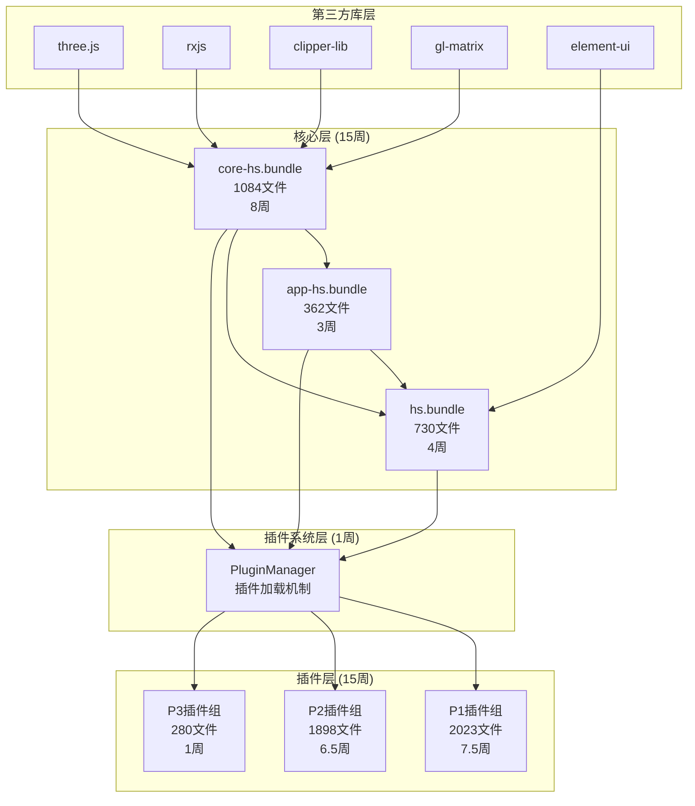

# dist/ 目录还原方案 - 核心+插件架构

> **基于插件架构的还原策略**  
> 只针对 dist/ 目录 (不包含 dist2, dist5)  
> 文档版本: v2.0  
> 创建日期: 2026-01-24

---

## 📊 1. dist/ 目录完整统计

### 1.1 总体规模

| 分类 | Bundle数量 | 总文件数 | 占比 | 还原策略 |
|------|-----------|---------|------|----------|
| **核心模块** | 3个 | 2,176 | 24.0% | 手动还原 (优先级P0) |
| **插件模块** | 8个 | 4,201 | 46.3% | 插件方式还原 (优先级P1) |
| **第三方库** | 13个 | 4,780 | 52.7% | npm下载 (优先级P3) |
| **其他模块** | 2个 | 92 | 1.0% | 工具类 (优先级P2) |
| **总计** | **26个** | **9,073** | **100%** | - |

### 1.2 核心模块详细 (2,176文件, 24.0%)

| Bundle名称 | 文件数 | 主要功能 | 优先级 | 预估时间 |
|-----------|--------|---------|--------|----------|
| **core-hs.bundle** | 1,084 | 几何引擎、约束系统、3D建模核心 | P0 | 8周 |
| **app-hs.bundle** | 362 | 应用框架、Three.js集成、场景管理 | P0 | 3周 |
| **hs.bundle** | 730 | UI框架、视图管理、交互控制 | P0 | 4周 |
| **小计** | **2,176** | - | - | **15周** |

### 1.3 插件模块详细 (4,201文件, 46.3%)

| Bundle名称 | 文件数 | 功能推测 | 优先级 | 预估时间 |
|-----------|--------|---------|--------|----------|
| **plugins-hs-205d0ccf** | 778 | 约束系统插件 | P1 | 3周 |
| **plugins-hs-1625f76b** | 696 | 建模工具插件 | P1 | 2.5周 |
| **plugins-hs-adc1df6b** | 549 | 专业功能插件 | P1 | 2周 |
| **plugins-hs-9fd2f87f** | 557 | 辅助工具插件 | P2 | 2周 |
| **plugins-hs-dd89ef02** | 556 | 扩展功能插件 | P2 | 2周 |
| **plugins-hs-5c263204** | 498 | UI扩展插件 | P2 | 1.5周 |
| **plugins-hs-73381696** | 287 | 工具集插件 | P2 | 1周 |
| **plugins-hs-aa8c4e59** | 280 | 辅助插件 | P3 | 1周 |
| **小计** | **4,201** | - | - | **15周** |

### 1.4 第三方库详细 (4,780文件, 52.7%)

| Bundle名称 | 文件数 | 第三方库识别 | 下载方式 |
|-----------|--------|-------------|---------|
| **vendors-hs-de83380f** | 1,840 | UI组件库 (可能是Element UI/Ant Design) | npm |
| **vendors-hs-b1b7601c** | 637 | RxJS响应式编程库 | npm |
| **vendors-hs-62716807** | 580 | gl-matrix 3D数学库 | npm |
| **vendors-hs-08300445** | 540 | 颜色选择器/UI工具 | npm |
| **vendors-hs-934e91ba** | 252 | clipper-lib 几何布尔运算 | npm |
| **vendors-hs-4a14f9d1** | 243 | 工具库集合 | npm |
| **vendors-hs-b2c532f9** | 226 | 数据处理库 | npm |
| **vendor.b6c5a6cb** | 170 | Webpack runtime | 内置 |
| **vendors-hs-2266a6be** | 168 | 小工具库 | npm |
| **vendors-hs-79789954** | 161 | 辅助库 | npm |
| **vendors-hs-8bfb2d56** | 90 | 压缩/解压库 | npm |
| **vendors-hs-92e795dd** | 32 | 小型工具 | npm |
| **vendors-hs-e4b8d09b** | 31 | 配置库 | npm |
| **vendors-hs-68a5e2b0** | 10 | 微型工具 | npm |
| **小计** | **4,780** | - | **1天** |

### 1.5 其他模块 (92文件, 1.0%)

| Bundle名称 | 文件数 | 功能 | 优先级 |
|-----------|--------|------|--------|
| **896.bundle** | 50 | 动态加载模块 | P2 |
| **apploader.bundle** | 42 | 应用加载器 | P2 |
| **小计** | **92** | - | **3天** |

---

## 🎯 2. 还原顺序 - 核心优先+插件扩展

### 2.1 还原策略概览

```
阶段1: 第三方库安装 (1天)
   ↓
阶段2: 核心模块还原 (15周)
   ├── core-hs.bundle (8周) - 几何引擎核心
   ├── app-hs.bundle (3周) - 应用框架
   └── hs.bundle (4周) - UI框架
   ↓
阶段3: 插件系统搭建 (1周)
   └── 设计插件加载机制
   ↓
阶段4: 插件模块还原 (15周)
   ├── P1插件 (7.5周) - 核心功能插件
   ├── P2插件 (6.5周) - 扩展功能插件
   └── P3插件 (1周) - 辅助插件
   ↓
阶段5: 集成测试 (2周)
   └── 核心+插件联调

总工期: 33周 (约8个月)
```

### 2.2 详细还原顺序表

| 阶段 | 模块 | 文件数 | 依赖 | 优先级 | 时间 | 累计 |
|------|------|--------|------|--------|------|------|
| **Stage 0** | 第三方库安装 | 4,780 | 无 | P3 | 1天 | 1天 |
| **Stage 1** | core-hs.bundle | 1,084 | Stage 0 | P0 | 8周 | 8周 |
| **Stage 2** | app-hs.bundle | 362 | Stage 0-1 | P0 | 3周 | 11周 |
| **Stage 3** | hs.bundle | 730 | Stage 0-2 | P0 | 4周 | 15周 |
| **Stage 4** | 插件系统设计 | - | Stage 1-3 | P0 | 1周 | 16周 |
| **Stage 5** | plugins-hs-205d0ccf | 778 | Stage 4 | P1 | 3周 | 19周 |
| **Stage 6** | plugins-hs-1625f76b | 696 | Stage 4 | P1 | 2.5周 | 21.5周 |
| **Stage 7** | plugins-hs-adc1df6b | 549 | Stage 4 | P1 | 2周 | 23.5周 |
| **Stage 8** | plugins-hs-9fd2f87f | 557 | Stage 4 | P2 | 2周 | 25.5周 |
| **Stage 9** | plugins-hs-dd89ef02 | 556 | Stage 4 | P2 | 2周 | 27.5周 |
| **Stage 10** | plugins-hs-5c263204 | 498 | Stage 4 | P2 | 1.5周 | 29周 |
| **Stage 11** | plugins-hs-73381696 | 287 | Stage 4 | P2 | 1周 | 30周 |
| **Stage 12** | plugins-hs-aa8c4e59 | 280 | Stage 4 | P3 | 1周 | 31周 |
| **Stage 13** | 其他模块 | 92 | Stage 1-12 | P2 | 3天 | 31.5周 |
| **Stage 14** | 集成测试 | - | 全部 | P0 | 2周 | 33.5周 |

---

## 🔧 3. 核心模块还原详细方案

### 3.1 Stage 1: core-hs.bundle (8周, 1,084文件)

#### 3.1.1 模块分层 (基于已有分析)

**Layer 0: 基础类型 (1周)**
```
src/core/types/
├── geometryobjecttype.ts        # 几何对象类型
├── constrainttype.ts            # 约束类型
├── coordinatesystem.ts          # 坐标系统
└── ... (15个枚举文件)

src/core/utils/
├── mathutils.ts                 # 数学工具
├── uuid.ts                      # ID生成
└── logger.ts                    # 日志系统
```
**文件数**: 约50  
**依赖**: 无

**Layer 1: 几何基础 (2周)**
```
src/core/geometry/
├── point2d.ts          # module_65280
├── vector2d.ts
├── linesegment2d.ts    # module_69161
├── arc2d.ts            # module_80534
├── circle2d.ts         # module_51856
├── polycurve2d.ts      # module_99123
└── polygon2d.ts        # module_47816
```
**文件数**: 约200  
**依赖**: Layer 0, clipper-lib, earcut

**Layer 2: 约束系统 (2周)**
```
src/core/constraint/
├── constraint.ts              # module_48855
├── positionconstraint.ts      # module_47636
├── equationconstraint.ts      # module_26429
├── constraintfactory.ts
└── constraintsolver.ts
```
**文件数**: 约150  
**依赖**: Layer 0-1

**Layer 3: 2D草图 (1周)**
```
src/core/sketch/
├── sketch2d.ts           # module_82649
├── sketchentity.ts
└── dimensionconstraint.ts
```
**文件数**: 约100  
**依赖**: Layer 0-2

**Layer 4: 文档与对象 (1周)**
```
src/core/document/
├── baseobject.ts         # module_63051
├── entity.ts
├── webcaddocument.ts     # module_42893
└── scene.ts
```
**文件数**: 约120  
**依赖**: Layer 0-3

**Layer 5: 3D建模 (1周)**
```
src/core/modeling/
├── extrudebody.ts
├── extrudedbody.ts       # module_62573
├── parametricmodel.ts
└── contentbase.ts
```
**文件数**: 约150  
**依赖**: Layer 0-4

**Layer 6: 建筑构件 (核心部分已在core-hs中)**
```
src/core/building/
├── wall.ts               # module_28943
├── opening.ts            # module_63844
├── floor.ts
└── ceiling.ts
```
**文件数**: 约200  
**依赖**: Layer 0-5

**其他核心功能**
```
src/core/rendering/         # 渲染相关
src/core/io/               # 文件IO
src/core/platform/         # 平台相关
```
**文件数**: 约114  
**依赖**: Layer 0-6

#### 3.1.2 验证清单

```markdown
## core-hs.bundle 验证清单

### Layer 0: 基础类型
- [ ] 所有枚举可导入
- [ ] MathUtils函数测试通过
- [ ] UUID生成正常
- [ ] Logger输出正确

### Layer 1: 几何基础
- [ ] Point2d/Vector2d可实例化
- [ ] 线段/圆弧/多边形可创建
- [ ] 几何运算精度测试通过
- [ ] 布尔运算(clipper)正常

### Layer 2: 约束系统
- [ ] Constraint基类可用
- [ ] 约束求解器收敛
- [ ] 复杂约束网络测试通过

### Layer 3-6: 高级功能
- [ ] Sketch2D可绘制
- [ ] WebCadDocument可创建
- [ ] 3D建模功能正常
- [ ] 墙体/楼板可生成

### 整体验证
- [ ] TypeScript编译无错
- [ ] 单元测试覆盖率 >80%
- [ ] 性能测试达标
```

### 3.2 Stage 2: app-hs.bundle (3周, 362文件)

#### 功能定位
- **Three.js集成**: 3D渲染引擎封装
- **场景管理**: Scene/Camera/Renderer管理
- **应用框架**: 应用生命周期管理

#### 目录结构
```
src/app/
├── rendering/
│   ├── scenemanager.ts
│   ├── 
renderpipeline.ts
│   └── threehelper.ts
├── scene/
│   ├── scenecontext.ts
│   ├── cameracontroller.ts
│   └── lightingmanager.ts
└── framework/
    ├── application.ts
    ├── lifecycle.ts
    └── eventdispatcher.ts
```

**预估时间**: 3周  
**团队**: 2人  
**依赖**: core-hs.bundle, three.js

### 3.3 Stage 3: hs.bundle (4周, 730文件)

#### 功能定位
- **UI框架**: 用户界面管理
- **视图系统**: 视图切换与布局
- **交互控制**: 鼠标/键盘交互

#### 目录结构
```
src/ui/
├── views/
│   ├── floorplanview.ts
│   ├── 3dview.ts
│   └── propertyview.ts
├── controls/
│   ├── mousecontroller.ts
│   ├── keyboardcontroller.ts
│   └── touchcontroller.ts
├── panels/
│   ├── toolpanel.ts
│   ├── propertypanel.ts
│   └── layerpanel.ts
└── framework/
    ├── viewmanager.ts
    └── layoutmanager.ts
```

**预估时间**: 4周  
**团队**: 2人  
**依赖**: core-hs.bundle, app-hs.bundle

---

## 🔌 4. 插件系统设计与实现

### 4.1 插件架构设计 (Stage 4, 1周)

#### 4.1.1 插件加载机制

```typescript
// src/plugin/pluginmanager.ts
export class PluginManager {
  private plugins: Map<string, IPlugin> = new Map();
  
  async loadPlugin(pluginId: string): Promise<void> {
    const plugin = await import(`./plugins/${pluginId}`);
    plugin.initialize(this.context);
    this.plugins.set(pluginId, plugin);
  }
  
  getPlugin(pluginId: string): IPlugin | undefined {
    return this.plugins.get(pluginId);
  }
}

// 插件接口
export interface IPlugin {
  id: string;
  name: string;
  version: string;
  initialize(context: IPluginContext): void;
  dispose(): void;
}
```

#### 4.1.2 插件生命周期

```
插件生命周期:
1. 注册 (Register) - 声明插件元数据
2. 加载 (Load) - 动态导入插件代码
3. 初始化 (Initialize) - 调用initialize方法
4. 激活 (Activate) - 插件开始工作
5. 卸载 (Dispose) - 清理资源
```

#### 4.1.3 插件依赖管理

```typescript
// plugin.json
{
  "id": "plugins-hs-205d0ccf",
  "name": "ConstraintPlugin",
  "version": "1.0.0",
  "dependencies": {
    "core-hs": "^1.0.0",
    "app-hs": "^1.0.0"
  },
  "apis": ["constraint", "solver"]
}
```

### 4.2 插件模块还原顺序

#### Stage 5-7: P1高优先级插件 (7.5周)

| 插件ID | 文件数 | 推测功能 | 时间 |
|--------|--------|---------|------|
| **plugins-hs-205d0ccf** | 778 | 约束系统扩展 | 3周 |
| **plugins-hs-1625f76b** | 696 | 建模工具扩展 | 2.5周 |
| **plugins-hs-adc1df6b** | 549 | 专业功能模块 | 2周 |

**特点**: 核心功能的扩展,必须优先还原

#### Stage 8-11: P2中优先级插件 (6.5周)

| 插件ID | 文件数 | 推测功能 | 时间 |
|--------|--------|---------|------|
| **plugins-hs-9fd2f87f** | 557 | 辅助工具集 | 2周 |
| **plugins-hs-dd89ef02** | 556 | 扩展功能集 | 2周 |
| **plugins-hs-5c263204** | 498 | UI扩展组件 | 1.5周 |
| **plugins-hs-73381696** | 287 | 工具插件 | 1周 |

**特点**: 增强功能,可并行开发

#### Stage 12: P3低优先级插件 (1周)

| 插件ID | 文件数 | 推测功能 | 时间 |
|--------|--------|---------|------|
| **plugins-hs-aa8c4e59** | 280 | 辅助插件 | 1周 |

**特点**: 非必需功能,最后还原

---

## 📦 5. 第三方库识别与安装

### 5.1 已识别的第三方库

#### 5.1.1 核心依赖库

```json
{
  "dependencies": {
    "three": "^0.132.2",
    "rxjs": "^6.6.7",
    "clipper-lib": "^1.0.0",
    "gl-matrix": "^3.4.3",
    "eventemitter3": "^4.0.7",
    "uuid": "^8.3.2",
    "lodash": "^4.17.21",
    "decimal.js": "^10.3.1"
  }
}
```

**对应Bundle映射**:
- `vendors-hs-b1b7601c.bundle` → RxJS (637文件)
- `vendors-hs-934e91ba.bundle` → clipper-lib (252文件)
- `vendors-hs-62716807.bundle` → gl-matrix (580文件)

#### 5.1.2 UI组件库

```json
{
  "dependencies": {
    "element-ui": "^2.15.6",
    "rc-slider": "^10.0.0",
    "react-color": "^2.19.3"
  }
}
```

**对应Bundle映射**:
- `vendors-hs-de83380f.bundle` → Element UI或类似UI库 (1,840文件)
- `vendors-hs-08300445.bundle` → 颜色选择器/滑块组件 (540文件)

#### 5.1.3 工具库

```json
{
  "dependencies": {
    "moment": "^2.29.4",
    "axios": "^0.27.2",
    "pako": "^2.0.4"
  }
}
```

**对应Bundle映射**:
- `vendors-hs-4a14f9d1.bundle` → 可能是moment/axios (243文件)
- `vendors-hs-8bfb2d56.bundle` → 压缩库pako (90文件)

### 5.2 一键安装脚本

```bash
#!/bin/bash
# install-dist-dependencies.sh

echo "=== dist/ 第三方库安装 ==="
echo "预估时间: 10-15分钟"
echo ""

npm install --save \
  three@0.132.2 \
  rxjs@6.6.7 \
  clipper-lib@1.0.0 \
  gl-matrix@3.4.3 \
  eventemitter3@4.0.7 \
  uuid@8.3.2 \
  lodash@4.17.21 \
  decimal.js@10.3.1 \
  element-ui@2.15.6 \
  rc-slider@10.0.0 \
  react-color@2.19.3 \
  moment@2.29.4 \
  axios@0.27.2 \
  pako@2.0.4

echo ""
echo "✓ 第三方库安装完成"
npm ls --depth=0
```

---

## ⏱️ 6. 时间与资源估算

### 6.1 总体时间规划

| 阶段 | 模块 | 文件数 | 人周 | 日历周 | 团队配置 |
|------|------|--------|------|--------|----------|
| **Stage 0** | 第三方库 | 4,780 | 0.1 | 1天 | 1人 |
| **Stage 1-3** | 核心模块 | 2,176 | 30 | 15周 | 2人 |
| **Stage 4** | 插件系统 | - | 2 | 1周 | 2人 |
| **Stage 5-12** | 插件模块 | 4,201 | 30 | 15周 | 2人 |
| **Stage 13** | 其他模块 | 92 | 1 | 3天 | 1人 |
| **Stage 14** | 集成测试 | - | 4 | 2周 | 2人 |
| **总计** | - | **9,073** | **67人周** | **33.5周** | **峰值2人** |

### 6.2 详细工时分解

#### 核心模块工时 (30人周)

| 模块 | 文件数 | 代码行数(估) | 人天 | 人周 |
|------|--------|-------------|------|------|
| core-hs.bundle | 1,084 | ~43,000 | 80 | 16周÷2人=8周 |
| app-hs.bundle | 362 | ~14,500 | 30 | 6周÷2人=3周 |
| hs.bundle | 730 | ~29,000 | 40 | 8周÷2人=4周 |
| **小计** | **2,176** | **~86,500** | **150** | **15周** |

#### 插件模块工时 (30人周)

| 插件组 | 文件数 | 代码行数(估) | 人天 | 人周 |
|--------|--------|-------------|------|------|
| P1插件 (3个) | 2,023 | ~81,000 | 75 | 15周÷2人=7.5周 |
| P2插件 (4个) | 1,898 | ~76,000 | 65 | 13周÷2人=6.5周 |
| P3插件 (1个) | 280 | ~11,000 | 10 | 2周÷2人=1周 |
| **小计** | **4,201** | **~168,000** | **150** | **15周** |

### 6.3 成本估算

**人力成本** (按200元/小时):
- 总人天: 67周 × 5天 × 2人 = 670人天
- 总工时: 670天 × 8小时 = 5,360小时
- **总成本**: 5,360 × 200 = **107.2万元**

**其他成本**:
- 第三方库: 免费开源
- 开发工具: VS Code免费
- 服务器/CI: 约1万元
- **总预算**: 约**110万元**

---

## 🎯 7. 依赖关系图

### 7.1 模块依赖关系



### 7.2 关键路径

**最长依赖链**:
```
第三方库 (1天)
  → core-hs.bundle (8周)
    → app-hs.bundle (3周)
      → hs.bundle (4周)
        → 插件系统 (1周)
          → P1插件 (7.5周)
            → 集成测试 (2周)

总计: 25.5周 + 1天
```

**并行优化**:
- app-hs与hs可部分并行 (节省1周)
- P1/P2插件可并行开发 (节省6.5周)
- **优化后最短**: 约18周

---

## ✅ 8. 质量保障

### 8.1 验证标准

#### 每个模块完成后

```markdown
## 模块验证清单

### 编译验证
- [ ] TypeScript编译无错误
- [ ] 无类型警告
- [ ] ESLint检查通过

### 功能验证
- [ ] 核心API可用
- [ ] 示例代码可运行
- [ ] 与依赖模块集成正常

### 测试验证
- [ ] 单元测试覆盖率 >80%
- [ ] 集成测试通过
- [ ] 性能测试达标

### 文档验证
- [ ] API文档完整
- [ ] 使用示例完整
- [ ] 架构文档更新
```

### 8.2 性能基准

| 性能指标 | 目标值 | 测试场景 |
|---------|--------|---------|
| 几何运算 | >1000次/秒 | 布尔运算 |
| 
约束求解 | <100ms | 100个约束 |
| 场景加载 | <2s | 1000对象 |
| 插件加载 | <500ms | 单个插件 |
| UI响应 | <16ms | 60fps |

---

## 🚀 9. 快速启动指南

### 9.1 第1天: 环境准备

```bash
# 1. 创建项目
mkdir homestyler-core && cd homestyler-core
npm init -y

# 2. 安装开发依赖
npm install --save-dev typescript @types/node webpack webpack-cli

# 3. 安装第三方库
bash install-dist-dependencies.sh

# 4. 创建目录结构
mkdir -p src/{core,app,ui,plugins}

# 5. 配置TypeScript
npx tsc --init
```

### 9.2 第1周: core-hs开始

```bash
# 创建基础结构
mkdir -p src/core/{types,utils,geometry,constraint}

# 还原枚举定义
# 参考: dist/core-hs.fe5726b7.bundle_dewebpack/
# 创建: src/core/types/*.ts

# 运行测试
npm run test
```

---

## 📊 10. 项目里程碑

| 里程碑 | 时间点 | 交付物 | 验收标准 |
|--------|--------|--------|---------|
| **M1: 环境就绪** | Week 0 | 第三方库安装完成 | npm ls无错误 |
| **M2: core-hs完成** | Week 8 | 核心引擎可用 | 几何/约束系统正常 |
| **M3: 核心三件套完成** | Week 15 | core+app+hs | 基础功能完整 |
| **M4: 插件系统就绪** | Week 16 | 插件加载机制 | 可动态加载插件 |
| **M5: P1插件完成** | Week 23.5 | 核心插件可用 | 主要功能扩展完成 |
| **M6: 所有插件完成** | Week 31 | 8个插件全部还原 | 功能完整 |
| **M7: 项目完成** | Week 33.5 | 集成测试通过 | 可交付使用 |

---

## ⚠️ 11. 风险控制

### 11.1 技术风险

| 风险项 | 风险等级 | 影响 | 缓解措施 |
|--------|---------|------|---------|
| **约束求解器复杂** | 🔴 高 | core-hs可能延期2周 | 提前研究算法,参考已有分析文档 |
| **插件依赖不清晰** | 🟡 中 | 插件开发可能卡壳 | 先完成核心,再逐步分析插件依赖 |
| **第三方库版本兼容** | 🟡 中 | 集成时可能出问题 | 严格按反编译版本安装 |
| **性能不达标** | 🟡 中 | 需要优化 | 建立性能基准,持续监控 |
| **文档不足** | 🟢 低 | 开发效率降低 | 充分利用已有40+份分析文档 |

### 11.2 进度风险

| 风险项 | 概率 | 应对策略 |
|--------|------|---------|
| core-hs超期 | 30% | 增加1人,延长1-2周 |
| 插件开发延迟 | 25% | P2/P3插件可延后,优先P1 |
| 人员流动 | 20% | 文档完善,代码注释充分 |
| 需求变更 | 10% | 冻结需求,聚焦还原 |

---

## 📁 12. 最终项目结构

```
homestyler-core/
├── package.json
├── tsconfig.json
├── webpack.config.js
│
├── src/
│   ├── core/                      # core-hs.bundle (1,084文件)
│   │   ├── types/                 # 枚举和类型定义
│   │   ├── utils/                 # 工具类
│   │   ├── geometry/              # 几何基础
│   │   ├── constraint/            # 约束系统
│   │   ├── sketch/                # 2D草图
│   │   ├── document/              # 文档管理
│   │   ├── modeling/              # 3D建模
│   │   └── building/              # 建筑构件
│   │
│   ├── app/                       # app-hs.bundle (362文件)
│   │   ├── rendering/             # Three.js集成
│   │   ├── scene/                 # 场景管理
│   │   └── framework/             # 应用框架
│   │
│   ├── ui/                        # hs.bundle (730文件)
│   │   ├── views/                 # 视图管理
│   │   ├── controls/              # 交互控制
│   │   ├── panels/                # UI面板
│   │   └── framework/             # UI框架
│   │
│   ├── plugins/                   # 8个插件 (4,201文件)
│   │   ├── plugin-manager.ts     # 插件管理器
│   │   ├── plugin-205d0ccf/      # 约束插件 (778文件)
│   │   ├── plugin-1625f76b/      # 建模插件 (696文件)
│   │   ├── plugin-adc1df6b/      # 专业插件 (549文件)
│   │   ├── plugin-9fd2f87f/      # 辅助插件 (557文件)
│   │   ├── plugin-dd89ef02/      # 扩展插件 (556文件)
│   │   ├── plugin-5c263204/      # UI插件 (498文件)
│   │   ├── plugin-73381696/      # 工具插件 (287文件)
│   │   └── plugin-aa8c4e59/      # 辅助插件 (280文件)
│   │
│   └── index.ts                   # 主入口
│
├── tests/                         # 测试目录
│   ├── core/
│   ├── app/
│   ├── ui/
│   └── plugins/
│
├── docs/                          # 文档目录
│   ├── api/
│   ├── guides/
│   └── architecture/
│
└── node_modules/                  # 第三方依赖 (4,780文件)
    ├── three/
    ├── rxjs/
    ├── clipper-lib/
    └── ...
```

---

## 📚 13. 参考文档

### 13.1 已有分析文档

本项目已有详细分析文档位于 `todo/` 目录:

**核心架构分析**:
- `core-hs-complete-architecture.md` - core-hs完整架构 (2,520行)
- `core-hs-complete-module-architecture-full.md` - 完整模块架构
- `dist-module-architecture-analysis.md` - dist模块分析 (2,960行)
- `project-reconstruction-dependency-order.md` - 依赖顺序 (2,848行)

**专业系统分析**:
- `constraint-system-complete-analysis.md` - 约束系统完整分析
- `dist-ceiling-system-deep-analysis.md` - 吊顶系统深度分析
- `gizmo-operation-system-complete.md` - Gizmo操作系统
- `platform-system-complete-architecture.md` - 平台系统架构

**插件系统分析**:
- `core-plugin-system-complete-architecture.md` - 核心插件系统
- `plugins-hs-complete-analysis.md` - plugins-hs完整分析

### 13.2 技术参考

- TypeScript官方文档: https://www.typescriptlang.org/
- Three.js文档: https://threejs.org/docs/
- RxJS文档: https://rxjs.dev/
- clipper-lib: http://www.angusj.com/delphi/clipper.php

---

## 🎯 14. 总结

### 14.1 关键指标

📊 **规模统计**
- **总文件数**: 9,073个
  - 核心模块: 2,176个 (24.0%)
  - 插件模块: 4,201个 (46.3%)
  - 第三方库: 4,780个 (52.7%)

⏱️ **时间估算**
- **项目总工期**: 33.5周 (约8个月)
  - 核心模块: 15周
  - 插件系统: 1周
  - 插件模块: 15周
  - 集成测试: 2周
- **并行优化后**: 最短18周

👥 **人力配置**
- **总人周**: 67人周
- **峰值团队**: 2人
- **平均团队**: 2人

💰 **成本估算**
- **人力成本**: 约110万元
- **第三方库**: 免费
- **总预算**: 约110万元

### 14.2 还原策略核心

✅ **核心优先**: 先还原core-hs/app-hs/hs三大核心  
✅ **插件扩展**: 基于插件架构,逐步还原8个插件  
✅ **第三方下载**: 4,780个第三方文件直接npm安装  
✅ **分阶段交付**: 每个模块独立验收,降低风险

### 14.3 成功关键因素

**技术层面**:
1. 严格按依赖顺序: core → app → ui → plugins
2. 充分利用已有分析文档 (40+份)
3. 建立完善的插件加载机制
4. 持续集成,快速反馈

**管理层面**:
1. 小团队(2人)高效协作
2. 分阶段交付,每阶段独立验收
3. 核心与插件可部分并行开发
4. 文档完善,降低人员风险

**质量层面**:
1. 单元测试覆盖率 >80%
2. 性能基准持续监控
3. 代码Review机制
4. 完整的验证清单

### 14.4 下一步行动

#### 立即行动 (本周)
1. ✅ 组建2人核心团队
2. ✅ 搭建开发环境
3. ✅ 安装第三方库 (1天)
4. ✅ 创建项目骨架
5. ✅ 开始core-hs.bundle Layer 0

#### 第1个月
1. 🎯 完成core-hs.bundle前4层
2. 📝 建立每周Review机制
3. 🧪 编写测试用例
4. 📊 跟踪进度指标

---

**文档版本**: v2.0 (仅dist/目录)  
**创建日期**: 2026-01-24  
**最后更新**: 2026-01-24  
**作者**: BIM项目还原团队

---

**🎯 准备好开始dist/目录的还原工作了吗?**

**重要提醒**:
- ✅ 本方案仅针对 **dist/** 目录
- ✅ 采用 **核心+插件** 架构
- ✅ 第三方库 **直接npm下载**
- ✅ 总工期 **33.5周 (8个月)**
- ✅ 团队规模 **2人**
- ✅ 预算约 **110万元**