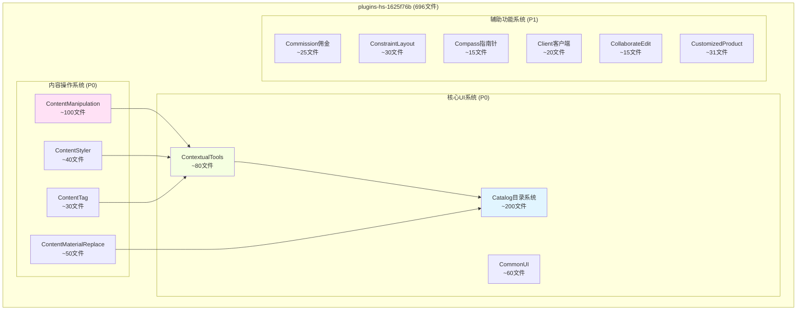
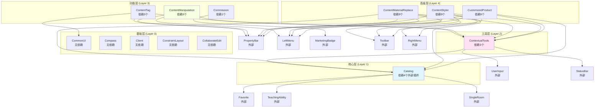

# plugins-hs-1625f76b 目录&建模工具插件完整分析

> **第二大插件: Catalog目录系统 + 建模工具集合**  
> 文件数: 696个 (仅次于205d0ccf的778个)  
> 插件定位: 核心UI系统 + 内容操作工具  
> 文档版本: v1.0  
> 创建日期: 2026-01-24

---

## 📋 目录

1. [插件概述](#1-插件概述)
2. [核心架构](#2-核心架构)
3. [子插件清单](#3-子插件清单)
4. [文件结构分析](#4-文件结构分析)
5. [Catalog目录系统](#5-catalog目录系统)
6. [建模工具系统](#6-建模工具系统)
7. [命令系统](#7-命令系统)
8. [UI组件系统](#8-ui组件系统)
9. [依赖关系](#9-依赖关系)
10. [还原计划](#10-还原计划)

---

## 🎯 1. 插件概述

### 1.1 插件定位

**plugins-hs-1625f76b** 是Homestyler的**核心UI与建模工具集合插件**，包含：

```
📁 plugins-hs-1625f76b (696文件)
├── 🎨 Catalog目录系统 (最大子系统)
├── 🛠️ 建模工具集 (13个命令)
├── 🎛️ UI组件库 (CommonUI, ContextualTools)
├── 🔧 内容操作 (ContentManipulation, ContentTag)
└── 💼 辅助功能 (Commission, Client, Compass)
```

### 1.2 规模统计

| 分类 | 数量 | 占比 | 说明 |
|------|------|------|------|
| **Module文件** | 570 | 81.9% | Webpack模块 |
| **命名文件** | 124 | 17.8% | 语义化命名 |
| **总文件数** | 696 | 100% | - |

**命名文件分类**:
- 工具类 (util): 58个
- 页面组件 (page): 17个
- 处理器 (handler): 18个
- 命令 (cmd): 13个
- 请求 (request): 14个
- 适配器 (adapter): 2个
- 插件主类 (plugin): 1个
- 属性栏 (propertybar): 1个

### 1.3 核心功能

#### 功能矩阵

| 功能域 | 子系统 | 文件数估算 | 核心价值 |
|--------|--------|-----------|---------|
| **目录系统** | Catalog | ~200 | 模型库、材质库、模板库管理 |
| **内容操作** | ContentManipulation | ~100 | 移动、缩放、旋转家具 |
| **上下文工具** | ContextualTools | ~80 | 动态工具栏、属性栏 |
| **通用UI** | CommonUI | ~60 | 弹窗、下拉菜单等组件 |
| **材质替换** | ContentMaterialReplace | ~50 | 材质编辑与替换 |
| **样式复制** | ContentStyler | ~40 | 快速复用样式 |
| **内容标签** | ContentTag | ~30 | 标签管理 |
| **佣金系统** | Commission | ~25 | 电商佣金功能 |
| **其他功能** | 其他7个子插件 | ~111 | 辅助功能 |

---

## 🏗️ 2. 核心架构

### 2.1 插件组成图



### 2.2 依赖层级

```
Layer 0: 基础插件 (无依赖)
├── CommonUI (通用UI组件)
├── Compass (指南针)
└── Client (客户端)

Layer 1: 核心系统 (依赖Layer 0)
├── Catalog (依赖: Favorite, TeachingAbility, SingleRoom)
└── ConstraintLayout (依赖: 无)

Layer 2: 工具系统 (依赖Layer 1)
├── ContextualTools (依赖: Catalog, UserInput, StatusBar)
└── CollaborateEdit (依赖: 无明确)

Layer 3: 功能插件 (依赖Layer 1-2)
├── ContentManipulation (依赖: ContextualTools, PropertyBar, LeftMenu)
├── ContentTag (依赖: ContextualTools, PropertyBar, CommonUI)
├── ContentMaterialReplace (依赖: 9个插件)
├── ContentStyler (依赖: 9个插件)
└── CustomizedProductPlugin (依赖: 9个插件)

Layer 4: 辅助功能
└── Commission (依赖: MarketingBadge)
```

---

## 📦 3. 子插件清单

### 3.1 注册的13个子插件

| # | 插件类型 | 插件名称 | 文件数估算 | 优先级 | 功能描述 |
|---|----------|---------|-----------|--------|---------|
| 1 | **Catalog** | 目录系统插件 | ~200 | P0 | 模型库、材质库、模板库核心 |
| 2 | **ContextualTools** | 上下文工具插件 | ~80 | P0 | 动态工具栏、状态栏 |
| 3 | **ContentManipulation** | 内容操作插件 | ~100 | P0 | 移动、缩放、旋转 |
| 4 | **CommonUI** | 通用UI插件 | ~60 | P0 | 弹窗、下拉菜单组件 |
| 5 | **ContentMaterialReplace** | 材质替换插件 | ~50 | P1 | 材质编辑与替换 |
| 6 | **ContentStyler** | 样式复制插件 | ~40 | P1 | 快速复用样式 |
| 7 | **ContentTag** | 内容标签插件 | ~30 | P1 | 标签管理 |
| 8 | **ConstraintLayout** | 约束布局插件 | ~30 | P1 | 布局约束系统 |
| 9 | **CustomizedProductPlugin** | 自定义产品插件 | ~31 | P1 | 自定义产品管理 |
| 10 | **Commission** | 佣金系统插件 | ~25 | P2 | 电商佣金计算 |
| 11 | **Client** | 客户端插件 | ~20 | P2 | 客户端功能 |
| 12 | **CollaborateEdit** | 协作编辑插件 | ~15 | P2 | 多人协作 |
| 13 | **Compass** | 指南针插件 | ~15 | P2 | 方向指示 |

**总计**: 13个子插件，696个文件

---

## 📂 4. 文件结构分析

### 4.1 文件类型统计

```
plugins-hs-1625f76b/
├── module_*.js (570个, 81.9%)
│   └── Webpack编译后的模块文件
│
├── cmd*.js (13个, 1.9%)
│   ├── cmdapplymoodboardlayout.js
│   ├── cmdcontentarcarray.js
│   ├── cmdcontentmaterialmovereplace.js
│   ├── cmdeditparametricbackgroundwallisautofit.js
│   ├── cmdmoveinharddecoration.js
│   ├── cmdmovencpbackgroundwallunit.js
│   ├── cmdmovencpbgwallinwfa.js
│   ├── cmdmoveparametricbackgroundwall.js
│   ├── cmdreplacezooweerrmodel.js
│   ├── cmdresizeinharddecoration.js
│   ├── cmdrotatecontent.js
│   ├── cmdrotatecontents.js
│   └── cmdrotateinharddecoration.js
│
├── handler*.js (18个, 2.6%)
│   ├── handler.js (主Handler)
│   ├── handler_2.js
│   ├── handler_3.js
│   ├── handler_4.js
│   ├── handler_5.js
│   ├── *propertybarhandler*.js (各种属性栏处理器)
│   └── ...
│
├── *page*.js (17个, 2.4%)
│   ├── aimoodboardpage.js (AI情绪板页面)
│   ├── aicreatepage.js (AI创建页面)
│   ├── airesultpage.js (AI结果页面)
│   ├── myaimodelerpage.js
│   ├── myaimoodboardpage.js
│   ├── enterpriseaimoodboardpage.js
│   └── ...
│
├── *container*.js (容器组件)
│   ├── merchantlandingpagecontainer.js
│   ├── merchantlistpagecontainer.js
│   ├── teambrandlistpagecontainer.js
│   └── teambrandpagecontainer.js
│
├── *request*.js (14个, 2.0%)
│   ├── applygeometrymaterialtopocketrequest.js
│   ├── movencpbackgroundwallunitrequest.js
│   └── ...
│
├── adapter*.js (2个, 0.3%)
│   ├── changencpbackgroundwallbaseadapter.js
│   └── changeparametriccontentbaseadapter.js
│
└── utils & others (58个, 8.3%)
    ├── materialutils.js
    ├── entityselector.js
    ├── snapto.js
    ├── xscale.js
    └── ...
```

### 4.2 
关键代码定位

| 文件 | Module ID | 功能 | 行数 |
|------|-----------|------|------|
| `module_33249.js` | 33249 | **Catalog插件主类** | 582 |
| `module_665765.js` | 665765 | **ContextualTools插件** | 183 |
| `module_59104.js` | 59104 | **ContentManipulation插件** | 109 |
| `module_137761.js` | 137761 | **CommonUI插件** | 171 |
| `module_525129.js` | 525129 | **ContentTag插件** | 73 |
| `module_847940.js` | 847940 | **ContentMaterialReplace插件** | 99 |
| `module_572294.js` | 572294 | **ContentStyler插件** | 91 |
| `constraintlayoutplugin.js` | - | **ConstraintLayout插件** | 681 |
| `module_26129.js` | 26129 | **Commission插件** | 120 |

---

## 🎨 5. Catalog目录系统

### 5.1 Catalog插件定义

```typescript
// 源码: module_33249.js:52-582
class CatalogPlugin extends HSApp.Plugin.IPlugin {
  constructor() {
    super({
      name: "General plugin",
      description: "provide general environment for floorplan",
      dependencies: [
        HSFPConstants.PluginType.Favorite,
        "hsw.brand.ezhome.firstlogin.Plugin",
        HSFPConstants.PluginType.TeachingAbility,
        HSFPConstants.PluginType.SingleRoom
      ]
    });
    
    // 核心属性
    this.handler = undefined;
    this.ui = undefined;
    this.env = HSFPConstants.Environment.Default;
    this.menuData = undefined;
    this.catalogSignalManager = undefined;
    this.baseApiManager = undefined;
    this.appCatalogManager = undefined;
    
    // 信号系统
    this.signalItemClicked = undefined;
    this.signalItemMouseOver = undefined;
    this.signalItemMouseOut = undefined;
    this.signalIndependentHidden = undefined;
    this.signalCustomizedProductPanelRegistered = undefined;
    this.signalExpandCatalog = undefined;
    this.signalShowCatalog = undefined;
    this.signalMenuItemClick = undefined;
    this.signalUploadItemsClick = undefined;
    this.signalPageScrollStart = undefined;
    this.signalCatalogRenderEnd = undefined;
    
    // 初始化管理器
    this.catalogSignalManager = HSApp.Catalog.CatalogSignalManager.getInstance();
    this.baseApiManager = HSApp.Catalog.BaseApiManager.getInstance();
    this.handler = new Handler();
    this.ui = new UI();
  }
  
  onActive(context, deps) {
    this.app = context.app;
    this.appCatalogManager = HSApp.Catalog.Manager;
    this.cmdMgr = this.app.cmdManager;
    
    // 注册命令
    this.cmdMgr.register(
      HSFPConstants.CommandType.PlaceProduct,
      HSFPConstants.CommandType.Sequence,
      PlaceProductCommand
    );
    
    this.cmdMgr.register(
      HSFPConstants.CommandType.OpenIndependentPanel,
      OpenIndependentPanelCommand,
      (args) => [this].concat(args)
    );
    
    // 初始化
    this.handler.init(context, this.appCatalogManager);
    this.appCatalogManager.init();
    this.ui.init(this.appCatalogManager);
    
    // 显示目录
    this.rootContainer = document.querySelector('.catalogLibContainer');
    this.showCatalog();
    this.listenSignal(context);
  }
}

// 注册
HSApp.Plugin.registerPlugin(
  HSFPConstants.PluginType.Catalog,
  CatalogPlugin,
  HSCore.Util.Object.nullFunction  // 无预加载
);
```

### 5.2 Catalog核心功能

#### 5.2.1 目录管理

```typescript
// 显示目录
showCatalog(forceUpdate = false): void

// 隐藏目录
hideCatalog(): void

// 切换目录显示
toggleCatalog(isShow: boolean): void

// 按分类ID显示页面
showPageByCategoryId(options: {
  categoryId: string;
  menuId: string;
}): void
```

#### 5.2.2 独立面板

```typescript
// 打开独立替换面板
async openIndependentPanel(
  options: {
    getFrontCategoryId?: boolean;
    showModelRecovery?: boolean;
    query?: any;
    replaceScene?: boolean;
  },
  callback?: Function,
  context?: any
): Promise<void>

// 关闭独立面板
closeIndependent(): void

// 设置面板初始位置
setIndependentPanelInitialPos(pos: { x: number; y: number }): void
```

#### 5.2.3 自定义产品

```typescript
// 添加自定义产品
addCustomizedProduct(
  productData: any,
  category?: string
): Promise<any>

// 更新自定义产品
updateCustomizedProduct(
  productId: string,
  productData: any,
  category: string
): Promise<any>

// 删除自定义产品
deleteCustomizedProduct(
  productId: string,
  category: string
): Promise<any>

// 删除普通产品
deleteProduct(productId: string): Promise<any>
```

#### 5.2.4 目录查询

```typescript
// 查询模板
QueryTemplate(
  type: string,
  params: any,
  callback: Function
): Promise<any>

// 设置模型ID搜索
setModelIdsSearch(modelIds: string[]): void

// 清除模型ID搜索
clearModelIdsSearch(): void
```

#### 5.2.5 信号系统

Catalog插件提供了丰富的信号机制：

```typescript
// 项目交互信号
signalItemClicked: Signal;        // 项目被点击
signalItemMouseOver: Signal;      // 鼠标悬停
signalItemMouseOut: Signal;       // 鼠标移出

// 面板信号
signalIndependentHidden: Signal;  // 独立面板隐藏
signalIndependentPanelShow: Signal; // 独立面板显示
signalExpandCatalog: Signal;      // 目录展开
signalShowCatalog: Signal;        // 目录显示

// 用户操作信号
signalMenuItemClick: Signal;      // 菜单项点击
signalUploadItemsClick: Signal;   // 上传项点击
signalUploadModelClick: Signal;   // 上传模型点击

// 页面信号
signalPageScrollStart: Signal;    // 页面滚动开始
signalPageNumChange: Signal;      // 页面编号变化
signalCatalogRenderEnd: Signal;   // 目录渲染完成
signalCatalogTabsClick: Signal;   // 标签页点击
```

### 5.3 Catalog页面组件

#### AI相关页面

```typescript
// AI情绪板页面
aimoodboardpage.js
myaimoodboardpage.js
enterpriseaimoodboardpage.js

// AI创建页面
aicreatepage.js
myaimodelerpage.js

// AI结果页面
airesultpage.js
```

#### 商户页面

```typescript
// 商户落地页容器
merchantlandingpagecontainer.js

// 商户列表页容器
merchantlistpagecontainer.js

// 团队品牌页容器
teambrandpagecontainer.js
teambrandlistpagecontainer.js
```

### 5.4 BaseApiManager

Catalog插件的API管理器提供数据接口：

```typescript
get BaseApiManager() {
  return this.baseApiManager;
}

// BaseApiManager提供的方法:
// - dataManager.getPublicTemplateRoom()
// - dataManager.getModelChannelSearch()
// - dataManager.getMerchentPublicStylerProduct()
// - dataManager.getMyStylerProduct()
// - dataManager.deleteCustomizedProduct()
// - dataManager.updateCustomizedProduct()
```

---

## 🛠️ 6. 建模工具系统

### 6.1 ContentManipulation插件

```typescript
// 源码: module_59104.js:36-109
class ContentManipulationPlugin extends HSApp.Plugin.IPlugin {
  constructor() {
    super({
      name: "Content Manipulation plugin",
      description: "Content manipulation functions: move, resize, rotate",
      dependencies: [
        HSFPConstants.PluginType.ContextualTools,
        HSFPConstants.PluginType.PropertyBar,
        HSFPConstants.PluginType.LeftMenu
      ]
    });
    
    this.signalContextualtoolElevationRefresh = new HSCore.Util.Signal(this);
    this._handler = new ContentManipulationHandler();
  }
  
  onActive(context, deps) {
    this._handler.init_(context, deps);
  }
  
  // 公共API
  showSizecard() {
    this._handler.showsizecard_();
  }
  
  hideSizecard() {
    this._handler.hidesizecard_();
  }
  
  replaceCustomizedMoldingType(entity, type) {
    this._handler.getPropertyBarV2Handlers().replaceCustomizedMoldingType(entity, type);
  }
  
  replaceNCustomizedMoldingType(entity) {
    this._handler.getPropertyBarV2Handlers().replaceNCustomizedMoldingType(entity);
  }
  
  registerGizmo(view) {
    return this._handler._registerGizmo(view);
  }
  
  unregisterGizmo(view, gizmo) {
    this._handler._unregisterGizmo(view, gizmo);
  }
}
```

### 6.2 ContentManipulation功能

#### 尺寸卡片 (Sizecard)

- **showSizecard()**: 显示尺寸编辑卡片
- **hideSizecard()**: 隐藏尺寸卡片
- **用途**: 实时显示和编辑家具/构件尺寸

#### Gizmo注册

- **registerGizmo(view)**: 注册Gizmo到视图
- **unregisterGizmo(view, gizmo)**: 取消注册Gizmo
- **用途**: 管理交互控制器生命周期

#### 模型替换

- **replaceCustomizedMoldingType()**: 替换自定义线脚类型
- **replaceNCustomizedMoldingType()**: 替换新版自定义线脚类型

### 6.3 命令系统 (13个命令)

#### 移动命令 (5个)

| 命令文件 | 功能 | 说明 |
|---------|------|------|
| `cmdmoveinharddecoration.js` | 硬装移动 | 移动硬装元素 |
| `cmdmovencpbackgroundwallunit.js` | NCP背景墙单元移动 | 新版背景墙移动 |
| `cmdmovencpbgwallinwfa.js` | NCP背景墙WFA移动 | 背景墙全屋方案移动 
|
| `cmdmoveparametricbackgroundwall.js` | 参数化背景墙移动 | 旧版背景墙移动 |
| `cmdcontentmaterialmovereplace.js` | 内容材质移动替换 | 材质移动时替换 |

#### 旋转命令 (3个)

| 命令文件 | 功能 | 说明 |
|---------|------|------|
| `cmdrotatecontent.js` | 旋转内容 | 旋转单个对象 |
| `cmdrotatecontents.js` | 旋转多个内容 | 批量旋转 |
| `cmdrotateinharddecoration.js` | 硬装旋转 | 硬装元素旋转 |

#### 缩放命令 (1个)

| 命令文件 | 功能 | 说明 |
|---------|------|------|
| `cmdresizeinharddecoration.js` | 硬装缩放 | 硬装元素缩放 |

#### 布局命令 (2个)

| 命令文件 | 功能 | 说明 |
|---------|------|------|
| `cmdapplymoodboardlayout.js` | 应用情绪板布局 | AI情绪板应用 |
| `cmdcontentarcarray.js` | 内容弧形阵列 | 圆形阵列摆放 |

#### 编辑命令 (2个)

| 命令文件 | 功能 | 说明 |
|---------|------|------|
| `cmdeditparametricbackgroundwallisautofit.js` | 编辑参数化背景墙自适应 | 背景墙适配开关 |
| `cmdreplacezooweerrmodel.js` | 替换Zooweer模型 | 特定模型替换 |

### 6.4 请求系统 (14个Request)

#### 几何操作请求

```typescript
// 应用几何材质到口袋
applygeometrymaterialtopocketrequest.js

// 移动NCP背景墙单元
movencpbackgroundwallunitrequest.js
```

---

## 🎛️ 7. ContextualTools上下文工具系统

### 7.1 插件定义

```typescript
// 源码: module_665765.js:36-183
class ContextualToolsPlugin extends HSApp.Plugin.IPlugin {
  constructor() {
    super({
      name: "contextual tools plugin",
      description: "show contextual tools UI for floorplan",
      dependencies: [
        HSFPConstants.PluginType.Catalog,
        HSFPConstants.PluginType.UserInput,
        HSFPConstants.PluginType.StatusBar
      ]
    });
    
    // 信号
    this.signalPopulateStatusBar = new HSCore.Util.Signal(this);
    this.signalPopulateCommandStatusBar = new HSCore.Util.Signal(this);
    this.signalRetiringStatusBar = new HSCore.Util.Signal(this);
    this.signalCanvasChanging = new HSCore.Util.Signal(this);
    this.signalContralPopup = new HSCore.Util.Signal(this);
    
    this._handler = new ContextualToolsHandler();
  }
  
  onActive(context, deps) {
    const app = context.app;
    this._handler.init_(app, this, deps);
    
    // 监听刷新信号
    app.signalContextualtoolRefresh.listen(this.onRefresh, this);
  }
  
  onDeactive() {
    this._handler.uninit_();
  }
}
```

### 7.2 核心功能

#### 状态栏管理

```typescript
// 显示状态栏
showStatusBar(): void

// 隐藏状态栏
hideStatusBar(force?: boolean): void

// 更新状态栏
update(data?: any): void

// 刷新状态栏
refresh(entity?: Entity, options?: {
  refreshStatusBar?: boolean;
  updateHeight?: boolean;
}): void
```

#### Web模式支持

```typescript
// Web模式属性栏可见性
willShowPropertyBarItemsForWeb(): boolean
showStatusBarItemsForWeb(): void
hideStatusBarItemsForWeb(): void
willShowStatusBarItemsForWeb(): boolean
```

#### Hookup管理

```typescript
// 禁用所有Hookup
disableAllHookups(): void

// 启用所有Hookup
enableAllHookups(): void
```

#### 自定义建模环境

```typescript
// 自定义建模环境变化
onCustomizedModelingEnvironmentChanged(env: string): void
```

---

## 🧩 8. UI组件系统

### 8.1 CommonUI插件

```typescript
// 源码: module_137761.js:42-171
class CommonUIPlugin extends HSApp.Plugin.IPlugin {
  constructor() {
    super({
      name: "CommonUI plugin",
      description: "provide CommonUI component for floorplan",
      dependencies: []  // 无依赖,基础插件
    });
    
    // 全局挂载
    window.updateMouseTips = this.updateMouseTips.bind(this);
  }
  
  onActive(context) {
    // 加载鼠标提示UI
    getXMLResource(MouseTooltipTemplate, (xml) => {
      $('#editor').append($(xml));
    }, 'div.mousetooltip');
  }
}
```

### 8.2 CommonUI组件API

#### 鼠标提示

```typescript
// 更新鼠标提示
updateMouseTips(
  text: string,
  position: { x: number; y: number },
  style?: {
    background?: string;
    txtColor?: string;
  }
): void

// 立即更新鼠标提示
updateMouseTipsImmediate(
  text: string,
  position: { x: number; y: number },
  style?: any
): void
```

#### 下拉菜单

```typescript
// 创建下拉菜单
createDropdownMenu(options: {
  refname: string;
  data: any[];
  title: string;
  name: string;
  classname: string;
  onchanged: Function;
  placeholder: string;
}): React.Element
```

#### 弹窗组件

```typescript
// 创建弹窗
createPopupwindow(options: {
  windowname: string;
  title: string;
  contents: React.Element;
  oklabel: string;
  cancellabel: string;
  maskClosable: boolean;
  width: number;
  height: number;
  submitcall: Function;
  cancelcall: Function;
  hasHelp: boolean;
  tooltipHtml: string;
  popover: any;
  tooltip: any;
}): React.Element

// 创建可拖拽弹窗
createDragPopupWindow(options: {
  ref: any;
  windowname: string;
  class: string;
  headername: string;
  contents: React.Element;
  winwidth: number;
  wintop: number;
  winright: number;
  submitcall: Function;
  cancelCmd: Command;
}): React.Element
```

#### 工具函数

```typescript
// 获取工具类
getUtil(): UtilClass
```

---

## 🎨 9. 材质与样式系统

### 9.1 ContentMaterialReplace插件

```typescript
// 源码: module_847940.js
class ContentMaterialReplacePlugin extends HSApp.Plugin.IPlugin {
  constructor() {
    super({
      name: "Content Material Replace plugin",
      description: "support reset material",
      dependencies: [
        HSFPConstants.PluginType.ContextualTools,
        HSFPConstants.PluginType.Toolbar,
        HSFPConstants.PluginType.Catalog,
        HSFPConstants.PluginType.RightMenu,
        HSFPConstants.PluginType.LeftMenu,
        "hsw.plugin.viewswitch.Plugin",
        "hsw.plugin.resizewidget.Plugin",
        HSFPConstants.PluginType.PageHeader,
        HSFPConstants.PluginType.PropertyBar
      ]  // 依赖9个插件!
    });
    
    this.handler = new ContentMaterialReplaceHandler();
  }
}
```

**特点**: 
- ⚠️ **依赖最多的插件** (9个依赖)
- 需要完整的UI系统支持
- 涉及目录、工具栏、菜单等多个系统

### 9.2 ContentStyler插件

```typescript
// 源码: module_572294.js
class ContentStylerPlugin extends HSApp.Plugin.IPlugin {
  constructor() {
    super({
      name: "Content Styler plugin",
      description: "quick reuse content style to others",
      dependencies: [
        HSFPConstants.PluginType.ContextualTools,
        HSFPConstants.PluginType.PropertyBar,
        HSFPConstants.PluginType.Toolbar,
        HSFPConstants.PluginType.Catalog,
        HSFPConstants.PluginType.RightMenu,
        HSFPConstants.PluginType.LeftMenu,
        "hsw.plugin.resizewidget.Plugin",
        HSFPConstants.PluginType.PageHeader,
        HSFPConstants.PluginType.ViewSwitch
      ]  // 依赖9个插件
    });
    
    this.handler = new ContentStylerHandler();
  }
}
```

**功能**: 快速复制一个对象的样式(材质、颜色、纹理)到其他对象

---

## 🏷️ 10. ContentTag内容标签系统

### 10.1 插件定义

```typescript
// 源码: module_525129.js:36-73
class ContentTagPlugin extends HSApp.Plugin.IPlugin {
  constructor() {
    super({
      name: "Content Tag plugin",
      description: "Content Tag functions",
      dependencies: [
        HSFPConstants.PluginType.ContextualTools,
        HSFPConstants.PluginType.PropertyBar,
        HSFPConstants.PluginType.CommonUI
      ]
    });
    
    this._handler = new ContentTagHandler();
  }
  
  onActive(context, deps) {
    this._handler.init(context, deps);
  }
  
  // 公共API
  initFloorplan(floorplan, scene, context) {
    this._handler.initFloorplan(floorplan, scene, context);
  }
}
```

### 10.2 功能说明

- **内容标签管理**: 为模型添加标签
- **标签初始化**: 初始化户型图标签系统
- **依赖**: 需要上下文工具和属性栏支持

---

## 💼 11. 辅助功能系统

### 11.1 Commission佣金系统

```typescript
// 源码: module_26129.js
class CommissionPlugin extends HSApp.Plugin.IPlugin {
  constructor() {
    super({
      name: "Commission plugin",
      description: "E-commerce commission system",
      dependencies: [
        HSFPConstants.PluginType.MarketingBadge
      ]
    });
  }
}

// 注册时提供nullFunction作为preloader
HSApp.Plugin.registerPlugin(
  HSFPConstants.PluginType.Commission,
  CommissionPlugin,
  HSCore.Util.Object.nullFunction
);
```

**功能**: 
- 
电商佣金计算
- 显示佣金信息
- 商家绑定管理
- 佣金数据持久化

**使用场景**: 电商版Homestyler中计算设计师佣金

### 11.2 Compass指南针

```typescript
// 源码: module_620684.js
class CompassPlugin extends HSApp.Plugin.IPlugin {
  constructor() {
    super({
      name: "Compass plugin",
      description: "Direction indicator",
      dependencies: []
    });
  }
}
```

**功能**: 2D视图中的方向指示器

### 11.3 Client客户端

```typescript
// 源码: module_886743.js
class ClientPlugin extends HSApp.Plugin.IPlugin {
  constructor() {
    super({
      name: "Client plugin",
      description: "Client-side features",
      dependencies: []
    });
  }
}
```

**功能**: 客户端特定功能封装

### 11.4 CollaborateEdit协作编辑

```typescript
// 源码: module_432076.js
class CollaborateEditPlugin extends HSApp.Plugin.IPlugin {
  constructor() {
    super({
      name: "Collaborate Edit plugin",
      description: "Multi-user collaboration",
      dependencies: []
    });
  }
}
```

**功能**: 多人协作编辑支持

### 11.5 ConstraintLayout约束布局

```typescript
// 源码: constraintlayoutplugin.js
class ConstraintLayoutPlugin extends HSApp.Plugin.IPlugin {
  constructor() {
    super({
      name: "Constraint Layout plugin",
      description: "Auto layout with constraints",
      dependencies: []
    });
  }
}
```

**功能**: 
- 自动布局引擎
- 约束规则管理
- 智能摆放家具

### 11.6 CustomizedProductPlugin自定义产品

```typescript
// 源码: module_204423.js
class CustomizedProductPlugin extends HSApp.Plugin.IPlugin {
  constructor() {
    super({
      name: "Customized Product plugin",
      description: "support content part reset material",
      dependencies: [
        HSFPConstants.PluginType.ContextualTools,
        HSFPConstants.PluginType.Toolbar,
        HSFPConstants.PluginType.LeftMenu,
        HSFPConstants.PluginType.ViewSwitch,
        HSFPConstants.PluginType.PageHeader,
        HSFPConstants.PluginType.PropertyBar,
        HSFPConstants.PluginType.ResizeWidget,
        HSFPConstants.PluginType.Catalog,
        HSFPConstants.PluginType.SingleRoom
      ]  // 依赖9个插件
    });
  }
}
```

**功能**: 
- 自定义产品管理
- 产品部件材质重置
- 与Catalog集成

---

## 🔗 12. 依赖关系分析

### 12.1 完整依赖图



### 12.2 依赖统计

| 插件 | 依赖数 | 依赖列表 |
|------|--------|---------|
| **ContentMaterialReplace** | 9 | ContextualTools, Toolbar, Catalog, RightMenu, LeftMenu, ViewSwitch, ResizeWidget, PageHeader, PropertyBar |
| **ContentStyler** | 9 | ContextualTools, PropertyBar, Toolbar, Catalog, RightMenu, LeftMenu, ResizeWidget, PageHeader, ViewSwitch |
| **CustomizedProductPlugin** | 9 | ContextualTools, Toolbar, LeftMenu, ViewSwitch, PageHeader, PropertyBar, ResizeWidget, Catalog, SingleRoom |
| **Catalog** | 4 | Favorite, FirstLogin, TeachingAbility, SingleRoom |
| **ContextualTools** | 3 | Catalog, UserInput, StatusBar |
| **ContentManipulation** | 3 | ContextualTools, PropertyBar, LeftMenu |
| **ContentTag** | 3 | ContextualTools, PropertyBar, CommonUI |
| **Commission** | 1 | MarketingBadge |
| **CommonUI** | 0 | 无 |
| **Compass** | 0 | 无 |
| **Client** | 0 | 无 |
| **ConstraintLayout** | 0 | 无 |
| **CollaborateEdit** | 0 | 无 |

**关键发现**:
- ✅ 5个插件无依赖,可优先还原
- ⚠️ 3个插件依赖9个外部插件,需最后还原
- 📊 平均依赖数: 3.5个/插件

### 12.3 外部依赖汇总

本插件bundle依赖**其他bundle**的插件:

| 外部插件 | 来源Bundle推测 | 被依赖次数 |
|---------|--------------|-----------|
| **PropertyBar** | plugins-hs-adc1df6b | 6次 |
| **LeftMenu** | plugins-hs-73381696 | 5次 |
| **Toolbar** | plugins-hs-205d0ccf | 4次 |
| **RightMenu** | plugins-hs-205d0ccf | 3次 |
| **StatusBar** | plugins-hs-205d0ccf | 2次 |
| **UserInput** | plugins-hs-dd89ef02 | 2次 |
| **Favorite** | plugins-hs-5c263204 | 1次 |
| **TeachingAbility** | plugins-hs-205d0ccf | 1次 |
| **SingleRoom** | plugins-hs-205d0ccf | 3次 |
| **MarketingBadge** | 896.bundle | 2次 |
| **ViewSwitch** | plugins-hs-dd89ef02 | 3次 |
| **PageHeader** | plugins-hs-adc1df6b | 3次 |
| **ResizeWidget** | plugins-hs-205d0ccf | 3次 |

---

## 📊 13. 详细文件结构

### 13.1 按功能分组

#### 组1: Catalog目录系统 (~200文件)

**核心文件**:
```
catalog/
├── module_33249.js                  # Catalog主插件类
├── handler.js                       # Catalog主Handler
├── handler_2.js, handler_3.js      # 辅助Handler
│
├── pages/                          # 页面组件 (17个)
│   ├── aimoodboardpage.js          # AI情绪板
│   ├── myaimoodboardpage.js
│   ├── enterpriseaimoodboardpage.js
│   ├── aicreatepage.js             # AI创建页面
│   ├── myaimodelerpage.js
│   ├── airesultpage.js             # AI结果页
│   ├── aimoodboarditem.js
│   └── ...
│
├── containers/                      # 容器组件 (4个)
│   ├── merchantlandingpagecontainer.js
│   ├── merchantlistpagecontainer.js
│   ├── teambrandpagecontainer.js
│   └── teambrandlistpagecontainer.js
│
├── utils/
│   ├── materialutils.js
│   ├── entityselector.js
│   ├── propertytreeparseutil.js
│   ├── replaceutil.js
│   └── ...
│
└── modules/ (~170个module_*.js)
```

#### 组2: ContentManipulation内容操作 (~100文件)

**核心文件**:
```
content-manipulation/
├── module_59104.js                  # 插件主类
├── module_455497.js                 # Handler实现
│
├── commands/                        # 13个命令
│   ├── cmdmoveinharddecoration.js
│   ├── cmdresizeinharddecoration.js
│   ├── cmdrotateinharddecoration.js
│   ├── cmdrotatecontent.js
│   ├── cmdrotatecontents.js
│   ├── cmdcontentarcarray.js
│   └── ...
│
├── gizmos/                         # Gizmo交互
│   └── (嵌入在handler中)
│
└── modules/ (~80个module_*.js)
```

#### 组3: ContextualTools上下文工具 (~80文件)

**核心文件**:
```
contextual-tools/
├── module_665765.js                 # 插件主类
├── module_129567.js                 # Handler实现
│
├── statusbar/                      # 状态栏系统
│   └── (动态工具栏)
│
└── modules/ (~75个module_*.js)
```

#### 组4: CommonUI通用组件 (~60文件)

**核心文件**:
```
common-ui/
├── module_137761.js                 # 插件主类
├── module_241921.js                 # DropdownMenu组件
├── module_91658.js                  # DragPopupWindow组件
├── module_448098.js                 # MouseTooltip模板
│
└── modules/ (~55个module_*.js)
```

#### 组5: 材质与样式 (~90文件)

**核心文件**:
```
material-style/
├── module_847940.js                 # ContentMaterialReplace
├── module_572294.js                 # ContentStyler
├── contentmaterialreplacecatalog.js
├── materialedittype.js
│
├── propertybar-handlers/           # 属性栏处理器
│   ├── 
customizedlightslotpropertybarhandler.js
│   ├── customizedlightbandpropertybarhandler.js
│   ├── customizedmoldingpropertybarhandler.js
│   ├── customizedmoldingpropertybarhandler_2.js
│   ├── ncustomizedlightslotpropertybarhandler.js
│   ├── ncustomizedmoldingpropertybarhandler.js
│   ├── ncustomizedbeampropertybarhandler.js
│   ├── ncustomizedstructurepropertybarhandler.js
│   ├── ncpbackgroundwallbasepropertybarhandler.js
│   ├── ncpceilingpropertybarhandler.js
│   ├── columnpropertybarhandler.js
│   └── parametriccontentbasepropertybarhandler.js
│
├── adapters/                        # 适配器 (2个)
│   ├── changencpbackgroundwallbaseadapter.js
│   └── changeparametriccontentbaseadapter.js
│
└── modules/ (~40个module_*.js)
```

#### 组6: 其他辅助 (~66文件)

```
auxiliary/
├── module_26129.js                  # Commission插件
├── module_886743.js                 # Client插件
├── module_620684.js                 # Compass插件
├── module_432076.js                 # CollaborateEdit插件
├── module_204423.js                 # CustomizedProduct插件
├── module_525129.js                 # ContentTag插件
├── constraintlayoutplugin.js       # ConstraintLayout插件
│
├── utils/
│   ├── snapto.js
│   ├── xscale.js
│   ├── loading.js
│   ├── shoprank.js
│   ├── imagesearchbutton.js
│   ├── cliptaskintergration.js
│   └── ...
│
└── modules/ (~50个module_*.js)
```

### 13.2 代码量估算

| 文件类型 | 数量 | 平均行数 | 总行数估算 |
|---------|------|---------|-----------|
| Module文件 | 570 | 150 | ~85,500 |
| 命令文件 | 13 | 300 | ~3,900 |
| Handler文件 | 18 | 250 | ~4,500 |
| 页面组件 | 17 | 200 | ~3,400 |
| Request文件 | 14 | 150 | ~2,100 |
| 工具类 | 58 | 100 | ~5,800 |
| 其他 | 6 | 100 | ~600 |
| **总计** | **696** | **~152** | **~105,800** |

---

## 🔍 14. 关键代码分析

### 14.1 Catalog插件核心代码

#### 初始化流程

```typescript
// 源码: module_33249.js:145-156
onActive(context, deps) {
  this.app = context.app;
  this.appCatalogManager = HSApp.Catalog.Manager;
  
  // 调用父类onActive
  super.onActive(context, deps);
  
  this.cmdMgr = this.app.cmdManager;
  
  // 注册PlaceProduct命令
  this.cmdMgr.register(
    HSFPConstants.CommandType.PlaceProduct,
    HSFPConstants.CommandType.Sequence,
    PlaceProductCommand
  );
  
  // 注册OpenIndependentPanel命令
  this.cmdMgr.register(
    HSFPConstants.CommandType.OpenIndependentPanel,
    OpenIndependentPanelCommand,
    (args) => [this].concat(args)  // 注入this作为第一个参数
  );
  
  // 初始化Handler和UI
  this.handler.init(context, this.appCatalogManager);
  this.appCatalogManager.init();
  this.ui.init(this.appCatalogManager);
  
  // 显示目录
  this.rootContainer = document.querySelector('.catalogLibContainer');
  this.setIndependentPanelInitialPos();
  this.showCatalog();
  this.listenSignal(context);
}
```

#### 信号监听

```typescript
// 源码: module_33249.js:159-194
listenSignal(context) {
  const firstLoginPlugin = this.app.pluginManager.getPlugin(
    'hsw.brand.ezhome.firstlogin.Plugin'
  );
  
  this.signalHook = new HSCore.Util.SignalHook(this);
  
  // 监听权限检查完成
  this.signalHook.listen(
    firstLoginPlugin.signalCheckPermissionsCompleted,
    () => {
      if (this.app.isUnderDefaultEnvironment()) {
        if (this.catalogShow) {
          this.showCatalog(true);
          HSApp.Catalog.Manager.signalToCatalog(
            EventBusType.getCategoryTree
          );
        } else {
          this.showCatalog();
        }
      }
    }
  );
  
  // 监听文档打开
  this.signalHook.listen(
    context.app.signalDocumentOpened,
    () => {
      this.clearModelIdsSearch();
    }
  );
  
  // 监听环境切换
  this.signalHook.listen(
    context.app.signalEnvironmentActivated,
    (e) => {
      if (this.checkEnvironments(e.data.oldEnvironmentId) &&
          e.data.newEnvironmentId === HSFPConstants.Environment.Default) {
        this.showCatalog();
      }
    }
  );
}
```

### 14.2 ContextualTools核心逻辑

#### 刷新机制

```typescript
// 源码: module_665765.js:115-130
onRefresh(event) {
  const app = HSApp.App.getApp();
  const data = event.data;
  
  if (app.selectionManager.count > 0 || (data && data.forceUpdate)) {
    const refreshStatusBar = data ? data.refreshStatusBar : undefined;
    const options = {
      refreshStatusBar: refreshStatusBar === undefined || refreshStatusBar,
      updateHeight: false
    };
    
    this.refresh(undefined, options);
  }
}
```

#### Handler初始化

```typescript
// Handler包含复杂的信号监听逻辑
onActive(context, deps) {
  const app = context.app;
  this._handler.init_(app, this, deps);
  
  // 监听应用刷新信号
  app.signalContextualtoolRefresh.listen(this.onRefresh, this);
}
```

### 14.3 ContentManipulation核心功能

#### Handler初始化

```typescript
// 源码: module_455497.js (Handler实现)
_handler.init_(context, deps) {
  this._app = context.app;
  
  // 获取依赖插件
  const contextualTools = deps[HSFPConstants.PluginType.ContextualTools];
  const propertyBar = deps[HSFPConstants.PluginType.PropertyBar];
  const leftMenu = deps[HSFPConstants.PluginType.LeftMenu];
  
  this._contextualToolsPlugin = contextualTools;
  this._cmdMgr = context.app.cmdManager;
  
  // 初始化
  this._initDomRoot();
  this._registerCommands(cmdMgr);
  this._registerRequests(context.app.transManager);
  this._registerGizmo(context.app.getMain2DView());
  this._registerGizmo(context.app.getAux2DView());
  
  this.sizecardIsHidden = true;
}
```

---

## 🎯 15. 插件间协作模式

### 15.1 Catalog与其他插件协作

#### 与Favorite协作

```typescript
// Catalog中使用Favorite
const favoritePlugin = deps[HSFPConstants.PluginType.Favorite];

// 获取收藏容器
const favContainer = favoritePlugin.favTopicContainer;

// 改变模板收藏状态
favoritePlugin.changeTemplateFavoriteStatus(data);

// 获取模板收藏ID
const favoriteId = favoritePlugin.getTemplateFavoriteId(templateId);
```

#### 与Autostyler协作

```typescript
// Catalog触发Autostyler
const autostylerPlugin = app.pluginManager.getPlugin(
  HSFPConstants.PluginType.Autostyler
);

// 创建模板房间
autostylerPlugin.createTemplateRoom(type, callback);

// 获取策略管理器
const strategyManager = autostylerPlugin.getStrategyManager();
strategyManager.deleteData();
```

#### 与TaskCenter协作

```typescript
// 触发任务中心信号
const taskCenter = app.pluginManager.getPlugin(
  HSFPConstants.PluginType.TaskCenter
);

taskCenter.inspirationLibrarySignal.dispatch({
  type: 'apply_all',
  data: ...
});
```

### 15.2 ContextualTools协作模式

#### 驱动PropertyBar更新

```typescript
// ContextualTools刷新后通知PropertyBar
const propertyBar = app.pluginManager.getPlugin(
  HSFPConstants.PluginType.PropertyBar
);

if (propertyBar) {
  propertyBar.update();
}
```

#### 监听Catalog信号

```typescript
// 监听Catalog的sizeGrow信号
const catalogPlugin = deps[HSFPConstants.PluginType.Catalog];

this.signalHook.listen(
  catalogPlugin.signalSizeGrow,
  () => {
    this.refresh();
  }
);
```

### 15.3 ContentManipulation协作

#### 触发ContextualTools刷新

```typescript
// 操作完成后刷新上下文工具
const ctxTools = app.pluginManager.getPlugin(
  HSFPConstants.PluginType.ContextualTools
);

ctxTools.refresh(undefined, {
  refreshStatusBar: false
});
```

#### 更新PropertyBar

```typescript
// 尺寸改变后更新属性栏
const propertyBar = app.pluginManager.getPlugin(
  HSFPConstants.PluginType.PropertyBar
);

if (propertyBar) {
  propertyBar.update();
}
```

---

## 📐 16. 属性栏处理器系统

### 16.1 PropertyBarHandler家族

plugins-hs-1625f76b包含**12个专用属性栏处理器**:

| Handler文件 | 处理对象 | 功能 |
|------------|---------|------|
| `customizedlightslotpropertybarhandler.js` | 灯槽 | 自定义灯槽属性 |
| `customizedlightbandpropertybarhandler.js` | 灯带 | 自定义灯带属性 |
| `customizedmoldingpropertybarhandler.js` | 线脚 | 自定义线脚属性 |
| `customizedmoldingpropertybarhandler_2.js` | 