# plugins-hs-1625f76b 目录&建模工具插件完整分析

> **第二大插件: Catalog目录系统 + 建模工具集合**  
> 文件数: 696个 (仅次于205d0ccf的778个)  
> 插件定位: 核心UI系统 + 内容操作工具  
> 文档版本: v1.0  
> 创建日期: 2026-01-24

---

## 📋 目录

1. [插件概述](#1-插件概述)
2. [核心架构](#2-核心架构)
3. [子插件清单](#3-子插件清单)
4. [文件结构分析](#4-文件结构分析)
5. [Catalog目录系统](#5-catalog目录系统)
6. [建模工具系统](#6-建模工具系统)
7. [命令系统](#7-命令系统)
8. [UI组件系统](#8-ui组件系统)
9. [依赖关系](#9-依赖关系)
10. [还原计划](#10-还原计划)

---

## 🎯 1. 插件概述

### 1.1 插件定位

**plugins-hs-1625f76b** 是Homestyler的**核心UI与建模工具集合插件**，包含：

```
📁 plugins-hs-1625f76b (696文件)
├── 🎨 Catalog目录系统 (最大子系统)
├── 🛠️ 建模工具集 (13个命令)
├── 🎛️ UI组件库 (CommonUI, ContextualTools)
├── 🔧 内容操作 (ContentManipulation, ContentTag)
└── 💼 辅助功能 (Commission, Client, Compass)
```

### 1.2 规模统计

| 分类 | 数量 | 占比 | 说明 |
|------|------|------|------|
| **Module文件** | 570 | 81.9% | Webpack模块 |
| **命名文件** | 124 | 17.8% | 语义化命名 |
| **总文件数** | 696 | 100% | - |

**命名文件分类**:
- 工具类 (util): 58个
- 页面组件 (page): 17个
- 处理器 (handler): 18个
- 命令 (cmd): 13个
- 请求 (request): 14个
- 适配器 (adapter): 2个
- 插件主类 (plugin): 1个
- 属性栏 (propertybar): 1个

### 1.3 核心功能

#### 功能矩阵

| 功能域 | 子系统 | 文件数估算 | 核心价值 |
|--------|--------|-----------|---------|
| **目录系统** | Catalog | ~200 | 模型库、材质库、模板库管理 |
| **内容操作** | ContentManipulation | ~100 | 移动、缩放、旋转家具 |
| **上下文工具** | ContextualTools | ~80 | 动态工具栏、属性栏 |
| **通用UI** | CommonUI | ~60 | 弹窗、下拉菜单等组件 |
| **材质替换** | ContentMaterialReplace | ~50 | 材质编辑与替换 |
| **样式复制** | ContentStyler | ~40 | 快速复用样式 |
| **内容标签** | ContentTag | ~30 | 标签管理 |
| **佣金系统** | Commission | ~25 | 电商佣金功能 |
| **其他功能** | 其他7个子插件 | ~111 | 辅助功能 |

---

## 🏗️ 2. 核心架构

### 2.1 插件组成图

```mermaid
graph TB
    subgraph "plugins-hs-1625f76b (696文件)"
        subgraph "核心UI系统 (P0)"
            CATALOG[Catalog目录系统<br/>~200文件]
            CTXTOOLS[ContextualTools<br/>~80文件]
            COMMONUI[CommonUI<br/>~60文件]
        end
        
        subgraph "内容操作系统 (P0)"
            MANIPULATION[ContentManipulation<br/>~100文件]
            MATERIALREPLACE[ContentMaterialReplace<br/>~50文件]
            STYLER[ContentStyler<br/>~40文件]
            TAG[ContentTag<br/>~30文件]
        end
        
        subgraph "辅助功能系统 (P1)"
            COMMISSION[Commission佣金<br/>~25文件]
            CONSTRAINT[ConstraintLayout<br/>~30文件]
            COMPASS[Compass指南针<br/>~15文件]
            CLIENT[Client客户端<br/>~20文件]
            COLLAB[CollaborateEdit<br/>~15文件]
            CUSTOM[CustomizedProduct<br/>~31文件]
        end
    end
    
    CTXTOOLS --> CATALOG
    MANIPULATION --> CTXTOOLS
    MATERIALREPLACE --> CATALOG
    STYLER --> CTXTOOLS
    TAG --> CTXTOOLS
    
    style CATALOG fill:#e1f5ff
    style MANIPULATION fill:#ffe1f5
    style CTXTOOLS fill:#f5ffe1
```



### 2.2 依赖层级

```
Layer 0: 基础插件 (无依赖)
├── CommonUI (通用UI组件)
├── Compass (指南针)
└── Client (客户端)

Layer 1: 核心系统 (依赖Layer 0)
├── Catalog (依赖: Favorite, TeachingAbility, SingleRoom)
└── ConstraintLayout (依赖: 无)

Layer 2: 工具系统 (依赖Layer 1)
├── ContextualTools (依赖: Catalog, UserInput, StatusBar)
└── CollaborateEdit (依赖: 无明确)

Layer 3: 功能插件 (依赖Layer 1-2)
├── ContentManipulation (依赖: ContextualTools, PropertyBar, LeftMenu)
├── ContentTag (依赖: ContextualTools, PropertyBar, CommonUI)
├── ContentMaterialReplace (依赖: 9个插件)
├── ContentStyler (依赖: 9个插件)
└── CustomizedProductPlugin (依赖: 9个插件)

Layer 4: 辅助功能
└── Commission (依赖: MarketingBadge)
```

---

## 📦 3. 子插件清单

### 3.1 注册的13个子插件

| # | 插件类型 | 插件名称 | 文件数估算 | 优先级 | 功能描述 |
|---|----------|---------|-----------|--------|---------|
| 1 | **Catalog** | 目录系统插件 | ~200 | P0 | 模型库、材质库、模板库核心 |
| 2 | **ContextualTools** | 上下文工具插件 | ~80 | P0 | 动态工具栏、状态栏 |
| 3 | **ContentManipulation** | 内容操作插件 | ~100 | P0 | 移动、缩放、旋转 |
| 4 | **CommonUI** | 通用UI插件 | ~60 | P0 | 弹窗、下拉菜单组件 |
| 5 | **ContentMaterialReplace** | 材质替换插件 | ~50 | P1 | 材质编辑与替换 |
| 6 | **ContentStyler** | 样式复制插件 | ~40 | P1 | 快速复用样式 |
| 7 | **ContentTag** | 内容标签插件 | ~30 | P1 | 标签管理 |
| 8 | **ConstraintLayout** | 约束布局插件 | ~30 | P1 | 布局约束系统 |
| 9 | **CustomizedProductPlugin** | 自定义产品插件 | ~31 | P1 | 自定义产品管理 |
| 10 | **Commission** | 佣金系统插件 | ~25 | P2 | 电商佣金计算 |
| 11 | **Client** | 客户端插件 | ~20 | P2 | 客户端功能 |
| 12 | **CollaborateEdit** | 协作编辑插件 | ~15 | P2 | 多人协作 |
| 13 | **Compass** | 指南针插件 | ~15 | P2 | 方向指示 |

**总计**: 13个子插件，696个文件

---

## 📂 4. 文件结构分析

### 4.1 文件类型统计

```
plugins-hs-1625f76b/
├── module_*.js (570个, 81.9%)
│   └── Webpack编译后的模块文件
│
├── cmd*.js (13个, 1.9%)
│   ├── cmdapplymoodboardlayout.js
│   ├── cmdcontentarcarray.js
│   ├── cmdcontentmaterialmovereplace.js
│   ├── cmdeditparametricbackgroundwallisautofit.js
│   ├── cmdmoveinharddecoration.js
│   ├── cmdmovencpbackgroundwallunit.js
│   ├── cmdmovencpbgwallinwfa.js
│   ├── cmdmoveparametricbackgroundwall.js
│   ├── cmdreplacezooweerrmodel.js
│   ├── cmdresizeinharddecoration.js
│   ├── cmdrotatecontent.js
│   ├── cmdrotatecontents.js
│   └── cmdrotateinharddecoration.js
│
├── handler*.js (18个, 2.6%)
│   ├── handler.js (主Handler)
│   ├── handler_2.js
│   ├── handler_3.js
│   ├── handler_4.js
│   ├── handler_5.js
│   ├── *propertybarhandler*.js (各种属性栏处理器)
│   └── ...
│
├── *page*.js (17个, 2.4%)
│   ├── aimoodboardpage.js (AI情绪板页面)
│   ├── aicreatepage.js (AI创建页面)
│   ├── airesultpage.js (AI结果页面)
│   ├── myaimodelerpage.js
│   ├── myaimoodboardpage.js
│   ├── enterpriseaimoodboardpage.js
│   └── ...
│
├── *container*.js (容器组件)
│   ├── merchantlandingpagecontainer.js
│   ├── merchantlistpagecontainer.js
│   ├── teambrandlistpagecontainer.js
│   └── teambrandpagecontainer.js
│
├── *request*.js (14个, 2.0%)
│   ├── applygeometrymaterialtopocketrequest.js
│   ├── movencpbackgroundwallunitrequest.js
│   └── ...
│
├── adapter*.js (2个, 0.3%)
│   ├── changencpbackgroundwallbaseadapter.js
│   └── changeparametriccontentbaseadapter.js
│
└── utils & others (58个, 8.3%)
    ├── materialutils.js
    ├── entityselector.js
    ├── snapto.js
    ├── xscale.js
    └── ...
```

### 4.2 
关键代码定位

| 文件 | Module ID | 功能 | 行数 |
|------|-----------|------|------|
| `module_33249.js` | 33249 | **Catalog插件主类** | 582 |
| `module_665765.js` | 665765 | **ContextualTools插件** | 183 |
| `module_59104.js` | 59104 | **ContentManipulation插件** | 109 |
| `module_137761.js` | 137761 | **CommonUI插件** | 171 |
| `module_525129.js` | 525129 | **ContentTag插件** | 73 |
| `module_847940.js` | 847940 | **ContentMaterialReplace插件** | 99 |
| `module_572294.js` | 572294 | **ContentStyler插件** | 91 |
| `constraintlayoutplugin.js` | - | **ConstraintLayout插件** | 681 |
| `module_26129.js` | 26129 | **Commission插件** | 120 |

---

## 🎨 5. Catalog目录系统

### 5.1 Catalog插件定义

```typescript
// 源码: module_33249.js:52-582
class CatalogPlugin extends HSApp.Plugin.IPlugin {
  constructor() {
    super({
      name: "General plugin",
      description: "provide general environment for floorplan",
      dependencies: [
        HSFPConstants.PluginType.Favorite,
        "hsw.brand.ezhome.firstlogin.Plugin",
        HSFPConstants.PluginType.TeachingAbility,
        HSFPConstants.PluginType.SingleRoom
      ]
    });
    
    // 核心属性
    this.handler = undefined;
    this.ui = undefined;
    this.env = HSFPConstants.Environment.Default;
    this.menuData = undefined;
    this.catalogSignalManager = undefined;
    this.baseApiManager = undefined;
    this.appCatalogManager = undefined;
    
    // 信号系统
    this.signalItemClicked = undefined;
    this.signalItemMouseOver = undefined;
    this.signalItemMouseOut = undefined;
    this.signalIndependentHidden = undefined;
    this.signalCustomizedProductPanelRegistered = undefined;
    this.signalExpandCatalog = undefined;
    this.signalShowCatalog = undefined;
    this.signalMenuItemClick = undefined;
    this.signalUploadItemsClick = undefined;
    this.signalPageScrollStart = undefined;
    this.signalCatalogRenderEnd = undefined;
    
    // 初始化管理器
    this.catalogSignalManager = HSApp.Catalog.CatalogSignalManager.getInstance();
    this.baseApiManager = HSApp.Catalog.BaseApiManager.getInstance();
    this.handler = new Handler();
    this.ui = new UI();
  }
  
  onActive(context, deps) {
    this.app = context.app;
    this.appCatalogManager = HSApp.Catalog.Manager;
    this.cmdMgr = this.app.cmdManager;
    
    // 注册命令
    this.cmdMgr.register(
      HSFPConstants.CommandType.PlaceProduct,
      HSFPConstants.CommandType.Sequence,
      PlaceProductCommand
    );
    
    this.cmdMgr.register(
      HSFPConstants.CommandType.OpenIndependentPanel,
      OpenIndependentPanelCommand,
      (args) => [this].concat(args)
    );
    
    // 初始化
    this.handler.init(context, this.appCatalogManager);
    this.appCatalogManager.init();
    this.ui.init(this.appCatalogManager);
    
    // 显示目录
    this.rootContainer = document.querySelector('.catalogLibContainer');
    this.showCatalog();
    this.listenSignal(context);
  }
}

// 注册
HSApp.Plugin.registerPlugin(
  HSFPConstants.PluginType.Catalog,
  CatalogPlugin,
  HSCore.Util.Object.nullFunction  // 无预加载
);
```

### 5.2 Catalog核心功能

#### 5.2.1 目录管理

```typescript
// 显示目录
showCatalog(forceUpdate = false): void

// 隐藏目录
hideCatalog(): void

// 切换目录显示
toggleCatalog(isShow: boolean): void

// 按分类ID显示页面
showPageByCategoryId(options: {
  categoryId: string;
  menuId: string;
}): void
```

#### 5.2.2 独立面板

```typescript
// 打开独立替换面板
async openIndependentPanel(
  options: {
    getFrontCategoryId?: boolean;
    showModelRecovery?: boolean;
    query?: any;
    replaceScene?: boolean;
  },
  callback?: Function,
  context?: any
): Promise<void>

// 关闭独立面板
closeIndependent(): void

// 设置面板初始位置
setIndependentPanelInitialPos(pos: { x: number; y: number }): void
```

#### 5.2.3 自定义产品

```typescript
// 添加自定义产品
addCustomizedProduct(
  productData: any,
  category?: string
): Promise<any>

// 更新自定义产品
updateCustomizedProduct(
  productId: string,
  productData: any,
  category: string
): Promise<any>

// 删除自定义产品
deleteCustomizedProduct(
  productId: string,
  category: string
): Promise<any>

// 删除普通产品
deleteProduct(productId: string): Promise<any>
```

#### 5.2.4 目录查询

```typescript
// 查询模板
QueryTemplate(
  type: string,
  params: any,
  callback: Function
): Promise<any>

// 设置模型ID搜索
setModelIdsSearch(modelIds: string[]): void

// 清除模型ID搜索
clearModelIdsSearch(): void
```

#### 5.2.5 信号系统

Catalog插件提供了丰富的信号机制：

```typescript
// 项目交互信号
signalItemClicked: Signal;        // 项目被点击
signalItemMouseOver: Signal;      // 鼠标悬停
signalItemMouseOut: Signal;       // 鼠标移出

// 面板信号
signalIndependentHidden: Signal;  // 独立面板隐藏
signalIndependentPanelShow: Signal; // 独立面板显示
signalExpandCatalog: Signal;      // 目录展开
signalShowCatalog: Signal;        // 目录显示

// 用户操作信号
signalMenuItemClick: Signal;      // 菜单项点击
signalUploadItemsClick: Signal;   // 上传项点击
signalUploadModelClick: Signal;   // 上传模型点击

// 页面信号
signalPageScrollStart: Signal;    // 页面滚动开始
signalPageNumChange: Signal;      // 页面编号变化
signalCatalogRenderEnd: Signal;   // 目录渲染完成
signalCatalogTabsClick: Signal;   // 标签页点击
```

### 5.3 Catalog页面组件

#### AI相关页面

```typescript
// AI情绪板页面
aimoodboardpage.js
myaimoodboardpage.js
enterpriseaimoodboardpage.js

// AI创建页面
aicreatepage.js
myaimodelerpage.js

// AI结果页面
airesultpage.js
```

#### 商户页面

```typescript
// 商户落地页容器
merchantlandingpagecontainer.js

// 商户列表页容器
merchantlistpagecontainer.js

// 团队品牌页容器
teambrandpagecontainer.js
teambrandlistpagecontainer.js
```

### 5.4 BaseApiManager

Catalog插件的API管理器提供数据接口：

```typescript
get BaseApiManager() {
  return this.baseApiManager;
}

// BaseApiManager提供的方法:
// - dataManager.getPublicTemplateRoom()
// - dataManager.getModelChannelSearch()
// - dataManager.getMerchentPublicStylerProduct()
// - dataManager.getMyStylerProduct()
// - dataManager.deleteCustomizedProduct()
// - dataManager.updateCustomizedProduct()
```

---

## 🛠️ 6. 建模工具系统

### 6.1 ContentManipulation插件

```typescript
// 源码: module_59104.js:36-109
class ContentManipulationPlugin extends HSApp.Plugin.IPlugin {
  constructor() {
    super({
      name: "Content Manipulation plugin",
      description: "Content manipulation functions: move, resize, rotate",
      dependencies: [
        HSFPConstants.PluginType.ContextualTools,
        HSFPConstants.PluginType.PropertyBar,
        HSFPConstants.PluginType.LeftMenu
      ]
    });
    
    this.signalContextualtoolElevationRefresh = new HSCore.Util.Signal(this);
    this._handler = new ContentManipulationHandler();
  }
  
  onActive(context, deps) {
    this._handler.init_(context, deps);
  }
  
  // 公共API
  showSizecard() {
    this._handler.showsizecard_();
  }
  
  hideSizecard() {
    this._handler.hidesizecard_();
  }
  
  replaceCustomizedMoldingType(entity, type) {
    this._handler.getPropertyBarV2Handlers().replaceCustomizedMoldingType(entity, type);
  }
  
  replaceNCustomizedMoldingType(entity) {
    this._handler.getPropertyBarV2Handlers().replaceNCustomizedMoldingType(entity);
  }
  
  registerGizmo(view) {
    return this._handler._registerGizmo(view);
  }
  
  unregisterGizmo(view, gizmo) {
    this._handler._unregisterGizmo(view, gizmo);
  }
}
```

### 6.2 ContentManipulation功能

#### 尺寸卡片 (Sizecard)

- **showSizecard()**: 显示尺寸编辑卡片
- **hideSizecard()**: 隐藏尺寸卡片
- **用途**: 实时显示和编辑家具/构件尺寸

#### Gizmo注册

- **registerGizmo(view)**: 注册Gizmo到视图
- **unregisterGizmo(view, gizmo)**: 取消注册Gizmo
- **用途**: 管理交互控制器生命周期

#### 模型替换

- **replaceCustomizedMoldingType()**: 替换自定义线脚类型
- **replaceNCustomizedMoldingType()**: 替换新版自定义线脚类型

### 6.3 命令系统 (13个命令)

#### 移动命令 (5个)

| 命令文件 | 功能 | 说明 |
|---------|------|------|
| `cmdmoveinharddecoration.js` | 硬装移动 | 移动硬装元素 |
| `cmdmovencpbackgroundwallunit.js` | NCP背景墙单元移动 | 新版背景墙移动 |
| `cmdmovencpbgwallinwfa.js` | NCP背景墙WFA移动 | 背景墙全屋方案移动 
|
| `cmdmoveparametricbackgroundwall.js` | 参数化背景墙移动 | 旧版背景墙移动 |
| `cmdcontentmaterialmovereplace.js` | 内容材质移动替换 | 材质移动时替换 |

#### 旋转命令 (3个)

| 命令文件 | 功能 | 说明 |
|---------|------|------|
| `cmdrotatecontent.js` | 旋转内容 | 旋转单个对象 |
| `cmdrotatecontents.js` | 旋转多个内容 | 批量旋转 |
| `cmdrotateinharddecoration.js` | 硬装旋转 | 硬装元素旋转 |

#### 缩放命令 (1个)

| 命令文件 | 功能 | 说明 |
|---------|------|------|
| `cmdresizeinharddecoration.js` | 硬装缩放 | 硬装元素缩放 |

#### 布局命令 (2个)

| 命令文件 | 功能 | 说明 |
|---------|------|------|
| `cmdapplymoodboardlayout.js` | 应用情绪板布局 | AI情绪板应用 |
| `cmdcontentarcarray.js` | 内容弧形阵列 | 圆形阵列摆放 |

#### 编辑命令 (2个)

| 命令文件 | 功能 | 说明 |
|---------|------|------|
| `cmdeditparametricbackgroundwallisautofit.js` | 编辑参数化背景墙自适应 | 背景墙适配开关 |
| `cmdreplacezooweerrmodel.js` | 替换Zooweer模型 | 特定模型替换 |

### 6.4 请求系统 (14个Request)

#### 几何操作请求

```typescript
// 应用几何材质到口袋
applygeometrymaterialtopocketrequest.js

// 移动NCP背景墙单元
movencpbackgroundwallunitrequest.js
```

---

## 🎛️ 7. ContextualTools上下文工具系统

### 7.1 插件定义

```typescript
// 源码: module_665765.js:36-183
class ContextualToolsPlugin extends HSApp.Plugin.IPlugin {
  constructor() {
    super({
      name: "contextual tools plugin",
      description: "show contextual tools UI for floorplan",
      dependencies: [
        HSFPConstants.PluginType.Catalog,
        HSFPConstants.PluginType.UserInput,
        HSFPConstants.PluginType.StatusBar
      ]
    });
    
    // 信号
    this.signalPopulateStatusBar = new HSCore.Util.Signal(this);
    this.signalPopulateCommandStatusBar = new HSCore.Util.Signal(this);
    this.signalRetiringStatusBar = new HSCore.Util.Signal(this);
    this.signalCanvasChanging = new HSCore.Util.Signal(this);
    this.signalContralPopup = new HSCore.Util.Signal(this);
    
    this._handler = new ContextualToolsHandler();
  }
  
  onActive(context, deps) {
    const app = context.app;
    this._handler.init_(app, this, deps);
    
    // 监听刷新信号
    app.signalContextualtoolRefresh.listen(this.onRefresh, this);
  }
  
  onDeactive() {
    this._handler.uninit_();
  }
}
```

### 7.2 核心功能

#### 状态栏管理

```typescript
// 显示状态栏
showStatusBar(): void

// 隐藏状态栏
hideStatusBar(force?: boolean): void

// 更新状态栏
update(data?: any): void

// 刷新状态栏
refresh(entity?: Entity, options?: {
  refreshStatusBar?: boolean;
  updateHeight?: boolean;
}): void
```

#### Web模式支持

```typescript
// Web模式属性栏可见性
willShowPropertyBarItemsForWeb(): boolean
showStatusBarItemsForWeb(): void
hideStatusBarItemsForWeb(): void
willShowStatusBarItemsForWeb(): boolean
```

#### Hookup管理

```typescript
// 禁用所有Hookup
disableAllHookups(): void

// 启用所有Hookup
enableAllHookups(): void
```

#### 自定义建模环境

```typescript
// 自定义建模环境变化
onCustomizedModelingEnvironmentChanged(env: string): void
```

---

## 🧩 8. UI组件系统

### 8.1 CommonUI插件

```typescript
// 源码: module_137761.js:42-171
class CommonUIPlugin extends HSApp.Plugin.IPlugin {
  constructor() {
    super({
      name: "CommonUI plugin",
      description: "provide CommonUI component for floorplan",
      dependencies: []  // 无依赖,基础插件
    });
    
    // 全局挂载
    window.updateMouseTips = this.updateMouseTips.bind(this);
  }
  
  onActive(context) {
    // 加载鼠标提示UI
    getXMLResource(MouseTooltipTemplate, (xml) => {
      $('#editor').append($(xml));
    }, 'div.mousetooltip');
  }
}
```

### 8.2 CommonUI组件API

#### 鼠标提示

```typescript
// 更新鼠标提示
updateMouseTips(
  text: string,
  position: { x: number; y: number },
  style?: {
    background?: string;
    txtColor?: string;
  }
): void

// 立即更新鼠标提示
updateMouseTipsImmediate(
  text: string,
  position: { x: number; y: number },
  style?: any
): void
```

#### 下拉菜单

```typescript
// 创建下拉菜单
createDropdownMenu(options: {
  refname: string;
  data: any[];
  title: string;
  name: string;
  classname: string;
  onchanged: Function;
  placeholder: string;
}): React.Element
```

#### 弹窗组件

```typescript
// 创建弹窗
createPopupwindow(options: {
  windowname: string;
  title: string;
  contents: React.Element;
  oklabel: string;
  cancellabel: string;
  maskClosable: boolean;
  width: number;
  height: number;
  submitcall: Function;
  cancelcall: Function;
  hasHelp: boolean;
  tooltipHtml: string;
  popover: any;
  tooltip: any;
}): React.Element

// 创建可拖拽弹窗
createDragPopupWindow(options: {
  ref: any;
  windowname: string;
  class: string;
  headername: string;
  contents: React.Element;
  winwidth: number;
  wintop: number;
  winright: number;
  submitcall: Function;
  cancelCmd: Command;
}): React.Element
```

#### 工具函数

```typescript
// 获取工具类
getUtil(): UtilClass
```

---

## 🎨 9. 材质与样式系统

### 9.1 ContentMaterialReplace插件

```typescript
// 源码: module_847940.js
class ContentMaterialReplacePlugin extends HSApp.Plugin.IPlugin {
  constructor() {
    super({
      name: "Content Material Replace plugin",
      description: "support reset material",
      dependencies: [
        HSFPConstants.PluginType.ContextualTools,
        HSFPConstants.PluginType.Toolbar,
        HSFPConstants.PluginType.Catalog,
        HSFPConstants.PluginType.RightMenu,
        HSFPConstants.PluginType.LeftMenu,
        "hsw.plugin.viewswitch.Plugin",
        "hsw.plugin.resizewidget.Plugin",
        HSFPConstants.PluginType.PageHeader,
        HSFPConstants.PluginType.PropertyBar
      ]  // 依赖9个插件!
    });
    
    this.handler = new ContentMaterialReplaceHandler();
  }
}
```

**特点**: 
- ⚠️ **依赖最多的插件** (9个依赖)
- 需要完整的UI系统支持
- 涉及目录、工具栏、菜单等多个系统

### 9.2 ContentStyler插件

```typescript
// 源码: module_572294.js
class ContentStylerPlugin extends HSApp.Plugin.IPlugin {
  constructor() {
    super({
      name: "Content Styler plugin",
      description: "quick reuse content style to others",
      dependencies: [
        HSFPConstants.PluginType.ContextualTools,
        HSFPConstants.PluginType.PropertyBar,
        HSFPConstants.PluginType.Toolbar,
        HSFPConstants.PluginType.Catalog,
        HSFPConstants.PluginType.RightMenu,
        HSFPConstants.PluginType.LeftMenu,
        "hsw.plugin.resizewidget.Plugin",
        HSFPConstants.PluginType.PageHeader,
        HSFPConstants.PluginType.ViewSwitch
      ]  // 依赖9个插件
    });
    
    this.handler = new ContentStylerHandler();
  }
}
```

**功能**: 快速复制一个对象的样式(材质、颜色、纹理)到其他对象

---

## 🏷️ 10. ContentTag内容标签系统

### 10.1 插件定义

```typescript
// 源码: module_525129.js:36-73
class ContentTagPlugin extends HSApp.Plugin.IPlugin {
  constructor() {
    super({
      name: "Content Tag plugin",
      description: "Content Tag functions",
      dependencies: [
        HSFPConstants.PluginType.ContextualTools,
        HSFPConstants.PluginType.PropertyBar,
        HSFPConstants.PluginType.CommonUI
      ]
    });
    
    this._handler = new ContentTagHandler();
  }
  
  onActive(context, deps) {
    this._handler.init(context, deps);
  }
  
  // 公共API
  initFloorplan(floorplan, scene, context) {
    this._handler.initFloorplan(floorplan, scene, context);
  }
}
```

### 10.2 功能说明

- **内容标签管理**: 为模型添加标签
- **标签初始化**: 初始化户型图标签系统
- **依赖**: 需要上下文工具和属性栏支持

---

## 💼 11. 辅助功能系统

### 11.1 Commission佣金系统

```typescript
// 源码: module_26129.js
class CommissionPlugin extends HSApp.Plugin.IPlugin {
  constructor() {
    super({
      name: "Commission plugin",
      description: "E-commerce commission system",
      dependencies: [
        HSFPConstants.PluginType.MarketingBadge
      ]
    });
  }
}

// 注册时提供nullFunction作为preloader
HSApp.Plugin.registerPlugin(
  HSFPConstants.PluginType.Commission,
  CommissionPlugin,
  HSCore.Util.Object.nullFunction
);
```

**功能**: 
- 
电商佣金计算
- 显示佣金信息
- 商家绑定管理
- 佣金数据持久化

**使用场景**: 电商版Homestyler中计算设计师佣金

### 11.2 Compass指南针

```typescript
// 源码: module_620684.js
class CompassPlugin extends HSApp.Plugin.IPlugin {
  constructor() {
    super({
      name: "Compass plugin",
      description: "Direction indicator",
      dependencies: []
    });
  }
}
```

**功能**: 2D视图中的方向指示器

### 11.3 Client客户端

```typescript
// 源码: module_886743.js
class ClientPlugin extends HSApp.Plugin.IPlugin {
  constructor() {
    super({
      name: "Client plugin",
      description: "Client-side features",
      dependencies: []
    });
  }
}
```

**功能**: 客户端特定功能封装

### 11.4 CollaborateEdit协作编辑

```typescript
// 源码: module_432076.js
class CollaborateEditPlugin extends HSApp.Plugin.IPlugin {
  constructor() {
    super({
      name: "Collaborate Edit plugin",
      description: "Multi-user collaboration",
      dependencies: []
    });
  }
}
```

**功能**: 多人协作编辑支持

### 11.5 ConstraintLayout约束布局

```typescript
// 源码: constraintlayoutplugin.js
class ConstraintLayoutPlugin extends HSApp.Plugin.IPlugin {
  constructor() {
    super({
      name: "Constraint Layout plugin",
      description: "Auto layout with constraints",
      dependencies: []
    });
  }
}
```

**功能**: 
- 自动布局引擎
- 约束规则管理
- 智能摆放家具

### 11.6 CustomizedProductPlugin自定义产品

```typescript
// 源码: module_204423.js
class CustomizedProductPlugin extends HSApp.Plugin.IPlugin {
  constructor() {
    super({
      name: "Customized Product plugin",
      description: "support content part reset material",
      dependencies: [
        HSFPConstants.PluginType.ContextualTools,
        HSFPConstants.PluginType.Toolbar,
        HSFPConstants.PluginType.LeftMenu,
        HSFPConstants.PluginType.ViewSwitch,
        HSFPConstants.PluginType.PageHeader,
        HSFPConstants.PluginType.PropertyBar,
        HSFPConstants.PluginType.ResizeWidget,
        HSFPConstants.PluginType.Catalog,
        HSFPConstants.PluginType.SingleRoom
      ]  // 依赖9个插件
    });
  }
}
```

**功能**: 
- 自定义产品管理
- 产品部件材质重置
- 与Catalog集成

---

## 🔗 12. 依赖关系分析

### 12.1 完整依赖图



### 12.2 依赖统计

| 插件 | 依赖数 | 依赖列表 |
|------|--------|---------|
| **ContentMaterialReplace** | 9 | ContextualTools, Toolbar, Catalog, RightMenu, LeftMenu, ViewSwitch, ResizeWidget, PageHeader, PropertyBar |
| **ContentStyler** | 9 | ContextualTools, PropertyBar, Toolbar, Catalog, RightMenu, LeftMenu, ResizeWidget, PageHeader, ViewSwitch |
| **CustomizedProductPlugin** | 9 | ContextualTools, Toolbar, LeftMenu, ViewSwitch, PageHeader, PropertyBar, ResizeWidget, Catalog, SingleRoom |
| **Catalog** | 4 | Favorite, FirstLogin, TeachingAbility, SingleRoom |
| **ContextualTools** | 3 | Catalog, UserInput, StatusBar |
| **ContentManipulation** | 3 | ContextualTools, PropertyBar, LeftMenu |
| **ContentTag** | 3 | ContextualTools, PropertyBar, CommonUI |
| **Commission** | 1 | MarketingBadge |
| **CommonUI** | 0 | 无 |
| **Compass** | 0 | 无 |
| **Client** | 0 | 无 |
| **ConstraintLayout** | 0 | 无 |
| **CollaborateEdit** | 0 | 无 |

**关键发现**:
- ✅ 5个插件无依赖,可优先还原
- ⚠️ 3个插件依赖9个外部插件,需最后还原
- 📊 平均依赖数: 3.5个/插件

### 12.3 外部依赖汇总

本插件bundle依赖**其他bundle**的插件:

| 外部插件 | 来源Bundle推测 | 被依赖次数 |
|---------|--------------|-----------|
| **PropertyBar** | plugins-hs-adc1df6b | 6次 |
| **LeftMenu** | plugins-hs-73381696 | 5次 |
| **Toolbar** | plugins-hs-205d0ccf | 4次 |
| **RightMenu** | plugins-hs-205d0ccf | 3次 |
| **StatusBar** | plugins-hs-205d0ccf | 2次 |
| **UserInput** | plugins-hs-dd89ef02 | 2次 |
| **Favorite** | plugins-hs-5c263204 | 1次 |
| **TeachingAbility** | plugins-hs-205d0ccf | 1次 |
| **SingleRoom** | plugins-hs-205d0ccf | 3次 |
| **MarketingBadge** | 896.bundle | 2次 |
| **ViewSwitch** | plugins-hs-dd89ef02 | 3次 |
| **PageHeader** | plugins-hs-adc1df6b | 3次 |
| **ResizeWidget** | plugins-hs-205d0ccf | 3次 |

---

## 📊 13. 详细文件结构

### 13.1 按功能分组

#### 组1: Catalog目录系统 (~200文件)

**核心文件**:
```
catalog/
├── module_33249.js                  # Catalog主插件类
├── handler.js                       # Catalog主Handler
├── handler_2.js, handler_3.js      # 辅助Handler
│
├── pages/                          # 页面组件 (17个)
│   ├── aimoodboardpage.js          # AI情绪板
│   ├── myaimoodboardpage.js
│   ├── enterpriseaimoodboardpage.js
│   ├── aicreatepage.js             # AI创建页面
│   ├── myaimodelerpage.js
│   ├── airesultpage.js             # AI结果页
│   ├── aimoodboarditem.js
│   └── ...
│
├── containers/                      # 容器组件 (4个)
│   ├── merchantlandingpagecontainer.js
│   ├── merchantlistpagecontainer.js
│   ├── teambrandpagecontainer.js
│   └── teambrandlistpagecontainer.js
│
├── utils/
│   ├── materialutils.js
│   ├── entityselector.js
│   ├── propertytreeparseutil.js
│   ├── replaceutil.js
│   └── ...
│
└── modules/ (~170个module_*.js)
```

#### 组2: ContentManipulation内容操作 (~100文件)

**核心文件**:
```
content-manipulation/
├── module_59104.js                  # 插件主类
├── module_455497.js                 # Handler实现
│
├── commands/                        # 13个命令
│   ├── cmdmoveinharddecoration.js
│   ├── cmdresizeinharddecoration.js
│   ├── cmdrotateinharddecoration.js
│   ├── cmdrotatecontent.js
│   ├── cmdrotatecontents.js
│   ├── cmdcontentarcarray.js
│   └── ...
│
├── gizmos/                         # Gizmo交互
│   └── (嵌入在handler中)
│
└── modules/ (~80个module_*.js)
```

#### 组3: ContextualTools上下文工具 (~80文件)

**核心文件**:
```
contextual-tools/
├── module_665765.js                 # 插件主类
├── module_129567.js                 # Handler实现
│
├── statusbar/                      # 状态栏系统
│   └── (动态工具栏)
│
└── modules/ (~75个module_*.js)
```

#### 组4: CommonUI通用组件 (~60文件)

**核心文件**:
```
common-ui/
├── module_137761.js                 # 插件主类
├── module_241921.js                 # DropdownMenu组件
├── module_91658.js                  # DragPopupWindow组件
├── module_448098.js                 # MouseTooltip模板
│
└── modules/ (~55个module_*.js)
```

#### 组5: 材质与样式 (~90文件)

**核心文件**:
```
material-style/
├── module_847940.js                 # ContentMaterialReplace
├── module_572294.js                 # ContentStyler
├── contentmaterialreplacecatalog.js
├── materialedittype.js
│
├── propertybar-handlers/           # 属性栏处理器
│   ├── 
customizedlightslotpropertybarhandler.js
│   ├── customizedlightbandpropertybarhandler.js
│   ├── customizedmoldingpropertybarhandler.js
│   ├── customizedmoldingpropertybarhandler_2.js
│   ├── ncustomizedlightslotpropertybarhandler.js
│   ├── ncustomizedmoldingpropertybarhandler.js
│   ├── ncustomizedbeampropertybarhandler.js
│   ├── ncustomizedstructurepropertybarhandler.js
│   ├── ncpbackgroundwallbasepropertybarhandler.js
│   ├── ncpceilingpropertybarhandler.js
│   ├── columnpropertybarhandler.js
│   └── parametriccontentbasepropertybarhandler.js
│
├── adapters/                        # 适配器 (2个)
│   ├── changencpbackgroundwallbaseadapter.js
│   └── changeparametriccontentbaseadapter.js
│
└── modules/ (~40个module_*.js)
```

#### 组6: 其他辅助 (~66文件)

```
auxiliary/
├── module_26129.js                  # Commission插件
├── module_886743.js                 # Client插件
├── module_620684.js                 # Compass插件
├── module_432076.js                 # CollaborateEdit插件
├── module_204423.js                 # CustomizedProduct插件
├── module_525129.js                 # ContentTag插件
├── constraintlayoutplugin.js       # ConstraintLayout插件
│
├── utils/
│   ├── snapto.js
│   ├── xscale.js
│   ├── loading.js
│   ├── shoprank.js
│   ├── imagesearchbutton.js
│   ├── cliptaskintergration.js
│   └── ...
│
└── modules/ (~50个module_*.js)
```

### 13.2 代码量估算

| 文件类型 | 数量 | 平均行数 | 总行数估算 |
|---------|------|---------|-----------|
| Module文件 | 570 | 150 | ~85,500 |
| 命令文件 | 13 | 300 | ~3,900 |
| Handler文件 | 18 | 250 | ~4,500 |
| 页面组件 | 17 | 200 | ~3,400 |
| Request文件 | 14 | 150 | ~2,100 |
| 工具类 | 58 | 100 | ~5,800 |
| 其他 | 6 | 100 | ~600 |
| **总计** | **696** | **~152** | **~105,800** |

---

## 🔍 14. 关键代码分析

### 14.1 Catalog插件核心代码

#### 初始化流程

```typescript
// 源码: module_33249.js:145-156
onActive(context, deps) {
  this.app = context.app;
  this.appCatalogManager = HSApp.Catalog.Manager;
  
  // 调用父类onActive
  super.onActive(context, deps);
  
  this.cmdMgr = this.app.cmdManager;
  
  // 注册PlaceProduct命令
  this.cmdMgr.register(
    HSFPConstants.CommandType.PlaceProduct,
    HSFPConstants.CommandType.Sequence,
    PlaceProductCommand
  );
  
  // 注册OpenIndependentPanel命令
  this.cmdMgr.register(
    HSFPConstants.CommandType.OpenIndependentPanel,
    OpenIndependentPanelCommand,
    (args) => [this].concat(args)  // 注入this作为第一个参数
  );
  
  // 初始化Handler和UI
  this.handler.init(context, this.appCatalogManager);
  this.appCatalogManager.init();
  this.ui.init(this.appCatalogManager);
  
  // 显示目录
  this.rootContainer = document.querySelector('.catalogLibContainer');
  this.setIndependentPanelInitialPos();
  this.showCatalog();
  this.listenSignal(context);
}
```

#### 信号监听

```typescript
// 源码: module_33249.js:159-194
listenSignal(context) {
  const firstLoginPlugin = this.app.pluginManager.getPlugin(
    'hsw.brand.ezhome.firstlogin.Plugin'
  );
  
  this.signalHook = new HSCore.Util.SignalHook(this);
  
  // 监听权限检查完成
  this.signalHook.listen(
    firstLoginPlugin.signalCheckPermissionsCompleted,
    () => {
      if (this.app.isUnderDefaultEnvironment()) {
        if (this.catalogShow) {
          this.showCatalog(true);
          HSApp.Catalog.Manager.signalToCatalog(
            EventBusType.getCategoryTree
          );
        } else {
          this.showCatalog();
        }
      }
    }
  );
  
  // 监听文档打开
  this.signalHook.listen(
    context.app.signalDocumentOpened,
    () => {
      this.clearModelIdsSearch();
    }
  );
  
  // 监听环境切换
  this.signalHook.listen(
    context.app.signalEnvironmentActivated,
    (e) => {
      if (this.checkEnvironments(e.data.oldEnvironmentId) &&
          e.data.newEnvironmentId === HSFPConstants.Environment.Default) {
        this.showCatalog();
      }
    }
  );
}
```

### 14.2 ContextualTools核心逻辑

#### 刷新机制

```typescript
// 源码: module_665765.js:115-130
onRefresh(event) {
  const app = HSApp.App.getApp();
  const data = event.data;
  
  if (app.selectionManager.count > 0 || (data && data.forceUpdate)) {
    const refreshStatusBar = data ? data.refreshStatusBar : undefined;
    const options = {
      refreshStatusBar: refreshStatusBar === undefined || refreshStatusBar,
      updateHeight: false
    };
    
    this.refresh(undefined, options);
  }
}
```

#### Handler初始化

```typescript
// Handler包含复杂的信号监听逻辑
onActive(context, deps) {
  const app = context.app;
  this._handler.init_(app, this, deps);
  
  // 监听应用刷新信号
  app.signalContextualtoolRefresh.listen(this.onRefresh, this);
}
```

### 14.3 ContentManipulation核心功能

#### Handler初始化

```typescript
// 源码: module_455497.js (Handler实现)
_handler.init_(context, deps) {
  this._app = context.app;
  
  // 获取依赖插件
  const contextualTools = deps[HSFPConstants.PluginType.ContextualTools];
  const propertyBar = deps[HSFPConstants.PluginType.PropertyBar];
  const leftMenu = deps[HSFPConstants.PluginType.LeftMenu];
  
  this._contextualToolsPlugin = contextualTools;
  this._cmdMgr = context.app.cmdManager;
  
  // 初始化
  this._initDomRoot();
  this._registerCommands(cmdMgr);
  this._registerRequests(context.app.transManager);
  this._registerGizmo(context.app.getMain2DView());
  this._registerGizmo(context.app.getAux2DView());
  
  this.sizecardIsHidden = true;
}
```

---

## 🎯 15. 插件间协作模式

### 15.1 Catalog与其他插件协作

#### 与Favorite协作

```typescript
// Catalog中使用Favorite
const favoritePlugin = deps[HSFPConstants.PluginType.Favorite];

// 获取收藏容器
const favContainer = favoritePlugin.favTopicContainer;

// 改变模板收藏状态
favoritePlugin.changeTemplateFavoriteStatus(data);

// 获取模板收藏ID
const favoriteId = favoritePlugin.getTemplateFavoriteId(templateId);
```

#### 与Autostyler协作

```typescript
// Catalog触发Autostyler
const autostylerPlugin = app.pluginManager.getPlugin(
  HSFPConstants.PluginType.Autostyler
);

// 创建模板房间
autostylerPlugin.createTemplateRoom(type, callback);

// 获取策略管理器
const strategyManager = autostylerPlugin.getStrategyManager();
strategyManager.deleteData();
```

#### 与TaskCenter协作

```typescript
// 触发任务中心信号
const taskCenter = app.pluginManager.getPlugin(
  HSFPConstants.PluginType.TaskCenter
);

taskCenter.inspirationLibrarySignal.dispatch({
  type: 'apply_all',
  data: ...
});
```

### 15.2 ContextualTools协作模式

#### 驱动PropertyBar更新

```typescript
// ContextualTools刷新后通知PropertyBar
const propertyBar = app.pluginManager.getPlugin(
  HSFPConstants.PluginType.PropertyBar
);

if (propertyBar) {
  propertyBar.update();
}
```

#### 监听Catalog信号

```typescript
// 监听Catalog的sizeGrow信号
const catalogPlugin = deps[HSFPConstants.PluginType.Catalog];

this.signalHook.listen(
  catalogPlugin.signalSizeGrow,
  () => {
    this.refresh();
  }
);
```

### 15.3 ContentManipulation协作

#### 触发ContextualTools刷新

```typescript
// 操作完成后刷新上下文工具
const ctxTools = app.pluginManager.getPlugin(
  HSFPConstants.PluginType.ContextualTools
);

ctxTools.refresh(undefined, {
  refreshStatusBar: false
});
```

#### 更新PropertyBar

```typescript
// 尺寸改变后更新属性栏
const propertyBar = app.pluginManager.getPlugin(
  HSFPConstants.PluginType.PropertyBar
);

if (propertyBar) {
  propertyBar.update();
}
```

---

## 📐 16. 属性栏处理器系统

### 16.1 PropertyBarHandler家族

plugins-hs-1625f76b包含**12个专用属性栏处理器**:

| Handler文件 | 处理对象 | 功能 |
|------------|---------|------|
| `customizedlightslotpropertybarhandler.js` | 灯槽 | 自定义灯槽属性 |
| `customizedlightbandpropertybarhandler.js` | 灯带 | 自定义灯带属性 |
| `customizedmoldingpropertybarhandler.js` | 线脚 | 自定义线脚属性 |
| `customizedmoldingpropertybarhandler_2.js` | 
线脚v2 | 线脚属性v2 |
| `ncustomizedlightslotpropertybarhandler.js` | 新灯槽 | 新版灯槽属性 |
| `ncustomizedlightbandpropertybarhandler.js` | 新灯带 | 新版灯带属性 |
| `ncustomizedmoldingpropertybarhandler.js` | 新线脚 | 新版线脚属性 |
| `ncustomizedbeampropertybarhandler.js` | 新梁 | 新版梁属性 |
| `ncustomizedstructurepropertybarhandler.js` | 新结构 | 新版结构属性 |
| `ncpbackgroundwallbasepropertybarhandler.js` | NCP背景墙 | 新版背景墙属性 |
| `ncpceilingpropertybarhandler.js` | NCP吊顶 | 新版吊顶属性 |
| `columnpropertybarhandler.js` | 柱子 | 柱子属性 |
| `parametriccontentbasepropertybarhandler.js` | 参数化内容 | 参数化对象基类 |

### 16.2 PropertyBarHandler模式

所有Handler遵循统一模式:

```typescript
class CustomizedLightSlotPropertyBarHandler {
  constructor() {
    this.app = HSApp.App.getApp();
    this.catalogPlugin = this.app.pluginManager.getPlugin(
      HSFPConstants.PluginType.Catalog
    );
    this.cmdMgr = this.app.cmdManager;
    
    // 特定信号
    this.lightSlotSizeChangeSignal = new HSCore.Util.Signal(this);
  }
  
  // 获取属性数据
  getPropertyData(entity) { }
  
  // 更新属性
  updateProperty(entity, property, value) { }
  
  // 提交修改
  commit(entity, changes) { }
}
```

---

## ⏱️ 17. 还原计划

### 17.1 还原策略

#### 阶段1: 基础插件 (Week 1, 5个插件, 无依赖)

```
优先级P0 - 可并行开发:
├── CommonUI (60文件, 2天)
├── Compass (15文件, 0.5天)
├── Client (20文件, 1天)
├── ConstraintLayout (30文件, 1.5天)
└── CollaborateEdit (15文件, 0.5天)

总计: 140文件, 5.5天 → 1周 (2人并行)
```

#### 阶段2: Catalog核心 (Week 2-4, 1个插件)

```
Catalog插件 (200文件, 3周):
├── Week 2: 核心框架 + Handler
│   ├── CatalogPlugin主类
│   ├── Handler基础实现
│   ├── BaseApiManager集成
│   └── 信号系统搭建
│
├── Week 3: 页面组件
│   ├── AI相关页面 (7个)
│   ├── 商户页面 (4个)
│   ├── 独立面板
│   └── 容器组件
│
└── Week 4: 高级功能
    ├── 自定义产品管理
    ├── 模板查询
    ├── 收藏集成
    └── 信号完善
```

#### 阶段3: 工具层插件 (Week 5-6, 2个插件)

```
ContextualTools (80文件, 1周):
├── 插件主类
├── Handler实现
├── 状态栏系统
├── 信号系统
└── Web模式支持

ContentTag (30文件, 2天):
├── 插件主类
├── Handler实现
└── 标签管理
```

#### 阶段4: 内容操作 (Week 7-8, 1个插件)

```
ContentManipulation (100文件, 2周):
├── Week 7: 命令系统
│   ├── 13个Cmd类
│   └── 命令注册
│
└── Week 8: Gizmo与交互
    ├── Gizmo注册系统
    ├── Sizecard组件
    ├── 12个PropertyBarHandler
    └── 适配器
```

#### 阶段5: 材质样式 (Week 9-10, 3个插件)

```
ContentMaterialReplace (50文件, 4天):
├── 插件主类 (依赖9个)
├── Handler实现
├── 材质替换逻辑
└── Catalog集成

ContentStyler (40文件, 3天):
├── 插件主类 (依赖9个)
├── Handler实现
└── 样式复制逻辑

CustomizedProductPlugin (31文件, 3天):
├── 插件主类 (依赖9个)
├── Handler实现
└── 产品管理
```

#### 阶段6: 辅助功能 (Week 11, 1个插件)

```
Commission佣金系统 (25文件, 1周):
├── 插件主类
├── 佣金计算
├── 商家管理
└── 数据持久化
```

### 17.2 时间估算汇总

| 阶段 | 插件数 | 文件数 | 人周 | 日历周 | 团队 |
|------|--------|--------|------|--------|------|
| **阶段1** | 5 | 140 | 1 | 1周 | 2人 |
| **阶段2** | 1 | 200 | 6 | 3周 | 2人 |
| **阶段3** | 2 | 110 | 3 | 1.5周 | 2人 |
| **阶段4** | 1 | 100 | 4 | 2周 | 2人 |
| **阶段5** | 3 | 121 | 2 | 1周 | 2人 |
| **阶段6** | 1 | 25 | 1 | 0.5周 | 2人 |
| **总计** | **13** | **696** | **17** | **9周** | **2人** |

**优化后**: 考虑并行开发，实际**7周**可完成

---

## 🔑 18. 关键技术点

### 18.1 信号驱动架构

```typescript
// Catalog的信号系统
class CatalogPlugin {
  // 定义10+个信号
  signalItemClicked: Signal;
  signalItemMouseOver: Signal;
  signalShowCatalog: Signal;
  // ...
  
  getSignal() {
    // 从CatalogSignalManager获取信号实例
    this.signalItemClicked = this.catalogSignalManager.signalItemClicked;
    this.signalItemMouseOver = this.catalogSignalManager.signalItemMouseOver;
    // ...
  }
}

// 其他插件监听Catalog信号
this.signalHook.listen(
  catalogPlugin.signalSizeGrow,
  this.onSizeGrow
);
```

### 18.2 依赖注入模式

```typescript
onActive(context, deps) {
  // 从deps中获取依赖插件
  const contextualTools = deps[HSFPConstants.PluginType.ContextualTools];
  const propertyBar = deps[HSFPConstants.PluginType.PropertyBar];
  const catalog = deps[HSFPConstants.PluginType.Catalog];
  
  // 使用依赖
  this._contextualToolsPlugin = contextualTools;
  this._propertyBarPlugin = propertyBar;
  this._catalogPlugin = catalog;
}
```

### 18.3 Handler职责分离

```typescript
// 插件类: 轻量级,只负责生命周期
class MyPlugin extends IPlugin {
  constructor() {
    super({ ... });
    this.handler = new MyHandler();  // 委托给Handler
  }
  
  onActive(context, deps) {
    this.handler.init(context, deps);  // Handler处理复杂逻辑
  }
}

// Handler类: 重量级,负责业务逻辑
class MyHandler {
  init(context, deps) {
    // 复杂的初始化逻辑
    this._registerCommands();
    this._registerGizmos();
    this._setupUI();
    this._listenSignals();
  }
}
```

### 18.4 命令注册策略

```typescript
// 方式1: 直接注册
cmdMgr.register(
  CommandType.PlaceProduct,
  CommandType.Sequence,
  PlaceProductCommand
);

// 方式2: 注入参数
cmdMgr.register(
  CommandType.OpenIndependentPanel,
  OpenIndependentPanelCommand,
  (args) => [this].concat(args)  // 注入插件实例
);

// 方式3: 批量注册
cmdMgr.register([
  [CommandType.CreateTgWall, CmdCreateTgWall],
  [CommandType.CreateRectTgWall, CmdCreateRectTgWall],
  [CommandType.CreatePolygonTgWall, CmdCreatePolygonTgWall]
]);
```

---

## 🧪 19. 测试策略

### 19.1 单元测试重点

#### Catalog插件测试

```typescript
describe('CatalogPlugin', () => {
  let plugin: CatalogPlugin;
  let mockContext: IPluginContext;
  
  beforeEach(() => {
    plugin = new CatalogPlugin();
    mockContext = createMockContext();
  });
  
  it('should register commands on activate', () => {
    plugin.onActive(mockContext, {});
    
    expect(mockContext.app.cmdManager.register).toHaveBeenCalledWith(
      HSFPConstants.CommandType.PlaceProduct,
      expect.any(Function)
    );
  });
  
  it('should show catalog on activate', () => {
    plugin.onActive(mockContext, {});
    
    expect(plugin.catalogShow).toBe(true);
  });
  
  it('should handle dependencies correctly', () => {
    const deps = {
      [HSFPConstants.PluginType.Favorite]: mockFavoritePlugin
    };
    
    plugin.onActive(mockContext, deps);
    
    expect(plugin.handler.init).toHaveBeenCalled();
  });
});
```

#### ContextualTools测试

```typescript
describe('ContextualToolsPlugin', () => {
  it('should populate status bar on selection', () => {
    const plugin = new ContextualToolsPlugin();
    plugin.onActive(mockContext, mockDeps);
    
    // 模拟选择对象
    mockContext.app.selectionManager.select(mockEntity);
    
    // 触发刷新
    mockContext.app.signalContextualtoolRefresh.dispatch();
    
    expect(plugin.signalPopulateStatusBar).toHaveBeenDispatched();
  });
});
```

### 19.2 集成测试

```typescript
describe('Plugin Integration', () => {
  it('Catalog should work with Favorite', async () => {
    // 加载Favorite插件
    await pluginManager.asyncLoad(HSFPConstants.PluginType.Favorite);
    
    // 加载Catalog插件
    const catalog 
= await pluginManager.asyncLoad(HSFPConstants.PluginType.Catalog);
    
    // 验证依赖已加载
    expect(catalog).toBeDefined();
    expect(pluginManager.getPlugin(HSFPConstants.PluginType.Favorite)).toBeDefined();
    
    // 测试功能
    catalog.showCatalog();
    expect(catalog.catalogShow).toBe(true);
  });
  
  it('ContextualTools should refresh on selection change', () => {
    const ctxTools = pluginManager.getPlugin(HSFPConstants.PluginType.ContextualTools);
    const catalog = pluginManager.getPlugin(HSFPConstants.PluginType.Catalog);
    
    // 验证依赖
    expect(ctxTools).toBeDefined();
    expect(catalog).toBeDefined();
    
    // 模拟选择变化
    app.selectionManager.select(mockEntity);
    
    // 验证刷新
    expect(ctxTools.signalPopulateStatusBar).toHaveBeenDispatched();
  });
});
```

### 19.3 E2E测试场景

```typescript
// 场景1: 放置家具流程
test('Place furniture from catalog', async () => {
  // 1. 打开Catalog
  const catalog = pluginManager.getPlugin(HSFPConstants.PluginType.Catalog);
  catalog.showCatalog();
  
  // 2. 点击家具项
  await catalog.signalItemClicked.dispatch({ itemId: 'sofa-001' });
  
  // 3. 执行PlaceProduct命令
  const cmd = cmdManager.createCommand(
    HSFPConstants.CommandType.PlaceProduct,
    ['sofa-001']
  );
  await cmdManager.execute(cmd);
  
  // 4. 验证对象已添加
  expect(scene.contents.length).toBeGreaterThan(0);
});

// 场景2: 材质替换流程
test('Replace material workflow', async () => {
  // 1. 选择对象
  selectionManager.select(furniture);
  
  // 2. 打开材质替换面板
  const materialReplace = pluginManager.getPlugin(
    HSFPConstants.PluginType.ContentMaterialReplace
  );
  
  // 3. 选择新材质
  await materialReplace.handler.selectMaterial('wood-oak');
  
  // 4. 验证材质已更新
  expect(furniture.getMaterial().seekId).toBe('wood-oak');
});
```

---

## 📋 20. 还原详细步骤

### 20.1 Week 1: 基础插件 (5个)

#### Day 1-2: CommonUI

```bash
# 1. 创建目录
mkdir -p src/plugins/plugin-1625f76b/common-ui

# 2. 还原核心文件
src/plugins/plugin-1625f76b/common-ui/
├── index.ts              # module_137761.js
├── dropdown-menu.tsx     # module_241921.js
├── popup-window.tsx      # module_424414.js
├── drag-popup.tsx        # module_91658.js
├── mouse-tooltip.tsx     # module_448098.js
└── utils.ts              # module_970102.js

# 3. 注册插件
HSApp.Plugin.registerPlugin(
  HSFPConstants.PluginType.CommonUI,
  CommonUIPlugin
);
```

#### Day 3: Compass + Client + CollaborateEdit

```bash
# 并行开发3个小插件
src/plugins/plugin-1625f76b/
├── compass/
│   └── index.ts          # module_620684.js
├── client/
│   └── index.ts          # module_886743.js
└── collaborate-edit/
    └── index.ts          # module_432076.js
```

#### Day 4-5: ConstraintLayout

```bash
src/plugins/plugin-1625f76b/constraint-layout/
├── index.ts              # constraintlayoutplugin.js
├── layout-engine.ts
├── constraint-rules.ts
└── auto-arrange.ts
```

### 20.2 Week 2-4: Catalog插件 (200文件)

#### Week 2: 核心框架

```typescript
// Day 1-2: 插件主类与Handler
src/plugins/plugin-1625f76b/catalog/
├── index.ts                         # module_33249.js (CatalogPlugin)
├── handler/
│   ├── index.ts                     # handler.js
│   ├── handler-2.ts                 # handler_2.js
│   ├── handler-3.ts                 # handler_3.js
│   └── handler-4.ts                 # handler_4.js

// Day 3-4: API管理器集成
├── api/
│   ├── base-api-manager.ts
│   ├── data-manager.ts
│   └── events-manager.ts

// Day 5: 信号系统
├── signals/
│   ├── catalog-signal-manager.ts
│   └── signal-definitions.ts
```

#### Week 3: 页面组件

```typescript
src/plugins/plugin-1625f76b/catalog/pages/
├── ai/
│   ├── ai-moodboard-page.tsx       # aimoodboardpage.js
│   ├── my-ai-moodboard-page.tsx    # myaimoodboardpage.js
│   ├── enterprise-ai-moodboard.tsx # enterpriseaimoodboardpage.js
│   ├── ai-create-page.tsx          # aicreatepage.js
│   ├── my-ai-modeler-page.tsx      # myaimodelerpage.js
│   └── ai-result-page.tsx          # airesultpage.js
│
├── merchant/
│   ├── landing-page-container.tsx  # merchantlandingpagecontainer.js
│   ├── list-page-container.tsx     # merchantlistpagecontainer.js
│   ├── team-brand-page.tsx         # teambrandpagecontainer.js
│   └── team-brand-list.tsx         # teambrandlistpagecontainer.js
│
└── common/
    ├── page-type.ts                # pagetype.js
    └── ...
```

#### Week 4: 高级功能

```typescript
src/plugins/plugin-1625f76b/catalog/
├── customized-product/
│   ├── add-product.ts
│   ├── update-product.ts
│   ├── delete-product.ts
│   └── product-manager.ts
│
├── template/
│   ├── query-template.ts
│   └── template-builder.ts
│
├── utils/
│   ├── material-utils.ts           # materialutils.js
│   ├── entity-selector.ts          # entityselector.js
│   ├── property-tree-parse.ts      # propertytreeparseutil.js
│   └── replace-util.ts             # replaceutil.js
│
└── ui/
    ├── independent-panel.tsx
    ├── catalog-container.tsx
    └── image-viewer.tsx
```

### 20.3 Week 5-6: 工具层

#### Week 5: ContextualTools

```typescript
src/plugins/plugin-1625f76b/contextual-tools/
├── index.ts                         # module_665765.js
├── handler.ts                       # module_129567.js
├── statusbar/
│   ├── statusbar-manager.ts
│   ├── statusbar-item.ts
│   └── populate-statusbar.ts
├── signals.ts
└── web-mode-support.ts
```

#### Week 6 (前半): ContentTag

```typescript
src/plugins/plugin-1625f76b/content-tag/
├── index.ts                         # module_525129.js
├── handler.ts                       # module_275156.js (Handler)
├── tag-manager.ts
└── floorplan-tag.ts
```

### 20.4 Week 7-8: ContentManipulation

#### Week 7: 命令系统

```typescript
src/plugins/plugin-1625f76b/content-manipulation/
├── index.ts                         # module_59104.js
├── handler.ts                       # module_455497.js
│
├── commands/
│   ├── move/
│   │   ├── cmd-move-in-hard-decoration.ts
│   │   ├── cmd-move-ncp-bgwall-unit.ts
│   │   ├── cmd-move-ncp-bgwall-wfa.ts
│   │   ├── cmd-move-parametric-bgwall.ts
│   │   └── cmd-content-material-move-replace.ts
│   │
│   ├── rotate/
│   │   ├── cmd-rotate-content.ts
│   │   ├── cmd-rotate-contents.ts
│   │   └── cmd-rotate-in-hard-decoration.ts
│   │
│   ├── resize/
│   │   └── cmd-resize-in-hard-decoration.ts
│   │
│   └── layout/
│       ├── cmd-apply-moodboard-layout.ts
│       └── cmd-content-arc-array.ts
```

#### Week 8: Gizmo与属性栏

```typescript
src/plugins/plugin-1625f76b/content-manipulation/
├── gizmo/
│   ├── gizmo-registry.ts
│   ├── manipulation-gizmo.ts
│   └── sizecard-gizmo.ts
│
├── propertybar-handlers/
│   ├── customized-lightslot-handler.ts
│   ├── customized-lightband-handler.ts
│   ├── customized-molding-handler.ts
│   ├── ncustomized-lightslot-handler.ts
│   ├── ncustomized-molding-handler.ts
│   ├── ncustomized-beam-handler.ts
│   ├── ncustomized-structure-handler.ts
│   ├── ncp-backgroundwall-handler.ts
│   ├── ncp-ceiling-handler.ts
│   ├── column-handler.ts
│   └── parametric-content-base-handler.ts
│
└── adapters/
    ├── change-ncp-backgroundwall-adapter.ts
    └── change-parametric-content-adapter.ts
```

### 20.5 Week 9-10: 材质样式

```typescript
src/plugins/plugin-1625f76b/
├── content-material-replace/
│   ├── index.ts                     # module_847940.js
│   ├── handler.ts
│   ├── material-catalog.ts
│   └── replace-engine.ts
│
├── content-styler/
│   ├── index.ts                     # module_572294.js
│   ├── handler.ts
│   └── style-copier.ts
│
└── customized-product/
    ├── index.ts                     # module_204423.js
    ├── handler.ts
    └── product-env.ts
```

### 20.6 Week 11: Commission

```typescript
src/plugins/plugin-1625f76b/commission/
├── index.ts                         # module_26129.js
├── handler.ts                       # handler_4.js
├── commission-calculator.ts
└── store-manager.ts
```

---

## 📊 21. 模块依赖树

### 21.1 还原优先级排序

```
优先级P0 (必须先完成):
├── CommonUI (Day 1-2)
├── Compass (Day 3)
├── Client (Day 3)
├── ConstraintLayout (Day 4-5)
└── CollaborateEdit (Day 3)

优先级P1 (依赖P0):
├── Catalog (Week 2-4)
└── ContextualTools (Week 5)

优先级P2 (依赖P0-P1):
├── ContentTag (Week 6前半)
├── ContentManipulation (Week 7-8)
└── Commission (Week 11)

优先级P3 (依赖多个插件):
├── ContentMaterialReplace (Week 9, 需等待9个外部插件)
├── ContentStyler (Week 9-10, 需等待9个外部插件)
└── CustomizedProductPlugin (Week 10, 需等待9个外部插件)
```

### 21.2 关键路径

```
第三方库 (npm)
  ↓
CommonUI (Week 1)
  ↓
Catalog (Week 2-4) ←
依赖Favorite等4个外部插件
  ↓
ContextualTools (Week 5) ← 依赖Catalog等3个
  ↓
ContentManipulation (Week 7-8) ← 依赖ContextualTools等3个
  ↓
ContentMaterialReplace (Week 9) ← 依赖9个外部插件
  ↓
集成测试 (Week 11)

总关键路径: 11周
```

---

## 🎯 22. 核心价值与定位

### 22.1 在整体架构中的角色

```
Homestyler架构:
├── core-hs.bundle (几何引擎)
├── app-hs.bundle (应用框架)
├── hs.bundle (UI框架)
│
└── plugins-hs-1625f76b ← 【核心UI与内容操作层】
    ├── Catalog (内容资源管理)
    ├── ContextualTools (动态工具栏)
    ├── ContentManipulation (内容操作)
    ├── CommonUI (UI组件库)
    └── 9个辅助插件
```

### 22.2 关键特性

#### 1. 最大的UI系统

- **Catalog**: Homestyler最重要的用户界面
- **17个页面组件**: AI、商户、模板等
- **信号驱动**: 10+个信号实现解耦

#### 2. 完整的内容操作工具链

```
ContentManipulation (移动/缩放/旋转)
    ↓
ContentMaterialReplace (材质替换)
    ↓
ContentStyler (样式复制)
    ↓
ContentTag (标签管理)
```

#### 3. 动态UI系统

- **ContextualTools**: 根据选择对象动态显示工具
- **PropertyBar集成**: 12个专用属性栏处理器
- **Web/Desktop双模式**: 支持不同平台

#### 4. 插件间协作枢纽

- **被依赖**: Catalog被6个子插件依赖
- **依赖外部**: 依赖13个其他bundle的插件
- **信号桥接**: 转发和协调多个插件信号

---

## ⚠️ 23. 还原风险与挑战

### 23.1 技术风险

| 风险项 | 风险等级 | 影响 | 缓解措施 |
|--------|---------|------|---------|
| **Catalog复杂度高** | 🔴 高 | 可能延期1-2周 | 分阶段交付,优先核心功能 |
| **依赖外部插件多** | 🟡 中 | 3个插件需等待外部 | 先Mock接口,后期集成 |
| **信号系统复杂** | 🟡 中 | 调试困难 | 建立信号追踪工具 |
| **React组件多** | 🟡 中 | UI还原工作量大 | 复用组件库,提取公共组件 |
| **API集成** | 🟢 低 | 后端接口对接 | 先用Mock数据 |

### 23.2 依赖风险

**外部插件依赖**:

```typescript
// 这3个插件需要等待9个外部插件完成
ContentMaterialReplace: 9个依赖
ContentStyler: 9个依赖  
CustomizedProductPlugin: 9个依赖

// 来自其他bundle:
- PropertyBar (plugins-hs-adc1df6b)
- LeftMenu, RightMenu (plugins-hs-73381696或205d0ccf)
- Toolbar, StatusBar (plugins-hs-205d0ccf)
- ViewSwitch (plugins-hs-dd89ef02)
- PageHeader (plugins-hs-adc1df6b)
- ResizeWidget, SingleRoom (plugins-hs-205d0ccf)
```

**缓解策略**:
1. ✅ 优先完成无依赖的5个插件
2. ✅ Catalog和ContextualTools可独立开发
3. ✅ 高依赖插件用Mock替代外部依赖
4. ✅ 最后阶段再集成真实依赖

### 23.3 进度风险

**关键里程碑**:

| 里程碑 | 时间点 | 交付物 | 风险 |
|--------|--------|--------|------|
| **M1** | Week 1 | 5个基础插件 | 🟢 低 |
| **M2** | Week 4 | Catalog完成 | 🟡 中 |
| **M3** | Week 6 | 工具层完成 | 🟢 低 |
| **M4** | Week 8 | ContentManipulation完成 | 🟡 中 |
| **M5** | Week 10 | 所有插件完成 | 🔴 高 |

---

## 💼 24. 资源需求

### 24.1 人力配置

| 阶段 | 角色1 | 角色2 | 协作方式 |
|------|-------|-------|---------|
| **Week 1** | CommonUI + ConstraintLayout | Compass + Client + Collab | 并行开发 |
| **Week 2-4** | Catalog核心 | Catalog页面 | 模块分工 |
| **Week 5-6** | ContextualTools | ContentTag | 并行开发 |
| **Week 7-8** | 命令系统 | Gizmo+PropertyBar | 模块分工 |
| **Week 9-10** | 材质替换 | 样式复制+自定义产品 | 并行开发 |
| **Week 11** | Commission | 集成测试 | 收尾阶段 |

### 24.2 技能要求

**必备技能**:
- ✅ TypeScript + ES6
- ✅ React 17 + Hooks
- ✅ 设计模式 (Observer, Factory, Command)
- ✅ 信号系统理解

**加分技能**:
- ✅ Three.js经验
- ✅ Webpack配置
- ✅ UI/UX设计
- ✅ 电商业务理解

---

## 📚 25. 参考资料

### 25.1 核心源码文件

| 文件 | Module ID | 功能 | 行数 | 优先级 |
|------|-----------|------|------|--------|
| `module_33249.js` | 33249 | Catalog主插件 | 582 | P0 |
| `module_665765.js` | 665765 | ContextualTools主插件 | 183 | P0 |
| `module_59104.js` | 59104 | ContentManipulation主插件 | 109 | P0 |
| `module_137761.js` | 137761 | CommonUI主插件 | 171 | P0 |
| `module_129567.js` | 129567 | ContextualTools Handler | ~800 | P0 |
| `module_455497.js` | 455497 | ContentManipulation Handler | ~600 | P0 |
| `constraintlayoutplugin.js` | - | ConstraintLayout主插件 | 681 | P1 |
| `module_847940.js` | 847940 | ContentMaterialReplace | 99 | P1 |
| `module_572294.js` | 572294 | ContentStyler | 91 | P1 |

### 25.2 相关文档

- [dist-plugin-system-complete-architecture.md](./dist-plugin-system-complete-architecture.md) - 插件系统架构
- [plugin-205d0ccf-constraint-system-analysis.md](./plugin-205d0ccf-constraint-system-analysis.md) - 第一大插件分析
- [dist-only-restoration-plan.md](./dist-only-restoration-plan.md) - 完整还原方案

---

## 🎓 26. 学习路径

### 26.1 新手开发者 (Week 1)

```
Day 1-2: 理解插件架构
- 阅读 IPlugin 基类
- 理解依赖注入
- 学习信号机制

Day 3-5: 熟悉Catalog
- 研究Catalog插件结构
- 理解目录管理逻辑
- 学习BaseApiManager

Day 6-7: 实践
- 修改CommonUI组件
- 添加简单功能
- 编写单元测试
```

### 26.2 进阶开发者 (Week 2-3)

```
Week 2: Catalog深入
- 实现页面组件
- 集成API管理器
- 完善信号系统

Week 3: ContextualTools
- 状态栏管理
- 动态工具更新
- Web模式适配
```

---

## 🔧 27. 开发工具链

### 27.1 推荐工具

```bash
# 代码编辑
VS Code + TypeScript插件

# 调试
Chrome DevTools + React DevTools

# 测试
Jest + React Testing Library

# 构建
Webpack 5 + Babel

# 代码质量
ESLint + Prettier + Husky
```

### 27.2 开发脚本

```json
// package.json
{
  "scripts": {
    "dev": "webpack serve --mode development",
    "build": "webpack --mode production",
    "test": "jest",
    "test:watch": "jest --watch",
    "lint": "eslint src/**/*.ts src/**/*.tsx",
    "type-check": "tsc --noEmit"
  }
}
```

---

## 📊 28. 总结

### 28.1 关键统计

📊 **规模指标**
- **总文件数**: 696个
- **子插件数**: 13个
- **代码行数**: ~105,800行
- **命令数**: 13个
- **Handler数**: 18个
- **页面组件**: 17个
- **PropertyBarHandler**: 12个

⏱️ **时间估算**
- **总工期**: 11周 (优化后7周)
- **核心开发**: 9周
- **测试集成**: 2周
- **团队规模**: 2人

💰 **成本估算**
- **人周**: 22人周
- **人力成本**: ~44万元 (200元/小时)

### 28.2 核心价值

**1. UI系统支柱**
- Catalog是用户主要交互界面
- ContextualTools提供动态工具体验
- 