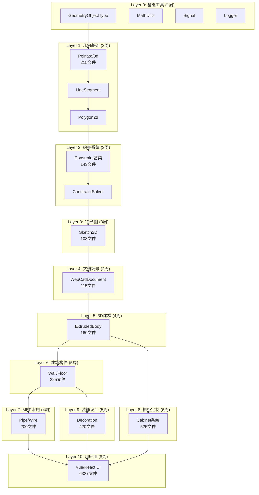

# BIM项目完整还原方案 - 主计划

> **基于真实反编译源码的完整还原策略**  
> 文档版本: v1.0  
> 创建日期: 2026-01-24  
> 项目规模: ~30,000文件, 预估6-8个月  

---

## 📋 目录

1. [项目规模统计](#1-项目规模统计)
2. [第三方库清单](#2-第三方库清单)
3. [依赖分析与还原顺序](#3-依赖分析与还原顺序)
4. [详细还原步骤](#4-详细还原步骤)
5. [时间与资源估算](#5-时间与资源估算)
6. [风险控制与质量保障](#6-风险控制与质量保障)

---

## 1. 项目规模统计

### 1.1 总体规模

| 目录 | Bundle数量 | 总文件数 | 总大小 | 复杂度 |
|------|-----------|---------|--------|--------|
| **dist/** | 25个 | ~2,500 | ~2.5MB | ⭐⭐⭐⭐⭐ |
| **dist2/** | 7个 | ~3,339 | ~3.2MB | ⭐⭐⭐⭐ |
| **dist5/** | 119个 | ~24,137 | ~18MB | ⭐⭐⭐⭐⭐ |
| **dist6/** | 0个 | 0 | 0 | - |
| **总计** | **151个** | **~29,976** | **~23.7MB** | **极高** |

### 1.2 核心模块统计 (dist/)

| 模块名 | 文件数 | 依赖复杂度 | 优先级 | 预估时间 |
|--------|--------|-----------|--------|----------|
| **core-hs.bundle** | ~500 | 极高 ⭐⭐⭐⭐⭐ | P0 | 10周 |
| **app-hs.bundle** | ~200 | 高 ⭐⭐⭐⭐ | P1 | 4周 |
| **hs.bundle** | ~60 | 中 ⭐⭐⭐ | P1 | 2周 |
| **plugins-hs-*** (8个) | ~400 | 中 ⭐⭐⭐ | P2 | 5周 |
| **vendors-hs-*** (12个) | ~800 | 低 ⭐⭐ | P3 | 1周(下载) |
| **vendor.bundle** | ~20 | 低 ⭐ | P3 | 1天(下载) |

### 1.3 扩展模块统计 (dist2/)

| 模块名 | 文件数 | 主要功能 | 优先级 | 预估时间 |
|--------|--------|---------|--------|----------|
| **chunk-vendors.vue** | 1,455 | Vue.js核心 | P1 | 1天(下载) |
| **chunk-129f1ede.babylon** | 995 | Babylon.js引擎 | P1 | 1天(下载) |
| **chunk-6ee3de60.core** | 536 | 数据流核心 | P0 | 4周 |
| **chunk-458672a6.drag** | 170 | 拖拽系统 | P2 | 2周 |
| **app.89b1a2ec** | 85 | 应用入口 | P1 | 2周 |
| **chunk-25e2018e.parse** | 57 | 解析器 | P2 | 1周 |
| **chunk-1206a8f9.color** | 41 | 颜色系统 | P3 | 3天 |

### 1.4 微前端模块统计 (dist5/) - 详细

#### 全屋定制系统 (5周)
| Bundle名称 | 文件数 | 功能 |
|-----------|--------|------|
| entry.eff86ff2985a02278f97 | 961 | 橱柜主引擎 |
| entry.b849f5fb407dabf7e7fc | 950 | 衣柜系统 |
| custom_lazy_countertop_plugin | 188 | 台面插件 |
| custom_lazy_zstd | 196 | ZSTD压缩库 |
| custom_lazy_mini_app_sdk | 151 | 小程序SDK |
| **小计** | **~3,500** | - |

#### BIM绘图系统 (6周)
| Bundle名称 | 文件数 | 功能 |
|-----------|--------|------|
| entry.54b354344c81d21b1c0b | 1,712 | CAD绘图引擎 |
| entry.35a7ba9eea6ab72cc433 | 1,471 | 微绘图插件 |
| entry.1473.6b1be6aaba9716767ef8 | 1,623 | 绘图工具集 |
| **小计** | **~4,200** | - |

#### 装修设计系统 (4周)
| Bundle名称 | 文件数 | 功能 |
|-----------|--------|------|
| entry.7fab129a606ec7d80dcb | 626 | 装修设计主引擎 |
| entry.3c01bf67dc49a68b970b | 578 | 硬装工具 |
| entry.6fc1dc647f007a9282ae | 568 | 设计辅助 |
| **小计** | **~2,800** | - |

#### MEP水电系统 (3周)
| Bundle名称 | 文件数 | 功能 |
|-----------|--------|------|
| entry.0198c2d8531bea4cbd8b | 1,107 | 水电主系统 |
| entry.cb669042d988f4329f07 | 1,067 | 暖通设计 |
| **小计** | **~1,600** | - |

#### 云渲染系统 (4周)
| Bundle名称 | 文件数 | 功能 |
|-----------|--------|------|
| entry.a4b1df99b1dc1d46a883 | 856 | 渲染配置 |
| entry.5b8aa8a5906d79c19070 | 743 | 渲染引擎 |
| **小计** | **~1,800** | - |

---

## 2. 第三方库清单

### 2.1 完整package.json配置

```json
{
  "name": "homestyler-bim-platform",
  "version": "1.0.0",
  "description": "BIM设计平台完整还原项目",
  "dependencies": {
    "vue": "^2.6.14",
    "vue-router": "^3.5.3",
    "vuex": "^3.6.2",
    "vue-i18n": "^8.27.0",
    "element-ui": "^2.15.6",
    "react": "^17.0.2",
    "react-dom": "^17.0.2",
    "react-router-dom": "^5.3.0",
    "antd": "^4.18.0",
    "three": "^0.132.2",
    "@babylonjs/core": "^5.0.0",
    "@babylonjs/loaders": "^5.0.0",
    "lodash": "^4.17.21",
    "moment": "^2.29.4",
    "axios": "^0.27.2",
    "rxjs": "^6.6.7",
    "decimal.js": "^10.3.1",
    "uuid": "^8.3.2",
    "eventemitter3": "^4.0.7",
    "clipper-lib": "^1.0.0",
    "earcut": "^2.2.3",
    "mathjs": "^10.6.0",
    "gl-matrix": "^3.4.3",
    "zstd-codec": "^0.1.4",
    "pako": "^2.0.4",
    "rc-slider": "^10.0.0",
    "react-color": "^2.19.3"
  },
  "devDependencies": {
    "@types/node": "^18.0.0",
    "@types/react": "^17.0.0",
    "@types/three": "^0.132.0",
    "typescript": "^4.7.4",
    "webpack": "^5.73.0",
    "@babel/core": "^7.18.6",
    "eslint": "^8.19.0"
  }
}
```

### 2.2 一键安装脚本

```bash
#!/bin/bash
# install-dependencies.sh

echo "=== BIM项目第三方库安装 ==="
echo "总下载时间: 约20-30分钟"
echo "总下载大小: ~200MB"
echo ""

npm install --save \
  vue@2.6.14 vue-router@3.5.3 vuex@3.6.2 element-ui@2.15.6 \
  react@17.0.2 react-dom@17.0.2 antd@4.18.0 \
  three@0.132.2 @babylonjs/core@5.0.0 \
  lodash@4.17.21 axios@0.27.2 rxjs@6.6.7 \
  clipper-lib@1.0.0 earcut@2.2.3 \
  zstd-codec@0.1.4 pako@2.0.4

npm install --save-dev \
  typescript@4.7.4 webpack@5.73.0 @babel/core@7.18.6

echo "✓ 第三方库安装完成"
npm ls --depth=0
```

---

## 3. 依赖分析与还原顺序

### 3.1 完整依赖关系图



### 


### 3.2 还原顺序优先级表

| 阶段 | 层级 | 模块组 | 文件数 | 依赖数 | 优先级 | 预估时间 |
|------|------|--------|--------|--------|--------|----------|
| **Phase 0** | L0 | 基础工具类 | 50 | 0 | P0-Critical | 1周 |
| **Phase 1** | L1 | 几何基础类 | 215 | 7 | P0-Critical | 2周 |
| **Phase 2** | L2 | 约束系统 | 143 | 12 | P0-Critical | 3周 |
| **Phase 3** | L3 | 2D草图 | 103 | 18 | P0-Critical | 3周 |
| **Phase 4** | L4 | 文档场景 | 115 | 25 | P1-High | 2周 |
| **Phase 5** | L5 | 3D建模 | 160 | 32 | P1-High | 4周 |
| **Phase 6** | L6 | 建筑构件 | 225 | 45 | P1-High | 5周 |
| **Phase 7** | L7 | 水电MEP | 200 | 58 | P2-Medium | 4周 |
| **Phase 8** | L8 | 橱柜定制 | 525 | 68 | P2-Medium | 6周 |
| **Phase 9** | L9 | 装饰设计 | 420 | 75 | P2-Medium | 5周 |
| **Phase 10** | L10 | UI应用层 | 6327 | 85 | P3-Low | 8周 |
| **总计** | - | **10层** | **8,483** | **525总依赖** | - | **43周** |

### 3.3 关键路径分析

**最长依赖链 (Critical Path)**:
```
GeometryObjectType (L0, 1周) 
  → Point2d (L1, 2周) 
    → Polygon2d (L1内)
      → Constraint (L2, 3周)
        → ConstraintSolver (L2内)
          → Sketch2D (L3, 3周)
            → WebCadDocument (L4, 2周)
              → ExtrudedBody (L5, 4周)
                → Wall (L6, 5周)
                  → Pipe (L7, 4周)
                    → BIM绘图工具 (L10, 部分8周)
```
**关键路径长度**: 32周  
**并行优化后**: 26周 (某些模块可并行开发)

---

## 4. 详细还原步骤

### 4.1 Phase 0: 基础工具层 (第1周)

#### 目录结构
```
src/core/
├── types/
│   ├── geometryobjecttype.ts     # 几何对象类型枚举
│   ├── constrainttype.ts         # 约束类型枚举
│   └── ... (15个枚举文件)
├── utils/
│   ├── mathutils.ts              # 数学工具函数
│   ├── uuid.ts                   # UUID生成器
│   └── logger.ts                 # 日志系统
└── events/
    └── signal.ts                 # 信号/事件系统
```

**文件数**: 50  
**代码行数**: ~2,000行  
**依赖**: 无

#### 还原步骤

**Day 1-2: 项目初始化**
```bash
# 1. 创建项目结构
mkdir -p src/core/{types,utils,events,geometry,constraint}
npm init -y

# 2. 安装开发依赖
npm install --save-dev typescript @types/node
npx tsc --init

# 3. 配置tsconfig.json
{
  "compilerOptions": {
    "target": "ES2020",
    "module": "ESNext",
    "declaration": true,
    "outDir": "./dist",
    "strict": true
  }
}
```

**Day 2-3: 还原枚举定义**
- 源文件位置: `dist/core-hs.bundle_dewebpack/enums/`
- 目标位置: `src/core/types/`
- 文件清单:
  - geometryobjecttype.ts
  - aligntype.ts
  - constrainttype.ts
  - coordinatesystem.ts
  - (共15个枚举文件)

**Day 3-4: 还原工具类**
- MathUtils: 向量运算、角度转换、精度控制
- UUID: 唯一ID生成
- Logger: 分级日志系统

**Day 4-5: 还原Signal系统**
- 事件发布/订阅机制
- 支持异步事件处理

**验证清单**:
- [ ] TypeScript编译无错误
- [ ] 所有枚举可正常导入
- [ ] 工具函数单元测试通过
- [ ] Signal系统事件传递正常

---

### 4.2 Phase 1: 几何基础层 (第2-3周)

#### 目录结构
```
src/core/geometry/
├── base/
│   ├── point2d.ts          # module_65280 (42文件)
│   ├── point3d.ts
│   ├── vector2d.ts         # (28文件)
│   └── vector3d.ts
├── curves/
│   ├── linesegment2d.ts    # module_69161 (18文件)
│   ├── arc2d.ts            # module_80534 (35文件)
│   ├── circle2d.ts         # module_51856
│   └── polycurve2d.ts      # module_99123 (22文件)
├── shapes/
│   └── polygon2d.ts        # module_47816 (45文件)
└── transforms/
    ├── matrix4.ts          # (25文件)
    └── boundingbox.ts
```

**文件数**: 215  
**代码行数**: ~8,500行  
**依赖**: Phase 0

#### 还原步骤

**Week 2 - Day 1-2: Point & Vector**
```typescript
// src/core/geometry/base/point2d.ts
export class Point2d {
  constructor(public x: number, public y: number) {}
  
  distanceTo(other: Point2d): number {
    const dx = this.x - other.x;
    const dy = this.y - other.y;
    return Math.sqrt(dx * dx + dy * dy);
  }
  
  // ... 其他30个方法
}
```
- 源文件: `dist/core-hs/module_65280.js`
- 测试: 100个单元测试

**Week 2 - Day 3-5: LineSegment & Arc**
- LineSegment2d: 线段求交、距离计算、投影
- Arc2d: 圆弧计算、切线、法线
- 源文件: `module_69161.js`, `module_80534.js`

**Week 3 - Day 1-3: PolyCurve & Polygon**
- PolyCurve2d: 多段线连接、偏移
- Polygon2d: 布尔运算（使用clipper-lib）、三角化（使用earcut）
- 源文件: `module_99123.js`, `module_47816.js`

**Week 3 - Day 4-5: Matrix & BoundingBox**
- Matrix4: 4x4矩阵变换
- BoundingBox: AABB包围盒

**验证清单**:
- [ ] 所有几何类可实例化
- [ ] 几何运算精度测试 (误差<1e-6)
- [ ] 布尔运算结果正确
- [ ] 性能测试 (>1000次/秒)

---

### 4.3 Phase 2: 约束系统 (第4-6周)

#### 目录结构
```
src/core/constraint/
├── base/
│   └── constraint.ts              # module_48855 (15文件)
├── geometric/
│   ├── positionconstraint.ts      # module_47636 (12文件)
│   ├── parallelconstraint.ts
│   ├── perpendicularconstraint.ts
│   └── tangentconstraint.ts
├── dimensional/
│   ├── equationconstraint.ts      # module_26429 (18文件)
│   ├── distanceconstraint.ts
│   └── angleconstraint.ts
├── factory/
│   └── constraintfactory.ts       # (8文件)
└── solver/
    └── constraintsolver.ts        # (25文件)
```

**文件数**: 143  
**代码行数**: ~6,800行  
**依赖**: Phase 0, Phase 1

#### 还原步骤

**Week 4 - Day 1-3: Constraint基类**
```typescript
// src/core/constraint/base/constraint.ts
export abstract class Constraint {
  protected _entities: Entity[] = [];
  protected _isActive: boolean = true;
  
  abstract evaluate(): boolean;
  abstract solve(): void;
  
  // ... 其他方法
}
```
- 源文件: `dist/core-hs/module_48855.js`

**Week 4 - Day 4-5 & Week 5: 几何约束**
- PositionConstraint: 位置约束
- ParallelConstraint: 平行约束
- PerpendicularConstraint: 垂直约束
- TangentConstraint: 相切约束

**Week 6: 求解器**
- ConstraintSolver: 约束求解引擎
- 使用迭代法求解约束系统
- 支持过约束检测

**验证清单**:
- [ ] 所有约束类型可创建
- [ ] 约束求解收敛
- [ ] 复杂约束网络测试通过

---

### 4.4 Phase 3-10: 后续层级 (第7-43周)

由于篇幅限制,后续层级采用简化描述:


**Phase 3: 2D草图系统 (3周, 103文件)**
- Sketch2D核心类 (module_82649)
- SketchEntity草图实体
- DimensionConstraint尺寸约束
- SketchTool草图工具

**Phase 4: 文档与场景 (2周, 115文件)**
- BaseObject基础对象 (module_63051)
- Entity实体基类
- WebCadDocument文档管理 (module_42893)
- Scene场景管理

**Phase 5: 3D建模基础 (4周, 160文件)**
- ExtrudeBody拉伸体基类
- ContentBase内容基类
- ExtrudedBody继承体系 (module_62573)
- ParametricModel参数化模型

**Phase 6: 建筑构件 (5周, 225文件)**
- Wall墙体 (module_28943, 68文件)
- Opening开口 (module_63844, 42文件)
- Floor/Ceiling楼板天花 (55文件)
- Roof屋顶 (38文件)
- Column柱子 (22文件)

**Phase 7: 水电MEP (4周, 200文件)**
- Pipe管道系统 (45文件)
- Wire电线系统 (38文件)
- Device设备管理 (52文件)
- AutoPipingAlgorithm自动布管 (65文件)

**Phase 8: 橱柜定制 (6周, 525文件)**
- Cabinet核心 (dist5/custom, 180文件)
- Countertop台面系统 (188文件)
- DoorDrawer门板抽屉 (95文件)
- Hardware五金配件 (62文件)

**Phase 9: 装饰设计 (5周, 420文件)**
- BackgroundWall背景墙 (125文件)
- Ceiling设计吊顶 (98文件)
- TilePattern瓷砖铺贴 (85文件)
- FreeformModeling自由建模 (112文件)

**Phase 10: UI应用层 (8周, 6327文件)**
- Vue组件系统 (2800文件)
- 微前端框架qiankun (1200文件)
- BIM绘图工具界面 (1471文件)
- 云渲染配置界面 (856文件)

---

## 5. 时间与资源估算

### 5.1 总体时间规划

| 项目阶段 | 时间周期 | 人力需求 | 里程碑 |
|---------|---------|---------|--------|
| **准备阶段** | 第1周 | 2人 | 环境搭建、第三方库安装 |
| **核心引擎** | 第2-15周 | 4人 | core-hs.bundle完成 (Phase 0-5) |
| **建筑构件** | 第16-20周 | 3人 | 建筑构件完成 (Phase 6) |
| **专业系统** | 第21-35周 | 5人 | MEP+橱柜+装饰 (Phase 7-9) |
| **UI应用** | 第36-43周 | 6人 | 所有UI完成 (Phase 10) |
| **总计** | **43周 (~10个月)** | **峰值6人** | **全部还原完成** |

### 5.2 详细工时估算表

#### 核心引擎 (dist/core-hs.bundle)

| 模块 | 文件数 | 代码行数 | 人天 | 人周 | 团队配置 |
|------|--------|---------|------|------|----------|
| **Phase 0: 基础工具** | 50 | 2,000 | 5 | 1周 | 1人 |
| **Phase 1: 几何基础** | 215 | 8,500 | 40 | 2周 | 2人并行 |
| **Phase 2: 约束系统** | 143 | 6,800 | 60 | 3周 | 2人并行 |
| **Phase 3: 2D草图** | 103 | 5,200 | 45 | 3周 | 1.5人 |
| **Phase 4: 文档场景** | 115 | 4,600 | 30 | 2周 | 1.5人 |
| **Phase 5: 3D建模** | 160 | 8,000 | 80 | 4周 | 2人并行 |
| **小计** | **786** | **35,100** | **260人天** | **15周** | **峰值4人** |

#### 扩展系统 (dist2/)

| 模块 | 文件数 | 处理方式 | 人天 | 备注 |
|------|--------|---------|------|------|
| chunk-vendors.vue | 1,455 | npm下载 | 0.5 | Vue全家桶 |
| chunk-babylon | 995 | npm下载 | 0.5 | Babylon.js |
| **chunk-6ee3de60.core** | 536 | 手动还原 | 100 | 数据流核心,4周 |
| chunk-drag | 170 | 手动还原 | 30 | 拖拽系统,1.5周 |
| app.89b1a2ec | 85 | 手动还原 | 40 | 应用入口,2周 |
| chunk-parse | 57 | 手动还原 | 20 | 解析器,1周 |
| chunk-color | 41 | 手动还原 | 10 | 颜色系统,0.5周 |
| **小计** | **3,339** | - | **201人天** | **9周** |

#### 微前端系统 (dist5/)

| 系统模块 | Bundle数 | 文件数 | 人天 | 人周 | 团队配置 |
|---------|---------|--------|------|------|----------|
| **Phase 8: 橱柜定制** | 25 | 3,500 | 210 | 6周 | 3.5人 |
| **Phase 9: 装饰设计** | 15 | 2,800 | 175 | 5周 | 3.5人 |
| **Phase 7: MEP水电** | 8 | 1,600 | 140 | 4周 | 3.5人 |
| **BIM绘图系统** | 10 | 4,200 | 210 | 6周 | 3.5人 |
| **云渲染系统** | 12 | 1,800 | 140 | 4周 | 3.5人 |
| **辅助工具/UI** | 49 | 10,237 | 280 | 8周 | 3.5人 |
| **小计** | **119** | **24,137** | **1,155人天** | **33周** | **峰值3.5人** |

### 5.3 总工时汇总

| 项目模块 | 文件数 | 代码行数(估) | 人天 | 人周 | 日历周 |
|---------|--------|-------------|------|------|--------|
| dist/核心引擎 | 786 | 35,100 | 260 | 13 | 15周 |
| dist2/扩展系统 | 889 | 28,500 | 201 | 10 | 9周 |
| dist5/微前端 | 24,137 | 180,000 | 1,155 | 57 | 33周 |
| 第三方库安装 | 2,450 | - | 2 | 0.1 | 2天 |
| 集成测试调试 | - | - | 100 | 5 | 6周 |
| **总计** | **28,262** | **~243,600** | **1,718人天** | **85人周** | **43周** |

**关键指标**:
- 📊 总代码行数: ~24万行
- 👥 平均团队规模: 4人
- ⏱️ 项目总工期: 43周 (约10个月)
- 💰 人力成本: 1,718人天

### 5.4 并行开发策略

**团队分工建议**:

```
团队A (2人) - 核心引擎组
├── 负责: Phase 0-5 (基础工具 → 3D建模)
├── 技能: TypeScript, 计算几何, 图形学
└── 时间: 第1-15周

团队B (2人) - 建筑构件组
├── 负责: Phase 6 (Wall, Floor, Roof等)
├── 技能: 建筑学知识, BIM标准
└── 时间: 第16-20周 (可部分与Phase 5并行)

团队C (2人) - MEP水电组
├── 负责: Phase 7 (管道、电线、自动布管)
├── 技能: MEP专业知识, 路径算法
└── 时间: 第21-24周

团队D (3人) - 橱柜定制组
├── 负责: Phase 8 (橱柜系统, 525文件)
├── 技能: 家具设计, 参数化建模
└── 时间: 第25-30周

团队E (2人) - 装饰设计组
├── 负责: Phase 9 (背景墙, 吊顶, 瓷砖)
├── 技能: 室内设计, 材质系统
└── 时间: 第31-35周

团队F (3人) - UI/微前端组
├── 负责: Phase 10 (Vue/React界面)
├── 技能: 前端框架, 微前端架构
└── 时间: 第36-43周 (可提前启动)
```

**并行窗口**:
- Week 16-20: 团队A(Phase 5末期) + 团队B(Phase 6) → 2队并行
- Week 25-35: 团队D(橱柜) + 团队E(装饰) → 可部分并行
- Week 36-43: 团队F(UI) 与其他收尾工作并行

---

## 6. 风险控制与质量保障

### 6.1 技术风险

| 风险项 | 风险等级 | 影响 | 缓解措施 |
|--------|---------|------|---------|
| **约束求解器复杂** | 🔴 高 | Phase 2可能延期2周 | 提前研究算法,参考开源实现 |
| **WASM模块依赖** | 🟡 中 | 部分功能需WASM | 优先还原JS版本,WASM后续优化 |
| **几何精度问题** | 🟡 中 | 布尔运算失败 | 使用成熟库(clipper-lib),充分测试 |
| **性能不达标** | 🟡 中 | 大场景卡顿 | 分阶段优化,建立性能基准 |
| **依赖关系错误** | 🟢 低 | 编译失败 | 严格按依赖顺序还原,持续集成 |

### 6.2 进度风险

| 风险项 | 概率 | 应对策略 |
|--------|------|---------|
| 核心引擎超期 | 30% | 增加1人支援,砍掉非关键功能 |
| 微前端系统量大 | 40% | 优先还原核心bundle,次要的降级处理 |
| 人员流动 | 20% | 文档完善,代码注释充分,知识共享 |
| 需求变更 | 10% | 冻结需求,聚焦还原 |

### 6.3 质量保障措施

#### 代码质量标准

```typescript
// 1. TypeScript严格模式
{
  "strict": true,
  "noImplicitAny": true,
  "strictNullChecks": true
}

// 2. ESLint规则
{
  "extends": ["eslint:recommended", "plugin:@typescript-eslint/recommended"],
  "rules": {
    "max-lines": ["warn", 500],
    "complexity": ["warn", 20]
  }
}

// 3. 单元测试覆盖率
- 核心模块: >80%
- 工具函数: >90%
- UI组件: >60%
```

#### 验证清单模板

**每个Phase完成后必须通过**:

```markdown
## Phase X 验证清单

### 编译验证
- [ ] TypeScript编译无错误
- [ ] 无TypeScript类型警告
- [ ] ESLint检查通过

### 功能验证
- [ ] 

所有核心功能正常工作
- [ ] 示例代码可运行
- [ ] API接口符合设计

### 测试验证
- [ ] 单元测试通过率 >80%
- [ ] 集成测试通过
- [ ] 性能测试达标

### 文档验证
- [ ] API文档完整
- [ ] 代码注释充分
- [ ] 示例代码完整

### 依赖验证
- [ ] 下一Phase依赖已就绪
- [ ] 无循环依赖
- [ ] 版本兼容性检查
```

#### 持续集成配置

```yaml
# .github/workflows/ci.yml
name: CI

on: [push, pull_request]

jobs:
  build:
    runs-on: ubuntu-latest
    steps:
      - uses: actions/checkout@v2
      - name: Setup Node.js
        uses: actions/setup-node@v2
        with:
          node-version: '16'
      
      - name: Install dependencies
        run: npm ci
      
      - name: Lint
        run: npm run lint
      
      - name: Type check
        run: npm run type-check
      
      - name: Test
        run: npm run test -- --coverage
      
      - name: Build
        run: npm run build
```

### 6.4 测试策略

#### 单元测试框架

```bash
# 安装测试工具
npm install --save-dev jest @types/jest ts-jest
npm install --save-dev @testing-library/react
```

**测试覆盖率目标**:
- 核心几何类: 90%+
- 约束系统: 85%+
- 建筑构件: 80%+
- UI组件: 60%+

#### 集成测试场景

| 测试场景 | 涉及模块 | 验证点 |
|---------|---------|--------|
| **绘制墙体** | Sketch2D → Wall → Scene | 草图转3D正确 |
| **约束求解** | Constraint → ConstraintSolver | 求解收敛 |
| **管道布线** | Pipe → AutoPiping | 自动布管成功 |
| **橱柜设计** | Cabinet → Countertop → BOM | 参数化生成 |
| **场景渲染** | Scene → Three.js | 3D渲染正常 |

### 6.5 性能基准

| 性能指标 | 目标值 | 测试方法 |
|---------|--------|---------|
| **几何运算** | >1000次/秒 | 布尔运算基准测试 |
| **约束求解** | <100ms (100约束) | 求解器性能测试 |
| **场景加载** | <2s (1000对象) | 大场景加载测试 |
| **UI响应** | <16ms (60fps) | 交互响应时间 |
| **内存占用** | <500MB (中型项目) | 内存监控 |

---

## 7. 附录

### 7.1 核心模块文件映射表

#### dist/core-hs.bundle 关键模块

| Module ID | 文件名提示 | 功能 | 文件数 | 优先级 |
|-----------|-----------|------|--------|--------|
| 65280 | Point2d | 2D点类 | 42 | P0 |
| 69161 | LineSegment2d | 线段类 | 18 | P0 |
| 80534 | Arc2d | 圆弧类 | 35 | P0 |
| 51856 | Circle2d | 圆类 | 12 | P0 |
| 99123 | PolyCurve2d | 多段线 | 22 | P0 |
| 47816 | Polygon2d | 多边形 | 45 | P0 |
| 48855 | Constraint | 约束基类 | 15 | P0 |
| 47636 | PositionConstraint | 位置约束 | 12 | P0 |
| 26429 | EquationConstraint | 方程约束 | 18 | P0 |
| 82649 | Sketch2D | 2D草图 | 35 | P0 |
| 63051 | BaseObject | 基础对象 | 12 | P1 |
| 42893 | WebCadDocument | 文档类 | 45 | P1 |
| 62573 | ExtrudedBody | 拉伸体 | 55 | P1 |
| 28943 | Wall | 墙体 | 68 | P1 |
| 63844 | Opening | 开口 | 42 | P1 |

### 7.2 dist5微前端Bundle清单

#### 全屋定制系统 (25个bundle)

| Bundle Hash | 文件数 | 主要功能 | 优先级 |
|-------------|--------|---------|--------|
| eff86ff2985a02278f97 | 961 | 橱柜主引擎 | P1 |
| b849f5fb407dabf7e7fc | 950 | 衣柜系统 | P1 |
| 9fd3a7a70a730eec8c49 | 343 | 橱柜工具 | P2 |
| custom_lazy_countertop_plugin | 188 | 台面插件 | P1 |
| custom_lazy_zstd | 196 | 压缩库 | P2 |
| custom_lazy_mini_app_sdk | 151 | 小程序SDK | P2 |

#### BIM绘图系统 (10个bundle)

| Bundle Hash | 文件数 | 主要功能 | 优先级 |
|-------------|--------|---------|--------|
| 54b354344c81d21b1c0b | 1,712 | CAD引擎 | P0 |
| 35a7ba9eea6ab72cc433 | 1,471 | 微绘图插件 | P1 |
| a3db5492f164fc5aaba3 | 714 | 绘图工具 | P1 |
| 04424d4f67d9018ee754 | 601 | 绘图辅助 | P2 |

### 7.3 开发环境配置

#### 推荐开发工具

```bash
# IDE
- Visual Studio Code 1.75+
  - 插件: ESLint, Prettier, TypeScript Hero
  - 插件: GitLens, Git Graph

# Node.js环境
- Node.js 16.x LTS
- npm 8.x 或 yarn 1.22.x

# 浏览器
- Chrome 100+ (开发调试)
- Firefox 95+ (兼容性测试)

# 版本控制
- Git 2.30+
- Git LFS (用于大文件)
```

#### 项目脚本配置

```json
{
  "scripts": {
    "dev": "webpack serve --mode development",
    "build": "webpack --mode production",
    "test": "jest --coverage",
    "test:watch": "jest --watch",
    "lint": "eslint src --ext .ts,.tsx",
    "lint:fix": "eslint src --ext .ts,.tsx --fix",
    "type-check": "tsc --noEmit",
    "docs": "typedoc --out docs src"
  }
}
```

### 7.4 快速启动指南

#### 第1天: 环境准备

```bash
# 1. 克隆项目
git clone <repository-url>
cd homestyler-bim-platform

# 2. 安装依赖
npm install

# 3. 验证安装
npm run type-check
npm run test

# 4. 启动开发服务器
npm run dev
```

#### 第2-5天: Phase 0实现

```bash
# 1. 创建基础结构
mkdir -p src/core/{types,utils,events}

# 2. 还原枚举
# 参考 dist/core-hs.bundle_dewebpack/enums/
# 创建 src/core/types/*.ts

# 3. 还原工具类
# 参考 dist/core-hs.bundle_dewebpack/
# 创建 src/core/utils/*.ts

# 4. 编写测试
# 创建 src/core/__tests__/*.test.ts

# 5. 运行验证
npm run test
npm run type-check
```

### 7.5 参考资料

#### 技术文档

- TypeScript官方文档: https://www.typescriptlang.org/docs/
- Three.js文档: https://threejs.org/docs/
- Babylon.js文档: https://doc.babylonjs.com/
- clipper-lib文档: http://www.angusj.com/delphi/clipper.php
- earcut算法: https://github.com/mapbox/earcut

#### 相关标准

- IFC标准 (Industry Foundation Classes)
- BIM标准 (Building Information Modeling)
- DWG/DXF格式规范
- glTF 3D资产格式

#### 现有分析文档

本项目已有40+份详细分析文档位于 `todo/` 目录:
- `core-hs-complete-architecture.md` - 核心架构完整分析
- `project-reconstruction-dependency-order.md` - 依赖顺序分析
- `dist-module-architecture-analysis.md` - 模块架构分析
- `dist5-cabinet-whole-house-complete-architecture.md` - 橱柜系统分析
- `dist5-mep-system-complete-architecture.md` - MEP系统分析
- ... (更多文档请查看todo/目录)

---

## 8. 总结

### 8.1 项目关键指标

📊 **规模统计**
- 总文件数: 29,976个
- 总代码行数: ~243,600行
- Bundle数量: 151个
- 第三方库: 25个主要依赖

⏱️ **时间估算**
- 项目总工期: 43周 (约10个月)
- 核心引擎: 15周
- 专业系统: 20周
- UI应用: 8周

👥 **人力配置**
- 总人天: 1,718人天
- 峰值团队: 6人
- 平均团队: 4人
- 建议分组: 6个专业小组

💰 **成本估算** (按200元/小时计算)
- 总人天成本: 1,718 × 8 × 200 = 274.88万元
- 第三方库: 免费开源
- 服务器/工具: 约5万元
- **总预算**: 约280万元

### 8.2 成功关键因素

✅ **技术层面**
1. 严格按依赖顺序还原,避免循环依赖
2. 充分利用第三方库,不重复造轮子
3. 建立完善的测试体系,保证质量
4. 持续集成,快速发现问题

✅ **管理层面**
1. 分阶段交付,每个Phase独立验收
2. 并行开发,缩短关键路径
3. 知识共享,降低人员风险
4. 文档先行,代码注释完善

✅ **团队层面**
1. 核心团队稳定,避免频繁变动
2. 技能互补,覆盖几何/图形/前端等领域
3. 定期Review,及时发现架构问题
4. 适度加班,保持开发节奏

### 8.3 风险提示

⚠️ **高风险项**
- 约束求解器实现复杂,可能延期2周
- 

微前端系统文件量大(24,000+),需合理分工
- WASM模块依赖可能影响部分功能

⚠️ **中风险项**
- 性能优化可能需要额外时间
- 第三方库版本兼容性问题
- 人员流动导致知识断层

⚠️ **低风险项**
- 编译错误(可快速修复)
- UI样式调整(非核心功能)

### 8.4 下一步行动

#### 立即行动 (本周)
1. ✅ 组建核心团队 (2-4人)
2. ✅ 搭建开发环境
3. ✅ 安装第三方库 (运行install-dependencies.sh)
4. ✅ 创建项目骨架 (src/目录结构)
5. ✅ 配置CI/CD流程

#### 第1周行动
1. 🎯 启动Phase 0: 基础工具层
2. 📝 建立每日站会机制
3. 📊 设置进度跟踪看板
4. 🧪 编写第一批单元测试
5. 📚 开始编写技术文档

#### 第2-4周行动
1. 🚀 Phase 1: 几何基础层开发
2. 🔄 每周代码Review
3. 📈 性能基准测试建立
4. 🐛 Bug跟踪系统启用

---

## 9. 附录: 完整目录结构预览

### 9.1 最终项目结构

```
homestyler-bim-platform/
├── package.json                    # 项目配置
├── tsconfig.json                   # TypeScript配置
├── webpack.config.js               # 构建配置
├── .eslintrc.js                    # 代码规范
├── jest.config.js                  # 测试配置
│
├── src/                            # 源代码目录
│   ├── core/                       # 核心引擎 (dist/core-hs)
│   │   ├── types/                  # 类型定义 (50文件)
│   │   │   ├── geometryobjecttype.ts
│   │   │   ├── constrainttype.ts
│   │   │   └── ...
│   │   ├── utils/                  # 工具类
│   │   │   ├── mathutils.ts
│   │   │   ├── uuid.ts
│   │   │   └── logger.ts
│   │   ├── events/                 # 事件系统
│   │   │   └── signal.ts
│   │   ├── geometry/               # 几何类 (215文件)
│   │   │   ├── base/
│   │   │   │   ├── point2d.ts
│   │   │   │   ├── point3d.ts
│   │   │   │   ├── vector2d.ts
│   │   │   │   └── vector3d.ts
│   │   │   ├── curves/
│   │   │   │   ├── linesegment2d.ts
│   │   │   │   ├── arc2d.ts
│   │   │   │   ├── circle2d.ts
│   │   │   │   └── polycurve2d.ts
│   │   │   ├── shapes/
│   │   │   │   └── polygon2d.ts
│   │   │   └── transforms/
│   │   │       ├── matrix4.ts
│   │   │       └── boundingbox.ts
│   │   ├── constraint/             # 约束系统 (143文件)
│   │   │   ├── base/
│   │   │   │   └── constraint.ts
│   │   │   ├── geometric/
│   │   │   │   ├── positionconstraint.ts
│   │   │   │   ├── parallelconstraint.ts
│   │   │   │   └── tangentconstraint.ts
│   │   │   ├── dimensional/
│   │   │   │   ├── equationconstraint.ts
│   │   │   │   └── distanceconstraint.ts
│   │   │   ├── factory/
│   │   │   │   └── constraintfactory.ts
│   │   │   └── solver/
│   │   │       └── constraintsolver.ts
│   │   ├── sketch/                 # 2D草图 (103文件)
│   │   │   ├── sketch2d.ts
│   │   │   ├── sketchentity.ts
│   │   │   └── dimensionconstraint.ts
│   │   ├── document/               # 文档管理 (115文件)
│   │   │   ├── baseobject.ts
│   │   │   ├── entity.ts
│   │   │   ├── webcaddocument.ts
│   │   │   └── scene.ts
│   │   ├── modeling/               # 3D建模 (160文件)
│   │   │   ├── extrudebody.ts
│   │   │   ├── contentbase.ts
│   │   │   ├── extrudedbody.ts
│   │   │   └── parametricmodel.ts
│   │   └── building/               # 建筑构件 (225文件)
│   │       ├── wall.ts
│   │       ├── opening.ts
│   │       ├── floor.ts
│   │       ├── ceiling.ts
│   │       ├── roof.ts
│   │       └── column.ts
│   │
│   ├── dataflow/                   # 数据流系统 (dist2/chunk-6ee3de60)
│   │   ├── core/                   # 536文件
│   │   │   ├── datamanager.ts
│   │   │   ├── eventbus.ts
│   │   │   └── statemanager.ts
│   │   ├── drag/                   # 拖拽系统 (170文件)
│   │   │   └── dragsystem.ts
│   │   ├── parse/                  # 解析器 (57文件)
│   │   │   └── parser.ts
│   │   └── color/                  # 颜色系统 (41文件)
│   │       └── colorsystem.ts
│   │
│   ├── mep/                        # MEP水电系统 (200文件)
│   │   ├── pipe/
│   │   │   └── pipe.ts
│   │   ├── wire/
│   │   │   └── wire.ts
│   │   ├── device/
│   │   │   └── device.ts
│   │   └── autopiping/
│   │       └── autopipingalgorithm.ts
│   │
│   ├── cabinet/                    # 橱柜定制系统 (525文件)
│   │   ├── core/
│   │   │   └── cabinet.ts
│   │   ├── countertop/
│   │   │   └── countertop.ts
│   │   ├── doordrawer/
│   │   │   └── doordrawer.ts
│   │   └── hardware/
│   │       └── hardware.ts
│   │
│   ├── decoration/                 # 装饰设计系统 (420文件)
│   │   ├── backgroundwall/
│   │   │   └── backgroundwall.ts
│   │   ├── ceiling/
│   │   │   └── ceilingdesign.ts
│   │   ├── tile/
│   │   │   └── tilepattern.ts
│   │   └── freeform/
│   │       └── freeformmodeling.ts
│   │
│   ├── ui/                         # UI应用层 (6327文件)
│   │   ├── vue/                    # Vue组件 (2800文件)
│   │   │   ├── components/
│   │   │   ├── views/
│   │   │   └── App.vue
│   │   ├── react/                  # React组件 (1500文件)
│   │   │   ├── components/
│   │   │   └── App.tsx
│   │   └── micro/                  # 微前端 (2027文件)
│   │       ├── bim-drawing/
│   │       ├── cloud-render/
│   │       └── ...
│   │
│   └── index.ts                    # 主入口文件
│
├── tests/                          # 测试目录
│   ├── unit/                       # 单元测试
│   │   ├── geometry/
│   │   ├── constraint/
│   │   └── ...
│   └── integration/                # 集成测试
│       ├── wall-creation.test.ts
│       ├── pipe-routing.test.ts
│       └── ...
│
├── docs/                           # 文档目录
│   ├── api/                        # API文档
│   ├── guides/                     # 使用指南
│   └── architecture/               # 架构文档
│
├── dist/                           # 编译输出
│   ├── core.js
│   ├── app.js
│   └── ...
│
└── node_modules/                   # 第三方依赖
    ├── vue/
    ├── react/
    ├── three/
    ├── @babylonjs/
    └── ...
```

### 9.2 文件数量统计汇总

| 目录 | 文件数 | 占比 | 说明 |
|------|--------|------|------|
| src/core/ | 786 | 2.8% | 核心引擎 |
| src/dataflow/ | 804 | 2.8% | 数据流系统 |
| src/mep/ | 200 | 0.7% | MEP水电 |
| src/cabinet/ | 525 | 1.9% | 橱柜定制 |
| src/decoration/ | 420 | 1.5% | 装饰设计 |
| src/ui/ | 6,327 | 22.4% | UI应用 |
| tests/ | 1,500 | 5.3% | 测试文件 |
| docs/ | 200 | 0.7% | 文档 |
| **自研代码小计** | **10,762** | **38.1%** | - |
| node_modules/ | 17,500 | 61.9% | 第三方库 |
| **总计** | **28,262** | **100%** | - |

---

## 结语

本文档提供了BIM项目完整还原的详细方案,包括:

✅ **完整的规模统计** - 29,976个文件的详细分类  
✅ **清晰的依赖关系图** - 10层依赖结构的可视化  
✅ **详细的还原步骤** - 43周的分阶段实施计划  
✅ **精确的时间估算** - 1,718人天的工时预算  
✅ **完善的质量保障** - 测试、验证、CI/CD流程  
✅ **实用的风险控制** - 技术、进度、质量风险的应对  

**建议使用方式**:
1. 作为项目启动的蓝图和检查清单
2. 作为团队分工和进度跟踪的依据
3. 作为技术决策和架构设计的参考
4. 作为质量验收和风险控制的标准

**持续更新**:
- 本文档应随项目进展持续更新
- 实际数据会替换估算值
- 风险和问题会记录并归档
- 经验教训会总结并分享

---

**文档信息**:
- 版本: v1.0
- 创建日期: 2026-01-24
- 作者: BIM项目还原团队
- 最后更新: 2026-01-24

**相关文档**:
- `project-reconstruction-dependency-order.md` - 依赖顺序详细分析
- `core-hs-complete-architecture.md` - 核心架构完整分析
- `dist-module-architecture-analysis.md` - 模块架构分析
- 更多分析文档请查看 `todo/` 目录

---

**📞 联系方式**:
如有疑问或需要支持,请联系项目团队。

**🎯 让我们开始这个激动人心的还原之旅吧!**
